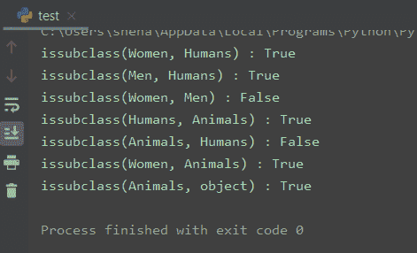
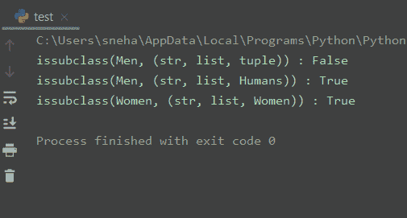

# Python issubclass()方法是如何工作的？

> 原文：<https://www.askpython.com/python/built-in-methods/python-issubclass-method>

嘿伙计们！今天我们在这里讨论另一个主题为 **Python issubclass()方法**的教程。

所以让我们直接进入主题。

## 什么是 Python issubclass()？

Python `issubclass()`方法是一个**内置的**方法，它检查传递的类是否是指定`classinfo`的**子类**(可能是一个类或类对象的[元组](https://www.askpython.com/python/tuple/python-tuple))。如果该类是 classinfo 的子类(直接、间接或[虚拟](https://docs.python.org/3.7/glossary.html#term-abstract-base-class)),则返回`True`。否则，返回`False`。在任何其他情况下，都会引发一个`TypeError`异常。

```py
issubclass(class, classinfo)

```

`class`是我们要确认是否是`classinfo`的子类的类的名称。如果 classinfo 是一个类元组，该函数对其中的每个类都进行相同的检查。

所以，现在我们对`issubclass()`有了一个基本的概念，让我们看一些例子来更好地理解。

## 使用 Python issubclass()方法

在这一节中，我们将讨论使用 Python `issubclass()`方法的不同方式。对于我们将`classinfo`作为类名以及类对象的[元组](https://www.askpython.com/python/tuple/python-tuple)传递的两种情况。

### 1.Python 继承中的 issubclass()

当我们在讨论[继承](https://www.askpython.com/python/oops/inheritance-in-python)的时候，父类和子类的概念是非常关键的。当一个**子**从一个**父**类继承时，它派生或扩展它的属性。此时，**子**被认为是**父**类的子类。

因此，当我们想要获得一个类的继承信息时，`issubclass()`方法就变得很方便。或者检查它是否继承自另一个类。

让我们举个例子。

```py
class Animals:
    pass

class Humans(Animals):
    pass

class Men(Humans):
    pass

class Women(Humans):
    pass

print("issubclass(Women, Humans) :", issubclass(Women, Humans))
print("issubclass(Men, Humans) :", issubclass(Men, Humans))
print("issubclass(Women, Men) :", issubclass(Women, Men)) #both are child of the same Humans Class
print("issubclass(Humans, Animals) :", issubclass(Humans, Animals))
print("issubclass(Animals, Humans) :", issubclass(Animals, Humans)) #not the opposite
print("issubclass(Women, Animals) :", issubclass(Women, Animals)) #multi-level inheritance
print("issubclass(Animals, object) :", issubclass(Animals, object)) #object is the baseclass of all classes

```

**输出:**



issubclass() with Inheritance – Output

这里的`Animals`是父类，有一个子类`Humans`。两个类，`Men`和`Women`再次继承自`Humans`类([多级继承](https://www.askpython.com/python/oops/python-multiple-inheritance))。因此`Men`和`Women`类都是`Humans`和`Animals`的子类。而`Humans`是`Animals`的子类。

这解释了前 **6** 的结果。

对于最后一种情况，我们得到了`True`。这是因为 Python 中的所有类都是`object`类的子类。

### 2.Python 是带有类元组的 issubclass()

现在让我们试着把`classinfo`看作一组类。仔细看下面的例子。

```py
class Animals:
    pass

class Humans(Animals):
    pass

class Men(Humans):
    pass

class Women(Humans):
    pass

print("issubclass(Men, (str, list, tuple)) :", issubclass(Men, (str, list, tuple)))
print("issubclass(Men, (str, list, Humans)) :", issubclass(Men, (str, list, Humans)))
print("issubclass(Women, (str, list, Women)) :", issubclass(Women, (str, dict, Women)))
#A class is a subclass of itself in Python

```

**输出:**



issubclass() with Tuple Of Classes – Output

这里我们再次举了同一个**继承**的例子。如前所述，这个时间`classinfo`是作为一个类对象元组传递的。在这种情况下，该函数检查传递的类是否是 **classinfo** 元组中任何一个类对象的子类。

对于第一个结果，`Men`显然不是任何 [str](https://www.askpython.com/python/string) 、 [list](https://www.askpython.com/python/list/python-list) 或 **tuple** 类的子类。所以我们得到了一个`False`。

在下一个例子中，男人也不是 str 或 list 的子类，而是人类的子类。因此，我们得到真实的结果。

最后，对于最后一种情况，我们得到 **True** ，因为`Women`是它自身的子类。这是因为在 Python 中，每个类都是自身的子类。

## 结论

今天就到这里吧。我们学习了 Python `issubclass()`方法。

如果你还有其他问题，请写在下面的评论里。

## 参考

*   Python[issubclass()](https://docs.python.org/2/library/functions.html#issubclass)–Python 2 文档，
*   [issubclass()](https://docs.python.org/3/library/functions.html#issubclass)–Python 3 文档，
*   [Python 历史与设计:为什么 issubclass()而不是 rich comparisons？](https://stackoverflow.com/questions/10095628/python-history-and-design-why-issubclass-instead-of-rich-comparisons)–stack overflow 问题。