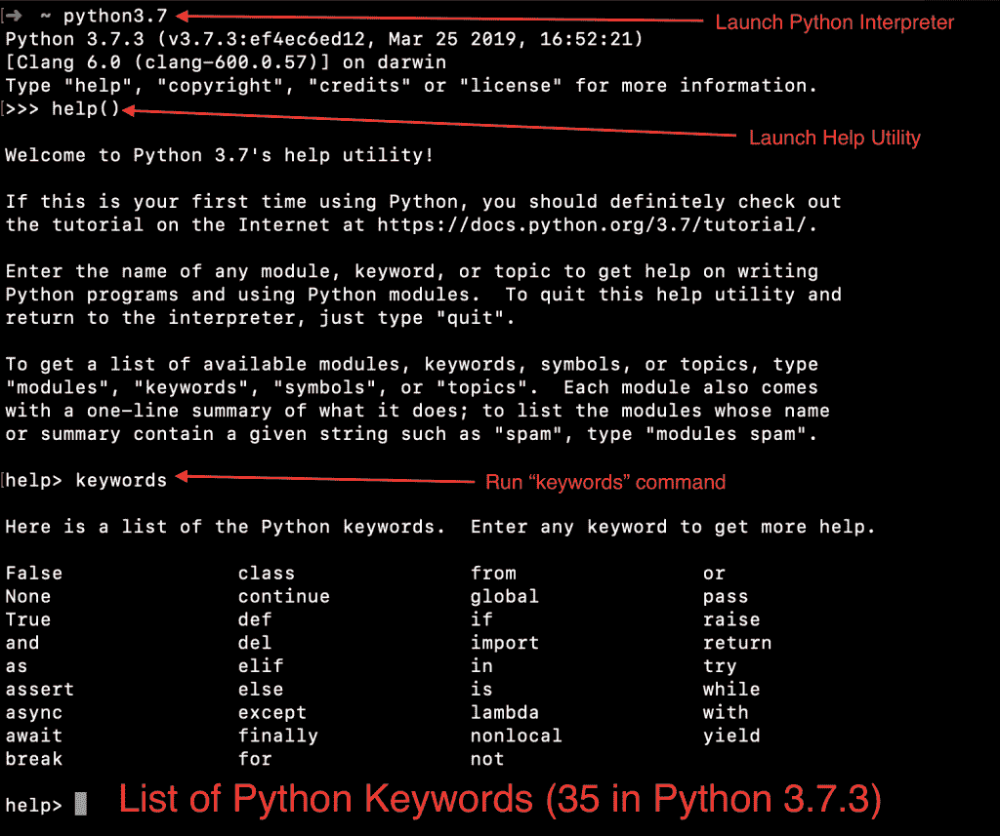
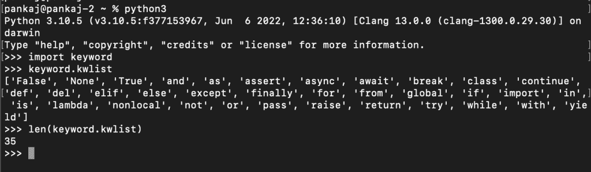

# Python 关键字

> 原文：<https://www.askpython.com/python/python-keywords>

Python 关键字是保留字。python 解释器使用它们来理解程序。关键字定义了程序的结构。我们不能用关键字来命名程序实体，如变量、类和函数。

* * *

## Python 中有多少个关键字？

Python 有很多关键词。随着 python 中新特性的出现，这个数字还在继续增长。

在撰写本教程时，Python 3.10.5 是当前的稳定版本。Python 3.10.5 版本中有 35 个关键字。

我们可以使用 python 解释器帮助实用程序获得关键字的完整列表。

```py
$ python3.10
>>> help()
help> keywords

Here is a list of the Python keywords.  Enter any keyword to get more help.

False               class               from                or
None                continue            global              pass
True                def                 if                  raise
and                 del                 import              return
as                  elif                in                  try
assert              else                is                  while
async               except              lambda              with
await               finally             nonlocal            yield
break               for                 not 

```



Python Keywords List

## Python 关键字列表

我们可以使用“关键字”模块来获取关键字列表。

```py
% python3
Python 3.10.5 (v3.10.5:f377153967, Jun  6 2022, 12:36:10) [Clang 13.0.0 (clang-1300.0.29.30)] on darwin
Type "help", "copyright", "credits" or "license" for more information.
>>> import keyword
>>> keyword.kwlist
['False', 'None', 'True', 'and', 'as', 'assert', 'async', 'await', 'break', 'class', 'continue', 'def', 'del', 'elif', 'else', 'except', 'finally', 'for', 'from', 'global', 'if', 'import', 'in', 'is', 'lambda', 'nonlocal', 'not', 'or', 'pass', 'raise', 'return', 'try', 'while', 'with', 'yield']
>>> len(keyword.kwlist)
35
>>> 

```



## Python 软关键字

Python 3.9 引入了软关键字的概念。我们可以使用软关键字作为变量名，它们只在程序的上下文中得到特殊处理。截至目前，有两个软关键词——**合并**和**案件**。我们可以使用关键字模块来确认这一点。

```py
>>> keyword.softkwlist
['_', 'case', 'match']
>>> 

```

为什么我们需要软文关键词？

我认为引入软关键字的想法是为了避免破坏现有代码，以防它们被用作标识符。这将给开发人员足够的时间对他们的代码进行适当的修改。

## 如何检查一个字符串是不是关键词？

我们可以使用 *keyword.iskeyword()* 函数来检查一个字符串是否是保留关键字。

比如 print 在 python 中是关键字吗？

```py
>>> keyword.iskeyword('print')
False
>>> 

```

所以，print 在 python 中不是关键字。

* * *

## Python 关键字简介

我们将在以后的教程中介绍所有的 python 关键字。让我们了解一下这些关键词的用途和用法。

| 序列号 | 关键字 | 描述 | 例子 |
| one | 错误的 | bool 类的实例。 | x =假 |
| Two | 班级 | 关键字来定义类。 | Foo 类:通过 |
| three | 从 | 子句从模块导入类 | 从集合导入订单直接 |
| four | 或者 | 逻辑算子 | x =真或假 |
| five | 没有人 | 非类型对象的实例 | x =无 |
| six | 继续 | continue 语句，用于嵌套的 for 和 while 循环中。它继续最近的封闭循环的下一个循环。 | numbers = numbers 中数字的范围(1，11):如果 number == 7:继续 |
| seven | 全球的 | 全局语句允许我们修改当前范围之外的变量。 | x = 0 def add():全局 x x = x + 10 add() print(x) # 10 |
| eight | 及格 | Python pass 语句用于不做任何事情。当我们需要一些语句但不想执行任何代码时，这是很有用的。 | def foo():通过 |
| nine | 真实的 | 布尔类的实例。 | x =真 |
| Ten | 极好的 | 用于定义函数的关键字。 | def bar(): print("Hello ") |
| Eleven | 如果 | if 语句用于编写条件代码块。 | x = 10 如果 x%2 == 0: print("x 是偶数")#打印" x 是偶数" |
| Twelve | 上升 | raise 语句用于在程序中引发异常。 | def square(x):如果 type(x)不是 int:raise type error(" Require int argument ")print(x * x) |
| Thirteen | 和 | 用于 and 运算的布尔运算符。 | x = True y = Falseprint(x 和 y) # False |
| Fourteen | 是吗 | del 关键字用于删除变量、列表、对象等对象。 | s1 = " Hello " print(S1)# Hello del S1 print(S1)# name 错误:未定义名称' S1 ' |
| Fifteen | 进口 | import 语句用于将模块和类导入我们的程序。 | #从集合中的模块导入类导入顺序直接#导入模块导入数学 |
| Sixteen | 返回 | return 语句在函数中用于返回值。 | def add(x，y):返回 x+y |
| Seventeen | 如同 | Python as 关键字用于为 import、except 和 with 语句提供名称。 | 从集合导入顺序直接作为 od 导入数学作为 m 打开(' data.csv ')作为文件:pass #对文件进行一些处理 try: pass 除了 TypeError 作为 e: pass |
| Eighteen | 艾列弗 | 对于“else if”运算，elif 语句总是与 if 语句一起使用。 | x = 10 如果 x > 10: print('x 大于 10') elif x > 100: print('x 大于 100') elif x == 10: print('x 等于 10') else: print('x 小于 10 ') |
| Nineteen | 在 | Python in 关键字用于测试成员资格。 | l1 = [1，2，3，4，5]if 2 in L1:print(' list contains 2 ')s = ' ABCD ' if ' a in s:print(' string contains a ') |
| Twenty | 尝试 | Python try 语句用于编写异常处理代码。 | x = " try:I = int(x)except value error as AE:print(AE)#以 10 为基数的 int()的无效文字: " |
| Twenty-one | 维护 | assert 语句允许我们在程序中插入调试断言。如果断言为真，程序继续运行。否则抛出 AssertionError。 | def divide(a，b):断言 b！= 0 返回 a / b |
| Twenty-two | 其他 | else 语句与 if-elif 条件一起使用。它用于在前面的条件都不为真时执行语句。 | 如果为假:传递 else: print('这将总是打印') |
| Twenty-three | 是 | Python is 关键字用于测试两个变量是否引用同一个对象。这与使用==运算符相同。 | fruits =[' apple ']fruits 1 =[' apple ']f = fruits print(f 是水果)# True print(fruits1 是水果)# False |
| Twenty-four | 在…期间 | while 语句用于运行一组语句，直到表达式为真。 | i = 0，而 i < 3:打印(i) i+=1#输出# 0 # 1 # 2 |
| Twenty-five | 异步ˌ非同步(asynchronous) | Python 3.5 中引入的新关键字。这个关键字总是在 couroutine 函数体中使用。它与 asyncio 模块和 await 关键字一起使用。 | import async io import Time async def Ping(URL):print(f ' Ping Started for { URL } ')await async io . sleep(1)print(f ' Ping Finished for { URL } ')async io . gather(Ping(' ask python . com ')，ping('python.org '))，if _ _ name _ _ = ' _ _ main _ _ ':then = Time . Time()loop = async io . get _ event _ loop()loop . run _ until _ complete(main())now = Time . Time()print(f ' |
| Twenty-six | 等待 | Python 3.5 中用于异步处理的新关键字。 | 上面的例子演示了 async 和 await 关键字的使用。 |
| Twenty-seven | 希腊字母的第 11 个 | lambda 关键字用于创建 lambda 表达式。 | multiply = lambda a，b: a * b print(multiply(8，6)) # 48 |
| Twenty-eight | 随着 | Python with 语句用于用上下文管理器定义的方法包装块的执行。该对象必须实现 __enter__()和 __exit__()函数。 | 用 open('data.csv ')作为 file: file.read() |
| Twenty-nine | 除...之外 | Python except 关键字用于捕获 try 块中抛出的异常，并对其进行处理。 | 请查看 try 关键字示例。 |
| Thirty | 最后 | finally 语句与 try-except 语句一起使用。finally 块中的代码总是被执行。主要用于关闭资源。 | def division(x，y): try:返回除 ZeroDivisionError 之外的 x / y 作为 e: print(e) return -1 最后:print('这将始终执行')print(division(10，2)) print(division(10，0))# Output 这将始终执行 5.0 除以零这将始终执行-1 |
| Thirty-one | 非局部的 | nonlocal 关键字用于访问在块范围之外定义的变量。这在嵌套函数中总是用来访问外部定义的变量。 | def outer(): v = 'outer'def inner():非本地 v v = 'inner'inner() print(v)outer() |
| Thirty-two | 产量 | Python yield 关键字是 return 关键字的替代。这用于从函数中逐个返回值。 | def multiplyByTen(* kwargs):for I in kwargs:yield I * 10a = multiplyByTen(4，5，)# a 是生成器对象，一个迭代器#显示 a 中 I 的值:print(i)# Output 40 50 |
| Thirty-three | 破裂 | break 语句与嵌套的“for”和“while”循环一起使用。它停止当前循环的执行，并将控制传递到循环的开始处。 | number = 1，而 True: print(number) number += 2，如果 number > 5: break print(number) #从不执行# Output 1 3 5 |
| Thirty-four | 为 | Python for 关键字用于迭代序列或可迭代对象的元素。 | S1 = ' Hello ' for c in S1:print(c)# Output H e l l o |
| Thirty-five | 不 | not 关键字用于布尔 not 运算。 | x = 20 如果 x 不是 10: print('x 不等于 10')x = True print(不是 x) # False |

* * *

## 摘要

Python 关键字有特定的功能。python 解释器使用它们来理解代码并执行它们。Python 中有 35 个关键字。随着新功能的出现，这个数字还会继续增长。

## 下一步是什么？

你对 python 中的关键字有了一个简单的概念。现在，您应该通过下面的教程来了解 Python 编程的基础。

*   [Python 标识符](https://www.askpython.com/python/python-identifiers-rules-best-practices)
*   [Python 变量](https://www.askpython.com/python/python-variables)
*   [Python 数据类型](https://www.askpython.com/python/python-data-types)
*   [Python 语句](https://www.askpython.com/python/python-statements)
*   [Python 函数](https://www.askpython.com/python/python-functions)

## 资源

*   [Python 关键字模块](https://docs.python.org/3/library/keyword.html)