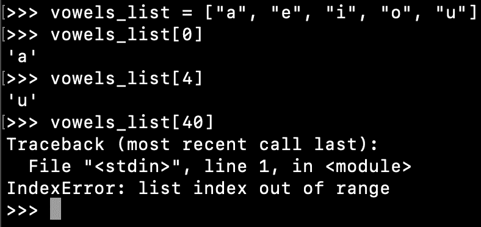

# Python 列表——你必须知道的 15 件事

> 原文：<https://www.askpython.com/python/list/python-list>

*   Python 列表是一个可变序列。
*   我们可以通过将元素放在方括号中来创建一个列表。
*   列表元素用逗号分隔。
*   我们可以创建嵌套列表。
*   该列表是有序的集合。因此它保持了添加元素的顺序。
*   我们可以使用索引来访问列表元素。它还支持负索引来引用从头到尾的元素。
*   我们可以将列表元素解包为逗号分隔的变量。
*   Python 列表可以有重复的元素。他们也允许**无**。
*   List 支持两个[操作符](https://www.askpython.com/python/python-operators) : +用于连接，而*用于重复元素。
*   我们可以分割一个列表，从它的元素中创建另一个列表。
*   我们可以使用循环的[遍历列表元素。](https://www.askpython.com/python/python-for-loop)
*   我们可以使用“in”操作符来检查一个条目是否在列表中。我们也可以在列表中使用“not in”操作符。
*   列表用于存储我们想要添加/更新/删除元素的同类元素。

* * *

## 创建 Python 列表

Python 列表是通过将元素放在方括号中创建的，用逗号分隔。

```py
fruits_list = ["Apple", "Banana", "Orange"]

```

我们可以在一个列表中保存不同类型的元素。

```py
random_list = [1, "A", object(), 10.55, True, (1, 2)]

```

我们也可以有嵌套列表。

```py
nested_list = [1, [2, 3], [4, 5, 6], 7]

```

我们可以通过在方括号中没有元素来创建一个空列表。

```py
empty_list = []

```


Creating a List in Python

* * *

## 访问列表元素

我们可以使用索引来访问列表元素。索引值从 0 开始。

```py
>>> vowels_list = ["a", "e", "i", "o", "u"]
>>> vowels_list[0]
'a'
>>> vowels_list[4]
'u'

```

如果索引不在范围内，将引发 IndexError。

```py
>>> vowels_list[40]
Traceback (most recent call last):
  File "<stdin>", line 1, in <module>
IndexError: list index out of range
>>> 

```



Accessing Python List Elements

我们也可以传递一个负的索引值。在这种情况下，元素从结尾返回到开始。有效的索引值范围是从-1 到-(列表长度)。

当我们需要一个特定的元素时，例如最后一个元素、倒数第二个元素等，这是很有用的。

```py
>>> vowels_list = ["a", "e", "i", "o", "u"]
>>> vowels_list[-1]  # last element
'u'
>>> vowels_list[-2]  # second last element
'e'
>>> vowels_list[-5]
'a'

```

* * *

## 访问嵌套列表元素

我们可以使用嵌套索引来访问嵌套列表元素。让我们用一些简单的例子来理解这一点。

```py
nested_list = [1, [2, 3], [4, 5, 6], 7]

# first element in the nested sequence at index 1
print(nested_list[1][0])

# second element in the nested sequence at index 1
print(nested_list[1][1])

# third element in the nested sequence at index 2
print(nested_list[2][2])

```

嵌套元素也可以是支持基于索引的访问的任何其他序列。例如，对于嵌套列表[1，(2，3)，(4，5，6)，7]，结果将是相同的。

我们也可以在嵌套列表中使用负索引。上面的代码片段可以重写如下。

```py
nested_list = [1, (2, 3), (4, 5, 6), 7]

# first element in the nested sequence at third last index
print(nested_list[-3][0])

# last element in the nested sequence at third last index
print(nested_list[-3][-1])

# last element in the nested sequence at second last index
print(nested_list[-2][-1])

```


Python List Index Values

* * *

## 更新列表

我们可以使用赋值操作符来改变指定索引处的列表值。

```py
>>> my_list = [1, 2, 3]
>>> my_list[1] = 10
>>> my_list
[1, 10, 3]
>>> 

```

* * *

## 遍历列表

我们可以使用 for 循环来遍历列表中的元素。

```py
>>> my_list = [1, 2, 3]
>>> for x in my_list:
...     print(x)
... 
1
2
3
>>> 

```

如果想以相反的顺序遍历列表元素，可以使用 reversed()内置函数。

```py
>>> my_list = [1, 2, 3]
>>> for x in reversed(my_list):
...     print(x)
... 
3
2
1
>>> 

```

* * *

## 检查列表中是否存在某个项目

我们可以使用“in”操作符来检查一个条目是否在列表中。同样，我们也可以在列表中使用“not in”运算符。

```py
>>> my_list = [1, 2, 3]
>>> 
>>> 1 in my_list
True
>>> 10 in my_list
False
>>> 10 not in my_list
True
>>> 1 not in my_list
False
>>> 

```

* * *

## 删除列表

我们可以使用“del”关键字来删除一个列表索引或整个列表本身。

```py
>>> my_list = [1, 2, 3]
>>> del my_list[1]
>>> my_list
[1, 3]
>>> 
>>> del my_list
>>> my_list
Traceback (most recent call last):
  File "<stdin>", line 1, in <module>
NameError: name 'my_list' is not defined
>>> 

```

* * *

## 分割列表

我们可以使用切片从列表的元素中创建一个新的列表。这在从源列表创建新列表时很有用。

切片技术包含两个用冒号分隔的索引。结果中包括左索引，不包括右索引。

```py
list_numbers = [1, 2, 3, 4, 5, 6, 7, 8]

print(list_numbers[1:3])
print(list_numbers[:4])
print(list_numbers[5:])
print(list_numbers[:-5])

```


Python List Slicing

* * *

## 列表连接(+运算符)

我们可以使用+操作符连接多个元素列表来创建一个新列表。

```py
>>> l1 = [1]
>>> l2 = [2, 3]
>>> l3 = [4, "5", (6, 7)]
>>> 
>>> l1 + l2 + l3
[1, 2, 3, 4, '5', (6, 7)]
>>> 

```

* * *

## 重复列表元素(*运算符)

Python List 还支持*操作符创建一个新的列表，其中的元素重复指定的次数。

```py
>>> l1 = [1, 2]
>>> 
>>> l1 * 3
[1, 2, 1, 2, 1, 2]
>>> 

```

* * *

## Python 列表长度

我们可以使用内置的 len()函数来获取列表的长度或大小。

```py
>>> list_numbers = [1, 2, 3, 4]
>>> len(list_numbers)
4

```

* * *

## 内置的 list()构造函数

我们可以使用内置的 list()构造函数从 iterable 创建一个列表。这个函数接受一个 iterable 参数，所以我们可以传递字符串、元组等。

```py
>>> l1 = list("ABC")
>>> l1
['A', 'B', 'C']
>>> 
>>> l1 = list((1, 2, 3))
>>> 
>>> l1
[1, 2, 3]
>>> 

```

* * *

## Python 列表函数

让我们看看 list 对象中的一些函数。

### 1.追加(对象)

这个函数用于将一个元素追加到列表的末尾。

```py
>>> list_numbers = [1, 2, 3, 4]
>>> list_numbers.append(5)
>>> print(list_numbers)
[1, 2, 3, 4, 5]

```

* * *

### 2.索引(对象，开始，结束)

这个函数返回列表中对象的第一个索引。如果没有找到对象，那么`ValueError`被引发。

start 和 end 是可选参数，用于指定开始和结束对象搜索的索引。

```py
>>> list_numbers = [1, 2, 1, 2, 1, 2]
>>> 
>>> list_numbers.index(1)
0
>>> list_numbers.index(1, 1)
2
>>> list_numbers.index(1, 3, 10)
4
>>> list_numbers.index(10)
Traceback (most recent call last):
  File "<stdin>", line 1, in <module>
ValueError: 10 is not in list
>>> 

```

* * *

### 3.计数(对象)

这个函数返回对象在列表中出现的次数。

```py
>>> list_numbers = [1, 2, 1, 2, 1, 2]
>>> list_numbers.count(2)
3
>>> list_numbers.count(1)
3

```

* * *

### 4.反向()

这个函数反转列表元素。

```py
>>> list_numbers = [1, 2, 3]
>>> list_numbers.reverse()
>>> print(list_numbers)
[3, 2, 1]

```

* * *

### 5.清除()

这个函数从列表中删除所有的元素。

```py
>>> list_numbers = [1, 2, 5]
>>> list_numbers.clear()
>>> print(list_numbers)
[]

```

* * *

### 6.复制()

这个函数返回列表的一个浅层副本。

```py
>>> list_items = [1, 2, 3]
>>> tmp_list = list_items.copy()
>>> print(tmp_list)
[1, 2, 3]

```

* * *

### 7.扩展(可迭代)

这个函数将 iterable 中的所有元素追加到这个列表的末尾。Python 中一些已知的可迭代对象是[元组](https://www.askpython.com/python/tuple/python-tuple)、列表和字符串。

```py
>>> list_num = []
>>> list_num.extend([1, 2])  # list iterable argument
>>> print(list_num)
[1, 2]
>>> list_num.extend((3, 4))  # tuple iterable argument
>>> print(list_num)
[1, 2, 3, 4]
>>> list_num.extend("ABC")  # string iterable argument
>>> print(list_num)
[1, 2, 3, 4, 'A', 'B', 'C']
>>> 

```

* * *

### 8.插入(索引，对象)

此方法在给定索引之前插入对象。

如果索引值大于列表的长度，则对象被添加到列表的末尾。

如果索引值为负且不在范围内，则对象被添加到列表的开头。

```py
>>> my_list = [1, 2, 3]
>>> 
>>> my_list.insert(1, 'X')  # insert just before index 1
>>> print(my_list)
[1, 'X', 2, 3]
>>> 
>>> my_list.insert(100, 'Y')  # insert at the end of the list
>>> print(my_list)
[1, 'X', 2, 3, 'Y']
>>> 
>>> my_list.insert(-100, 'Z')  # negative and not in range, so insert at the start
>>> print(my_list)
['Z', 1, 'X', 2, 3, 'Y']
>>> my_list.insert(-2, 'A')  # negative and in the range, so insert before second last element
>>> print(my_list)
['Z', 1, 'X', 2, 'A', 3, 'Y']
>>> 

```

* * *

### 9.流行指数

这个函数移除给定索引处的元素并返回它。如果没有提供索引，则删除并返回最后一个元素。

如果列表为空或索引超出范围，此函数将引发 *IndexError* 。

```py
>>> my_list = [1, 2, 3, 4]
>>> 
>>> my_list.pop()
4
>>> my_list
[1, 2, 3]
>>> my_list.pop(1)
2
>>> my_list
[1, 3]
>>> my_list.pop(-1)
3
>>> my_list
[1]
>>> my_list.pop(100)
Traceback (most recent call last):
  File "<stdin>", line 1, in <module>
IndexError: pop index out of range
>>> 

```

* * *

### 10.移除(对象)

这个函数从列表中删除给定对象的第一个匹配项。如果在列表中没有找到该对象，则引发 *ValueError* 。

```py
>>> my_list = [1,2,3,1,2,3]
>>> my_list.remove(2)
>>> my_list
[1, 3, 1, 2, 3]
>>> my_list.remove(20)
Traceback (most recent call last):
  File "<stdin>", line 1, in <module>
ValueError: list.remove(x): x not in list
>>>

```

* * *

### 11.排序(键，反向)

该函数用于对列表元素进行排序。列表元素必须实现 **__lt__(self，other)** 函数。

我们可以指定一个 **[函数](https://www.askpython.com/python/python-functions)** 名作为**键**用于排序。这样，我们可以定义自己的自定义函数来对列表元素进行排序。

反之则接受布尔值。如果**为真**，那么列表以相反的顺序排序。reversed 的默认值是 **False** ，元素按自然顺序排序。

```py
>>> list_num = [1, 0, 3, 4, -1, 5, 2]
>>> list_num.sort()
>>> list_num
[-1, 0, 1, 2, 3, 4, 5]
>>> list_num.sort(reverse=True)
>>> list_num
[5, 4, 3, 2, 1, 0, -1]
>>> 

```

* * *

## 列表与元组

*   列表是可变序列，而元组是不可变的。
*   该列表优先存储相同类型的[数据类型](https://www.askpython.com/python/python-data-types)，我们需要添加/更新它们。
*   列表比元组需要更多的内存，因为它支持动态长度。
*   遍历一个列表比遍历一个元组花费的时间稍微多一点，因为它的元素不需要存储在连续的内存位置。

* * *

## 结论

Python 列表是一个可变序列。它提供了各种功能来添加、插入、更新、删除它的元素。我们可以使用内置的 list()构造函数从其他可迭代元素创建一个列表。

* * *

## 参考资料:

*   [Python 列表数据结构](https://docs.python.org/3/tutorial/datastructures.html#more-on-lists)
*   [list()内置函数](https://docs.python.org/3/library/functions.html#func-list)