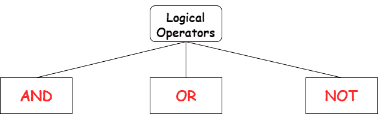
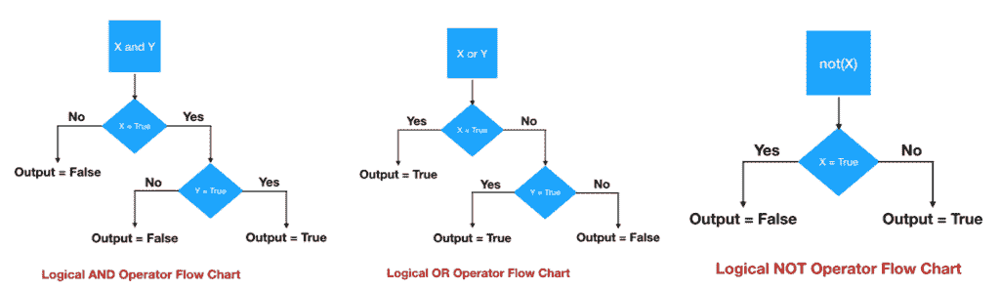

# Python 逻辑运算符

> 原文：<https://www.askpython.com/python/python-logical-operators>

Python 操作符是告诉 Python 解释器执行某些操作任务的符号/单词。逻辑运算符用于组合多个布尔语句。

Python 中有三个逻辑运算符。

1.  和
2.  或者
3.  不



Python Logical Operators

* * *

## Python 逻辑运算符流程图

下图描述了逻辑运算符的流程图。



Python Logical Operators Flowchart

* * *

## Python 中的逻辑 AND 运算符

当**两个语句/条件**都**为真**时，语句返回为真。

### 示例:

```py
a=20
b=10
if a > 0 and b > 0
  print("Both a and b are positive numbers.")

```

**输出**:a 和 b 都是正数。

* * *

## Python 中的逻辑 OR 运算符

当**任一语句/条件**为**真**时，语句返回真。

### 示例:

```py
a=20
b= -10
if a > 0 or b > 0
  print("True")

```

**输出**:真

* * *

## Python 中的逻辑 NOT 运算符

该运算符处理单个值。它**反转**结果，即如果语句为**真**，not 运算符会将语句转换为**假**，反之亦然。

### 示例:

```py
a=50
print(not(a % 4 or a > 0))  

```

**输出**:假

在上面的例子中，条件`a % 4 or a > 0` 评估为**真**。但是，由于我们使用了 not 语句，它会反转结果，即它提供的结果为 **False** 。