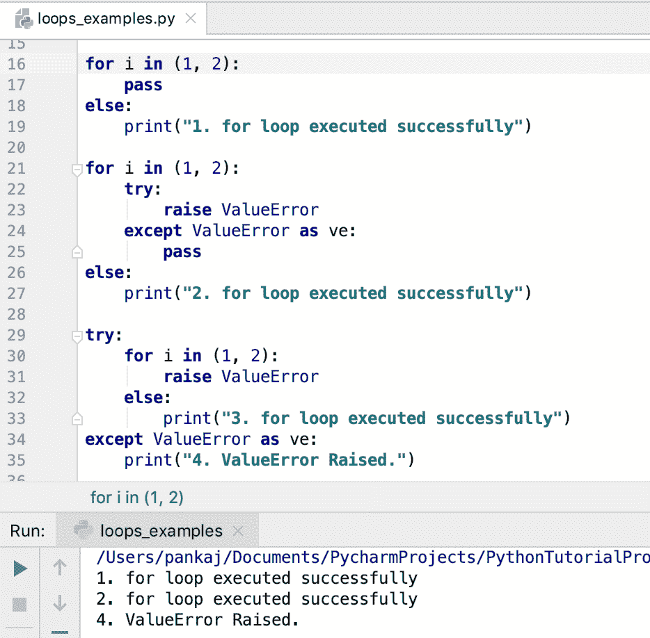
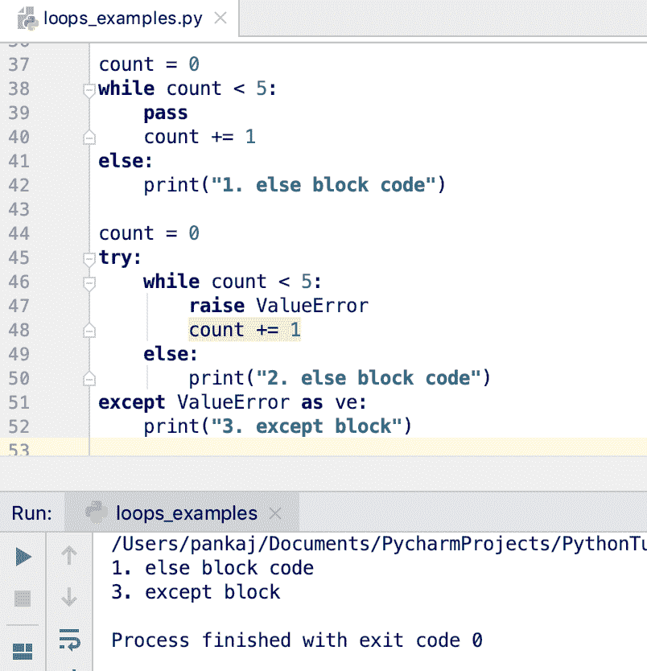
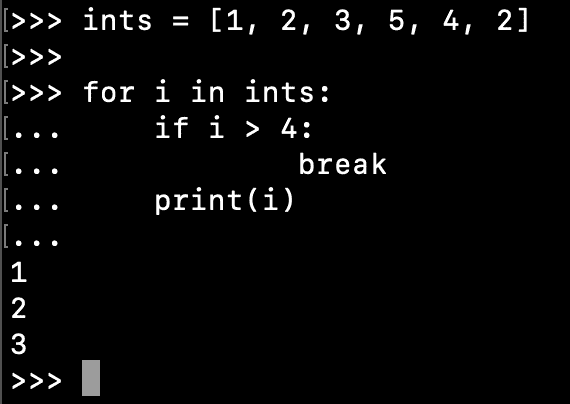
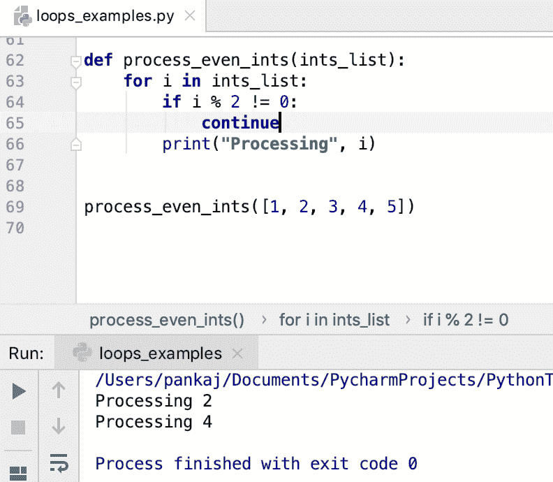
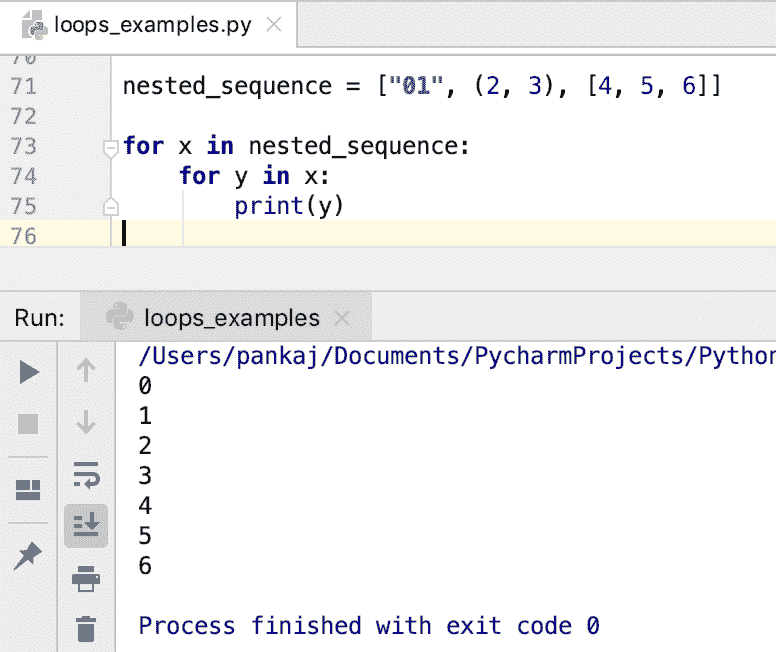

# Python 循环——关于 Python 中的循环你必须知道的事情

> 原文：<https://www.askpython.com/python/python-loops-in-python>

*   我们可以在 Python 中使用[创建循环](https://www.askpython.com/python/python-for-loop)，使用[创建循环](https://www.askpython.com/python/python-while-loop)。
*   for 循环用于迭代一组条目，如[元组](https://www.askpython.com/python/tuple/python-tuple)、[列表](https://www.askpython.com/python/list/python-list)、集合、[字典](https://www.askpython.com/python/dictionary/python-dictionary-dict-tutorial)、字符串等。
*   Python for 循环总是与“in”[操作符](https://www.askpython.com/python/python-operators)一起使用。
*   while 循环用于执行一个代码块，直到指定的条件变为`False`。
*   Python 有两个循环控制语句——break 和 continue。
*   Python 也支持嵌套循环。
*   如果循环自然终止，我们可以将“else”块与 for 循环和 while 循环一起使用来执行代码块。

* * *

## Python 循环语法

### 1.for 循环语法

```py
for element in sequence:
    # for statement code block
else: # optional
    # else block code

```

### 2.while 循环语法

```py
while condition:
    # while block code
else: # optional
    # else block code

```

* * *

## Python for 循环示例

让我们看一个简单的 for 循环示例，它遍历序列、集合和字典项。

### 1.在字符串字符上循环

```py
>>> str = "Python"
>>> for c in str:
...     print(c)
... 
P
y
t
h
o
n
>>> 

```

* * *

### 2.在元组元素上循环

```py
>>> t = (1,2,3)
>>> for i in t:
...     print(i)
... 
1
2
3
>>>

```

* * *

### 3.循环遍历列表元素

```py
>>> fruits = ["Apple", "Banana", "Grapes"]
>>> 
>>> for fruit in fruits:
...     print(fruit)
... 
Apple
Banana
Grapes
>>> 

```

* * *

### 4.循环遍历一组元素

```py
>>> my_set = set("ABCBA")
>>> 
>>> for c in my_set:
...     print(c)
... 
C
B
A
>>> 

```

请注意，该集合是一个无序序列，因此如果您运行相同的代码片段，输出可能会有所不同。

* * *

### 5.循环遍历字典条目

我们可以使用 dictionary items()方法来获取字典项的视图。然后在 for 循环中将它们解包为逗号分隔的值。

```py
>>> num_dict = {1: "one", 2: "two", 3: "three"}
>>> 
>>> for k, v in num_dict.items():
...     print(f'{k}={v}')
... 
1=one
2=two
3=three
>>>

```

* * *

## Python while 循环示例

让我们看一些在 Python 中使用 while 循环的例子。

### 1.循环固定次数

假设我们必须运行一个代码块 5 次。我们可以用 while 循环来写这个循环。

```py
>>> count = 5
>>> 
>>> while count > 0:
...     print("run this code")
...     count -=1
... 
run this code
run this code
run this code
run this code
run this code
>>>

```

* * *

### 2.循环随机次数

```py
from random import Random

def change_count():
    global count
    r = Random()
    count = r.randint(0, 12)

count = 0
while count < 10:
    print("print this random times")
    change_count()

```

这里我们使用 Random class 来改变 count 的值。因此 while 循环将随机运行多次。

* * *

## 将 else 语句与循环一起使用

我们可以在 for-loop 和 while-loop 中使用 else 语句。

### 1.else with for 循环

```py
for i in (1, 2):
    pass
else:
    print("1\. for loop executed successfully")

for i in (1, 2):
    try:
        raise ValueError
    except ValueError as ve:
        pass
else:
    print("2\. for loop executed successfully")

try:
    for i in (1, 2):
        raise ValueError
    else:
        print("3\. for loop executed successfully")
except ValueError as ve:
    print("4\. ValueError Raised.")

```



Loops In Python

请注意，当异常在 for 循环中引发并且没有被处理时，else 块代码不会被执行。这种行为在 while 循环中也是一样的。

* * *

### 2.else 与 while 循环

```py
count = 0
while count < 5:
    pass
    count += 1
else:
    print("1\. else block code")

count = 0
try:
    while count < 5:
        raise ValueError
        count += 1
    else:
        print("2\. else block code")
except ValueError as ve:
    print("3\. except block")

```

**输出:**



Python while loop with else block

* * *

## Python 循环控制语句

Python 有两个循环控制语句。

1.  [突破](https://www.askpython.com/python/python-break-statement)
2.  [继续](https://www.askpython.com/python/python-continue-statement)

### 1.循环中的中断语句

```py
ints = [1, 2, 3, 5, 4, 2]

for i in ints:
    if i > 4:
        break
    print(i)

```



Python Loop Control Statement – break

* * *

### 2.循环中的 continue 语句

```py
def process_even_ints(ints_list):
    for i in ints_list:
        if i % 2 != 0:
            continue
        print("Processing", i)

process_even_ints([1, 2, 3, 4, 5])

```

**输出:**



Python Loop Control Statement – continue

* * *

## Python 中的嵌套循环

在 Python 中，我们可以有任何层次的嵌套循环。我们可以使用 for-loop 和 while loop 来创建嵌套循环。

下面是一个使用嵌套循环打印嵌套列表元素的简单例子。

```py
nested_sequence = ["01", (2, 3), [4, 5, 6]]

for x in nested_sequence:
    for y in x:
        print(y)

```



Nested Loops In Python

* * *

## 结论

Python for 循环和 while 循环足以创建任何类型的循环。我们可以使用 break 和 continue 语句来控制循环执行流程。您还可以使用“else”块来记录循环的成功执行。

* * *

## 参考资料:

*   [用于声明正式文件](https://docs.python.org/3.7/tutorial/controlflow.html#for-statements)
*   [while 语句文档](https://docs.python.org/3.7/reference/compound_stmts.html#while)