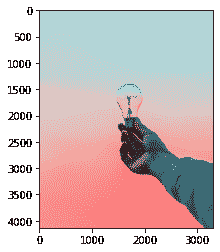
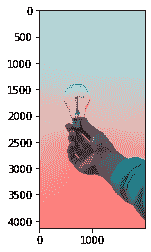
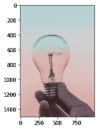
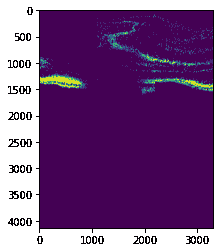
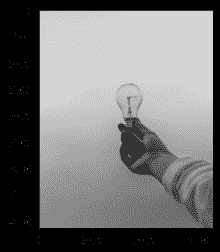

# 图像处理用 Mahotas 简介

> 原文：<https://www.askpython.com/python-modules/python-mahotas-for-image-processing>

嘿程序员们！我相信你已经实现了多个图像处理库。但是你知道蟒蛇的口袋里总有一些小把戏吗？！它还有另一个名为`Mahotas`的计算机视觉和图像处理库。

这个库是在`C++ and operates on NumPy arrays`中实现的，这使得它更快。目前，它包含`around 100`计算机视觉和图像处理功能。

***也读:[Python 中显示图像的 5 种方式](https://www.askpython.com/python/examples/display-images-using-python)***

在本教程中，我们将从使用 Mahotas 库进行一些简单的图像操作开始。在我们继续之前，我们将从使用`pip`命令安装库开始。使用下面显示的命令也可以做到这一点。

```py
pip install mahotas

```

安装完库之后，我们将继续将库导入到程序中。我们将为图像显示相关的功能导入`pylab`。

```py
import mahotas
from pylab import imshow, show

```

您可以使用任何图像进行图像处理。对于本教程，我们将使用来自互联网的随机图像。我们将使用`mahotas.imread`加载图像，使用`imshow`函数显示图像。

```py
img = mahotas.imread('sample.jpg')
imshow(img)
show()

```



Mahotas Output 1

`mean of an image`用于多种目的，包括图像处理中的降噪。Mahotas 能够计算图像的平均值，但一次仅限于一个通道，因为我们的图像是彩色的，所以我们将一次减少到一个通道。

```py
img0 = img[:,:,0]
img1 = img[:,:,1]
img2 = img[:,:,2]
mean0 = img0.mean() 
mean1 = img1.mean()
mean2 = img2.mean() 
print("Mean Value for the channel 1 is ", mean0) 
print("Mean Value for the channel 2 is ", mean1)
print("Mean Value for the channel 3 is ", mean2)

```

我正在使用的图像总共有 3 个通道。因此，我分别计算 3 个通道的 3 个平均值。

```py
Mean Value for the channel 1 is  195.63318904447684
Mean Value for the channel 2 is  172.86992779952305
Mean Value for the channel 3 is  172.8701535539508

```

使用该库，我们还可以使用下面的代码片段来裁剪图像。您可以将起始像素和结束像素指定为您想要的任何像素值。

我将首先尝试获得灯泡和手的焦点，它位于 x 轴上 1000 和 3000 像素值之间。

```py
img2 = img[:, 1000:3000]  
imshow(img2) 
show() 

```



Mahotas Output 2

让我们不要试图沿着 y 轴进一步裁剪图像，而只是聚焦在灯泡上。请看下面的代码片段。我们已经像之前一样从完整图像的绘图中的 x 轴和 y 轴选择了值。

```py
img2 = img[1000:2500, 1300:2300]  
imshow(img2) 
show() 

```



Mahotas Output 3

`roundness`是图像中的物体与形成一个完美的圆形有多相似/接近的量度。让我们来看两个不同的值，一个是完整的图像，另一个是有灯泡聚焦的图像。价值观的差异非常明显。

```py
img1 = img[::,1]
r1 = mahotas.features.roundness(img1) 
r2 = mahotas.features.roundness(img2) 
print("Roundness of the full image : ", r1)
print("Roundness of the bulb focused image : ", r2)

```

代码的输出如下所示:

```py
Roundness of the full image :  0.0
Roundness of the bulb focused image :  0.0009273648133338048

```

图像的`local maxima`是图像中被识别为`local peaks`的区域。可以使用下面的代码行显示它们。

```py
img2 = img.max(1)
lmaxim = mahotas.locmax(img) 
imshow(lmaxim)
show()

```



Mahotas Output 4

在下面代码片段中的`Overlay image`的帮助下，我们可以得到图像的灰度版本。

```py
img = img[:, :, ]  
ol = mahotas.overlay(img) 
imshow(ol) 
show()

```



Mahotas Output 5

## 结论

在本教程中，我们了解并学习了开发人员如何在一些基本函数的帮助下使用 mahotas 进行图像处理。图书馆里还有更多可用的功能。敬请关注更多内容！

***也读作:[Python 中的图像处理——边缘检测、大小调整、腐蚀、膨胀](https://www.askpython.com/python/examples/image-processing-in-python)***