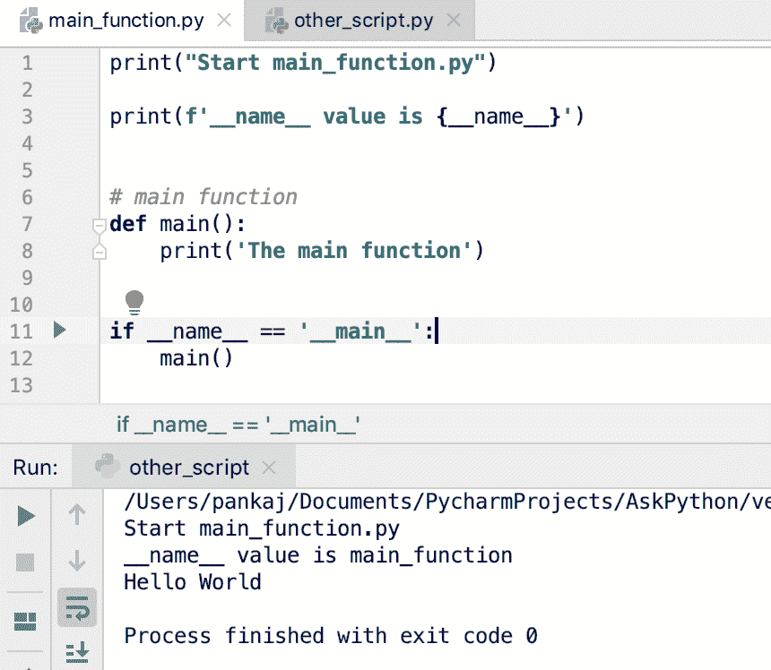

# Python 主函数示例

> 原文：<https://www.askpython.com/python/python-main-function>

Python main function 的思想是只有在直接执行 Python 脚本时才执行一些代码。当同一个脚本作为 Python 模块导入到另一个程序中时，该函数不应执行。

* * *

## 如何写一个 Python 主函数？

当我们运行一个 python 程序时，它会执行其中的所有语句。因此，如果我们有一个 main()函数，并在程序中直接调用它，它将一直被执行，即使脚本是作为一个模块导入的。

但是，我们希望只在脚本被直接执行时才执行主函数。我们必须使用另一种方法来实现 Python 的 main 函数。

每当我们执行一个 Python 脚本时，它的作用域被设置为`__main__`，并且它可以被`__name__`变量检索。

但是，当脚本作为模块导入时，范围值被设置为 python 脚本的名称。我们可以在 if 语句中使用作用域名称来调用 main()方法。

让我们用一个简单的例子来研究它。Python 脚本名为`main_function.py`。

```py
print("Start main_function.py")

print(f'__name__ value is {__name__}')

# main function
def main():
    print('The main function')

if __name__ == '__main__':
    main()

```

让我们使用 Python 解释器直接运行这个脚本。

```py
$ python3.7 main_function.py 
Start main_function.py
__name__ value is __main__
The main function
$ 

```

我们正在打印 __name__ 变量值，它是 __main__。这就是 if 条件返回 True 并执行 main()函数的原因。



Python Main Function

* * *

## 当 Python 脚本作为模块导入时

现在，让我们看看当我们在另一个程序中将脚本作为 Python 模块导入时会发生什么。我正在创建另一个名为`other_script.py`的 Python 脚本。

```py
import main_function

print('Hello World')

```

让我们看看当我们用 Python 解释器运行这个脚本时会发生什么。

```py
$ python3.7 other_script.py 
Start main_function.py
__name__ value is main_function
Hello World
$

```

main_function 模块的作用域名称是 main_function。这会导致 if 条件返回 False，并且不执行 main()方法。

* * *

## Python 主函数最佳实践

*   习惯上保持主函数名为 main()。我们也可以保留任何其他名称，但是最好遵循命名约定。
*   最好将所有可直接执行的脚本代码放在 main()函数中。因为大多数时候我们不希望它们在脚本作为模块导入时执行。

* * *

## 参考资料:

*   [Python.org 文件](https://docs.python.org/3.7/library/__main__.html)