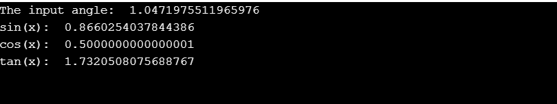
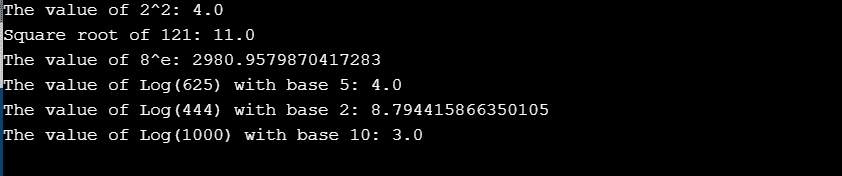
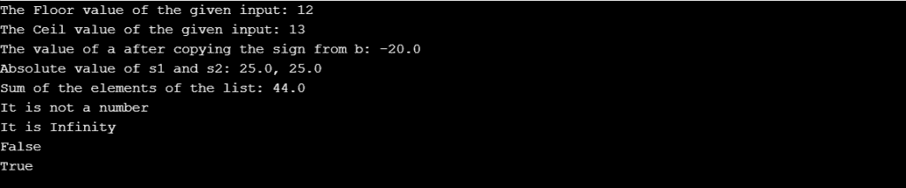

# Python 数学模块

> 原文：<https://www.askpython.com/python-modules/python-math-module>

Python 数学模块帮助用户直接访问程序中的数学函数。因此，它有助于解决和减少复杂的计算。

为了利用数学模块的功能，我们需要使用`**import math**`语句将其导入到我们的代码中。

数学模块不支持复杂的数据类型。`cmath`模块为复杂数据类型提供功能。

* * *

## Python 数学模块中的函数列表

| 数学模块中的函数 | 功能描述 |
| 阶乘 | 返回 x 的阶乘 |
| 复制符号(x，y) | 返回带有 y 符号的 x |
| 晶圆厂(十) | 返回 x 的绝对值 |
| 上限(x) | 返回大于或等于 x 的最小整数。 |
| 楼层(x) | 返回小于或等于 x 的最大整数 |
| fmod(x, y) | 返回 x 除以 y 的余数 |
| frexp(x) | 返回 x 的尾数和指数对(m，e) |
| fsum(可迭代) | 返回 iterable 中值的精确浮点和 |
| isfinite(x) | 如果 x 既不是无穷大也不是 NaN(不是数字)，则返回 True |
| isinf(x) | 如果 x 是正无穷大或负无穷大，则返回 True |
| isnan(x) | 如果 x 是 NaN，则返回 True |
| ldexp(x，I) | 返回 x * (2**i) |
| modf(x) | 返回 x 的小数和整数部分 |
| trunc(x) | 返回 x 的截断整数值 |
| exp(x) | 返回 e**x |
| expm1(x) | 返回 e * * x–1 |
| log(x[，base]) | 返回以 x 为底的对数(默认为 e) |
| log1p(x) | 返回 1+x 的自然对数 |
| 对数 2(x) | 返回 x 的以 2 为底的对数 |
| log10(x) | 返回 x 的以 10 为底的对数 |
| 功率(x，y) | 返回 x 的 y 次幂 |
| sqrt(x) | 返回 x 的平方根 |
| 助理文书主任(十) | 返回 x 的反余弦值 |
| 阿辛(x) | 返回 x 的反正弦 |
| 阿坦(x) | 返回 x 的反正切值 |
| atan2(y，x) | 返回 atan(y / x) |
| cos(x) | 返回 x 的余弦值 |
| 海波(x，y) | 返回欧几里得范数 sqrt(x*x + y*y) |
| 罪恶(x) | 返回 x 的正弦值 |
| 谭(x) | 返回 x 的正切值 |
| 度(x) | 将角度 x 从弧度转换为角度 |
| radians(x) | 将角度 x 从度转换为弧度 |
| acosh(x) | 返回 x 的反双曲余弦值 |
| 阿西卡(x) | 返回 x 的反双曲正弦值 |
| 阿坦赫(x) | 返回 x 的反双曲正切值 |
| cosh(x) | 返回 x 的双曲余弦值 |
| 辛赫(x) | 返回 x 的双曲余弦值 |
| tanh(x) | 返回 x 的双曲正切值 |
| 电流变流体(x) | 返回 x 处的误差函数 |
| erfc(x) | 返回 x 处的互补误差函数 |
| 伽玛(x) | 返回 x 点的伽玛函数 |
| 真(x) | 返回伽玛函数在 x 点的绝对值的自然对数 |
| 圆周率 | 数学常数，圆的周长与直径之比(3.14159…) |
| e | 数学常数 e (2.71828…) |

* * *

## Python 数学三角函数

下面的代码代表了数学模块的一些三角函数。

**举例:**

```py
import math

angle_degree = 60
angle_radian = math.radians(angle_degree)

print('The input angle: ', angle_radian)
print('sin(x): ', math.sin(angle_radian))
print('cos(x): ', math.cos(angle_radian))
print('tan(x): ', math.tan(angle_radian))

```

**输出:**



*Output-Trigonometric Functions*

* * *

## Python 数学幂和对数函数

下面的代码代表了数学模块的一些对数函数。

**举例:**

```py
import math
print('The value of 2^2: ' + str(math.pow(2, 2)))
print('Square root of 121: ' + str(math.sqrt(121)))
print('The value of 8^e: ' + str(math.exp(8)))
print('The value of Log(625) with base 5: ' + str(math.log(625, 5)))
print('The value of Log(444) with base 2: ' + str(math.log2(444)))
print('The value of Log(1000) with base 10: ' + str(math.log10(1000)))

```

**输出:**



*Output-Logarithmic Functions*

* * *

## Python 数学数值表示函数

下面的代码代表了数学模块的一些数值函数。

**举例:**

```py
import math

input = 12.35
print('The Floor value of the given input: ' + str(math.floor(input)))

print('The Ceil value of the given input: ' + str(math.ceil(input)))

a = 20
b = -10

print('The value of a after copying the sign from b: ' + str(math.copysign(a, b)))

s1 = -25
s2 = 25

print('Absolute value of s1 and s2: ' + str(math.fabs(s1)) + ', ' + str(math.fabs(s2)))

my_input = [0,1,2,3,4,5,6,7,8,9,-1]
print('Sum of the elements of the list: ' + str(math.fsum(my_input)))

p = float('nan')
if math.isnan(p):
    print('It is not a number')
q = float('inf')
y = 10
if math.isinf(q):
    print('It is Infinity')
print(math.isfinite(q)) #q is not a finite number
print(math.isfinite(y)) #y is a finite number

```

**输出:**



*Output-Numeric Functions*

* * *

## Python 数学 PI

Python 数学模块提供了一个称为 pi 的常数，可用于数学计算，例如:圆的面积。

**举例:**

```py
import math

print('Value of pi: ', math.pi)

radius = 2

print('Area of Circle: ', math.pi * (radius ** 2))

```

**输出:**

`Value of pi: 3.141592653589793
Area of Circle: 12.566370614359172`

* * *

## 结论

因此，在本文中，我们已经用 Python 实现了数学模块提供的大部分功能。

* * *

## 参考

*   Python 数学模块
*   [Python 数学函数文档](https://docs.python.org/3/library/math.html)