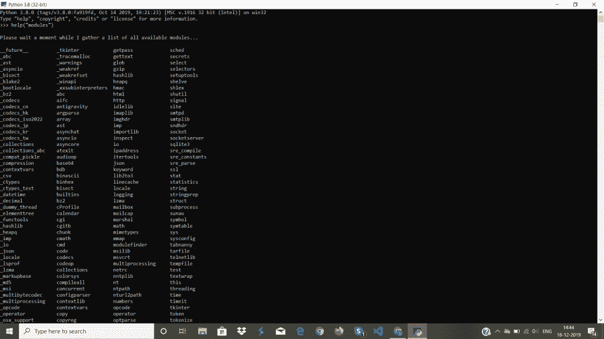

# Python 模块简介

> 原文：<https://www.askpython.com/python-modules/python-modules>

模块是预定义的文件，包含描述类、方法、变量等基本功能的 python 代码。它由不同的函数、类和目录中的一组文件组成。模块也可以称为库。这些基本上是预定义的方法，可用于提高代码效率和减少冗余。

模块绑定代码，减少代码中频繁使用的函数的重复。因此，它使代码更加清晰易懂。

**例子:**

*   操作系统（Operating System）
*   时间
*   数学
*   MatPlotlib

* * *

## Python 模块的机制


Python Module Mechanism

通过程序导入模块时，Python 解释器会从以下任一位置获取模块:

*   程序目录
*   PYTHONPATH 变量中的目录
*   缺省目录

* * *

## 模块列表

通过在命令提示符(解释器 shell)中执行以下命令，可以找到 Python 中可用模块的列表。

>>>帮助(“模块”)



Python Module List

* * *

## 从 Python 标准路径导入模块

**语法**:

导入模块名称

**举例:**

导入数学

* * *

## 从其他来源导入模块

为了从其他和新的来源获取和使用模块，我们需要安装 Python PIP。

Python pip 是一个从 index 安装 Python 模块或者使用 Anaconda 这样的管理器的软件。

**运行以下命令，使用 python pip 从新的源代码安装模块:**

python -m pip3 安装模块名称

**运行以下命令，使用 Ananconda 从新的源代码安装模块:**

conda 安装模块 _ 名称

**示例:安装 numpy 的步骤**

python -m pip3 安装 numpy
conda 安装 numpy
sudo 安装 python3-numpy

* * *

## 示例:内置模块

```py
import math 

print (math.sqrt(121)) 

print (math.pi) 

print (dir(math))

```

**输出**:

11.0
3.1415926535893
[‘doc’、‘loader’、‘name’、‘package’、‘spec’、‘acos’、‘acosh’、‘asin’、‘asinh’、‘atan’、‘atan2’、‘atan’、‘ceil’、‘copy sign’、‘T2’、‘cos’、‘cosh’、‘degrees’、‘e’、‘ERF’、‘exp’、‘expm 1’、‘fabs’、‘factor’、‘floor’、‘fmod’、‘frexp’、‘fsum’、‘gamma’、‘hypf’

在上面的例子中，dir()方法给出了数学模块中的函数名、变量等。

* * *

## 模块中的变量

除了方法和类，模块还可以包含变量。

**举例**:

```py
Fruit = {
  "name": "Apple",
  "color": "Green"
}

```

将上述代码片段保存在文件 Module1.py 中

```py
import Module1

x = Module1.Fruit["name"]
print(x)

```

**输出:**

苹果

在上面这段代码中，Module1 被导入并在其上执行功能。

* * *

## Python 中模块和包的区别

**Python 模块**:这些是一组预定义的文件，包含描述类、方法、变量等基本功能的 Python 代码。

**Python 包**:它是一个保存并包含模块和子包的目录。

* * *

## 参考

*   Python 模块
*   [Python 模块-文档](https://docs.python.org/3/tutorial/modules.html)