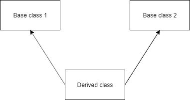

# Python 多重继承

> 原文：<https://www.askpython.com/python/oops/python-multiple-inheritance>

当一个类从一个以上的类继承时，它被称为多重继承。Python 支持多重继承，而 Java 不支持。所有超/基类的属性都被继承到派生/子类中。



Python Multiple Inheritance

* * *

## Python 多重继承语法

多重继承的语法也与单一继承相似。顺便说一下，派生类声明了所有基类的属性和方法。

```py
class Base1:
    pass

class Base2:
    pass

class MultiDerived(Base1, Base2):
    pass

```

* * *

## Python 多重继承示例

```py
# first parent class 
class Manager(object):                   
      def __init__(self, name, idnumber): 
            self.name = name 
            self.idnumber = idnumber 

# second parent class       
class Employee(object):                 
      def __init__(self, salary, post): 
            self.salary = salary 
            self.post = post 

# inheritance from both the parent classes       
class Person(Manager, Employee):         
      def __init__(self, name, idnumber, salary, post, points): 
            self.points = points 
            Manager.__init__(self, name, idnumber) 
            Employee.__init__(self, salary, post)    
            print(self.salary) 

ins = Person('Rahul', 882016, 75000, 'Assistant Manager', 560)

```

**输出** : 75000

* * *

## 多重分辨率顺序

方法解析顺序(MRO)是一种解析类的变量或函数的方法。

*   在多重继承用例中，首先在当前类中查找属性。如果失败，那么下一个要搜索的地方是父类。
*   如果有多个父类，那么优先顺序是深度优先，然后是左右路径。
*   MRO 确保一个类总是在它的父类之前，对于多个父类，保持基类元组的顺序并避免歧义。

* * *

## 解释 MRO 的例子

```py
class Agile:
    def create(self):
        print(" Forming class Agile")

class Dev(Agile):
    def create(self):
        print(" Forming class Dev")

class QA(Agile):
    def create(self):
        print(" Forming class QA")

# Ordering of classes
class Sprint(Dev, QA):
    pass

sprint = Sprint()
sprint.create()

```

**输出**:成型类开发

* * *

## 方法解析顺序的方法(MRO)

Python 提供了一个 *__mro__* 属性和 *mro()* 方法。有了这些，你就可以得到解析顺序了。

```py
class Material:
    def create(self):
        print(" Creating class Appliance")

class Pencil:
    def create(self):
        print(" Creating class Pencil")

    # Order of classes

class Pen(Material, Pencil):
    def __init__(self):
        print("Constructing Pen")

appl = Pen()

# Display the lookup order
print(Pen.__mro__)
print(Pen.mro())

```

**输出**:

```py
Constructing Pen
(<class '__main__.Pen'>, <class '__main__.Material'>, <class '__main__.Pencil'>, <class 'object'>)
[<class '__main__.Pen'>, <class '__main__.Material'>, <class '__main__.Pencil'>, <class 'object'>]

```

## 参考资料:

*   [Python.org 关于多重继承的文件](https://docs.python.org/3/tutorial/classes.html#multiple-inheritance)
*   [Python.org 法决议顺序文件](https://www.python.org/download/releases/2.3/mro/)