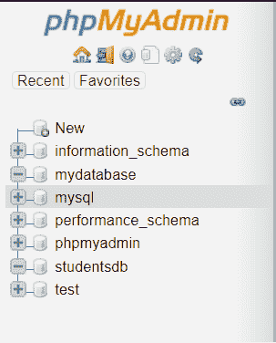
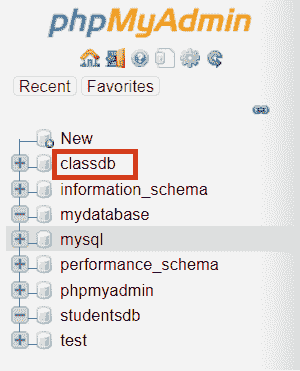
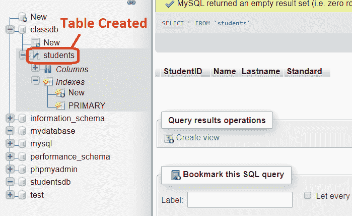
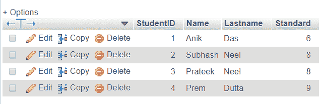
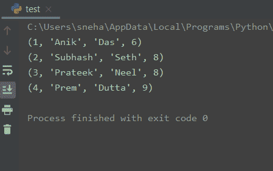
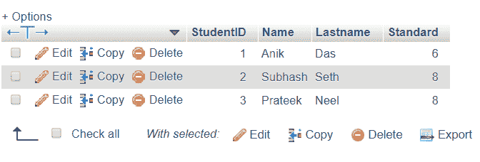

# Python MySQL 教程-完整指南

> 原文：<https://www.askpython.com/python-modules/python-mysql-tutorial>

今天在本教程中，我们将讨论如何开发和集成 Python MySQL 数据库。

* * *

## 什么是 MySQL

[MySQL](https://www.mysql.com/) 是一个开源的关系数据库管理系统，可以用来以**表**的形式存储数据。此外，**表**是相关数据的集合，由**列**和**行**组成。

MySQL 是一个广泛使用的免费数据库软件，它运行在服务器上，并提供一系列可以在其上执行的操作。当然，我们可以将 MySQL 集成到我们的 Python 程序中，通过 **MySQL 服务器**上的**数据库**执行数据事务。

* * *

## 在 Python 上安装 MySQL

我们可以使用已经提供的各种模块或技术来使用 **Python MySQL** 。有些是，

1.  [MySQL 连接器 Python](https://dev.mysql.com/downloads/connector/net/)
2.  [PyMySQL](https://pymysql.readthedocs.io/en/latest/)
3.  [MySQLDB](http://mysql-python.sourceforge.net/MySQLdb.html)
4.  [mysqlclient](https://pypi.org/project/mysqlclient/)
5.  [我们的 SQL](https://pythonhosted.org/oursql/)

上述所有技术都使用相同的语法和方法来连接 MySQL 数据库并按照 [PEP 249](https://peps.python.org/pep-0249/) 执行操作。

因此，我们可以使用上面的任何一个模块访问一个 MySQL 数据库服务器。此外，只安装其中一个是有意义的。我们可以在 shell 中使用简单的 [PIP](https://www.askpython.com/python-modules/python-pip) 命令来安装它们，如下所示。

```py
pip install pymysql

```

这里，我们以 **PyMySQL** 为例。

在开始之前，请确保您的系统中已经设置了一个 MySQL 数据库，并且它工作正常。您拥有数据库启动连接的登录名和密码。

* * *

## Python MySQL 中的基本方法

现在我们已经安装了`pymysql`，让我们来看看我们今天将要使用的一些基本方法。

### 1.MySQL 连接()

`pymysql.connect()`方法从 Python 建立到 **MySQL** 数据库的连接，并返回一个`MySQLConnection`对象。然后，这个对象可以用来访问整个数据库并执行其他操作。它接受**主机**、**用户**、**密码**和**数据库**等参数作为你要连接的数据库的规格。

*   `user`–对于本地服务器，用户应该被称为**“根用户”**，否则您可以通过[此链接](https://dev.mysql.com/doc/refman/8.0/en/create-user.html)创建一个用户。
*   `password`–这取决于您在创建用户时使用的密码。数据库也可以是无密码的(对于我们的例子)，
*   `host`–对于使用 **xampp** 的本地服务器，我们可以使用`localhost`来访问数据库。我们也可以使用服务器的 **IP** 地址或**名称**来访问主机，
*   `database`–这是您设置要使用的数据库名称。如果你已经创建了一个数据库，你可以在这里输入名称。

### 2\. MySQL cursor()

`cursor()`方法创建一个**光标**对象，该对象可以进一步用于对数据库执行 **CRUD** (创建、检索、更新和删除)操作。

### 3.MySQL execute()

`execute()`方法使用先前创建的游标执行传递给它的 SQL 查询。

### 4.MySQL 关闭()

游标和 **MySQLConnection** 类中定义的`close()`方法用于**关闭**各自的对象。

### 5.MySQL 提交()

`commit()`方法向 MySQL 服务器发送一条`COMMIT`语句，从而提交当前的数据事务。

### 6.MySQL fetchall()

`fetchall()`方法获取查询结果集的所有行，并使用游标对象返回元组的**列表。**

### 7.MySQL 是 _connected()

这个方法检查到 MySQL 服务器的连接是否可用。如果是，则返回`True`，如果不是，则返回`False`。

* * *

## Python MySQL 入门

在本教程中，我们将使用 **Xampp** 控制面板连接到本地服务器并创建我们的数据库。在 Xampp 中启动 Apache 和 MySQL 就可以完成这项工作。

此外，我们可以直接点击`https://localhost/phpmyadmin/`来查看我们的本地服务器界面，如下所示。



Initial phpMyAdmin

这里， **mydatabase** 和**studentdb**是我之前创建的一些数据库。

## 用 Python 创建 MySQL 数据库

如果您之前没有创建数据库，您可以通过使用`cursor.execute()`方法执行 **CREATE** 查询来轻松创建一个。与服务器建立连接后。看看下面的代码。

```py
import pymysql

#server connection
mydb = pymysql.connect(
  host="localhost",
  user="root",
  passwd=""
)

mycursor = mydb.cursor() #cursor created

#creating database with name classdb
mycursor.execute("CREATE DATABASE classdb;")

```



Create New Database

执行上述代码后，使用 **phpMyAdmin** 可以在数据库中看到上述变化。在这里，新数据库`classdb`被成功创建。

如果已经有了一个数据库，只需在`connect()`方法中指定名称，就可以轻松地连接到它。如下图。

```py
import pymysql

#server connection
mydb = pymysql.connect(
  host="localhost",
  user="root",
  database="classdb", #database created before
  passwd=""
)

mycursor = mydb.cursor() #cursor created

#work with the cursor here like printing initial database data

#closing the cursor
mycursor.close()

```

## Python MySQL 数据库上的操作

在本节中，我们将重点关注我们可以在 MySQL 数据库上执行的各种操作( **CRUD** )。

### 1.python MySQL–创建表格

在我们连接到想要使用的数据库，并创建了一个**光标**对象后，我们可以使用`execute()`方法和**创建**表来轻松执行查询。

```py
import pymysql

#server connection
mydb = pymysql.connect(
  host="localhost",
  user="root",
  database="classdb", #database
  passwd=""
)

mycursor = mydb.cursor() #cursor created

#work with the cursor
query = "CREATE TABLE Students(StudentID int  PRIMARY KEY AUTO_INCREMENT, Name CHAR(20), Lastname CHAR(20),Standard int);"

mycursor.execute(query)
#closing the cursor
mycursor.close()

```



Table students is created

我们可以看到，创建了一个包含列**学生 ID** 、**姓名**、**姓氏**和**标准**的表。

### 2.Python MySQL 插入

现在我们已经创建了一个表，我们可以通过再次使用 cursor 对象执行查询来将**行插入其中。**

```py
import pymysql

#server connection
mydb = pymysql.connect(
  host="localhost",
  user="root",
  database="classdb", #database
  passwd=""
)

mycursor = mydb.cursor() #cursor created

#work with the cursor
query1 = "INSERT INTO students(Name, Lastname, Standard) VALUES('Anik', 'Das', 6);"
query2 = "INSERT INTO students(Name, Lastname, Standard) VALUES('Subhash', 'Neel', 8);"
query3 = "INSERT INTO students(Name, Lastname, Standard) VALUES('Prateek', 'Neel', 8);"
query4 = "INSERT INTO students(Name, Lastname, Standard) VALUES('Prem', 'Dutta', 9);"

mycursor.execute(query1)
mycursor.execute(query2)
mycursor.execute(query3)
mycursor.execute(query4)

#closing the db
mydb.commit()
mydb.close()

```



After Insertion

这些行已成功插入数据库。

### 3.Python 选择 MySQL

正如我们前面提到的，`fetchall()`方法获取查询结果集的所有行，并使用 cursor 对象返回元组列表。

因此，通过应用一个查询来从数据库中选择一些独特的或想要的数据，我们可以使用游标的`fetchall()`方法和一个`for-loop`来显示它们。

```py
import pymysql

#server connection
mydb = pymysql.connect(
  host="localhost",
  user="root",
  database="classdb", #database
  passwd=""
)

mycursor = mydb.cursor() #cursor

#work with the cursor
res = "Select * from students;"

#executing the query
mycursor.execute(res)

rows = mycursor.fetchall()

#showing the rows
for row in rows:
   print(row)

#closing the db
mydb.commit()
mydb.close()

```

**输出:**

```py
(1, 'Anik', 'Das', 6)
(2, 'Subhash', 'Neel', 8)
(3, 'Prateek', 'Neel', 8)
(4, 'Prem', 'Dutta', 9)

```

### 4.Python MySQL 更新

此外，如果我们想要更新任何一组数据，我们可以使用如下所示的 **UPDATE** 查询。这里，我们尝试用 **StudentID** = **2** 来更新学生的`Lastname`(即 Subhash)。

```py
import pymysql

#server connection
mydb = pymysql.connect(
  host="localhost",
  user="root",
  database="classdb", #database
  passwd=""
)

mycursor = mydb.cursor() #cursor

#query to update database data
update_query = "UPDATE students set Lastname = 'Seth' WHERE StudentID = 2"

#executing the query
mycursor.execute(update_query)

#showing the rows
res = "Select * from students;"
mycursor.execute(res)
rows = mycursor.fetchall()

for row in rows:
   print(row)

#closing the db
mydb.commit()
mydb.close()

```

**输出:**



Update Output

可以看出，更新是成功的。

### 5.Python MySQL 删除

现在让我们尝试使用游标查询来删除一组数据。这里，我们尝试删除带有`Standard > 8`的条目。在本例中，只有一个(StudentID 4 和标准的 9)。

```py
import pymysql

#server connection
mydb = pymysql.connect(
  host="localhost",
  user="root",
  database="classdb", #database
  passwd=""
)

mycursor = mydb.cursor() #cursor

#query to delete database data
delete_query = "DELETE FROM students WHERE Standard > 8"

#executing the query
mycursor.execute(delete_query)

#showing the rows
res = "Select * from students;"
mycursor.execute(res)
rows = mycursor.fetchall()

for row in rows:
   print(row)

#closing the db
mydb.commit()
mydb.close()

```

**输出:**

```py
(1, 'Anik', 'Das', 6)
(2, 'Subhash', 'Seth', 8)
(3, 'Prateek', 'Neel', 8)

```



Delete Output

很明显，**删除**成功完成。

### 6.Python 在 MySQL 中删除了一个表

我们还可以在 MySQL 中使用 **DROP** 查询删除或删除一个表。这可以用来删除一个表，以便我们可以重用该名称，或者避免表名冲突。

```py
#query to drop table
drop_query = "DROP TABLE IF EXISTS students;"

#executing the query
mycursor.execute(drop_query)

```

上面的代码片段**删除了**我们之前创建的表`students`。

* * *

## Python MySQL 的优势

*   MySQL 是来自[甲骨文](https://www.oracle.com/mysql/)的免费且维护良好的软件。因此，它是完全可信和可靠的。
*   它很容易使用，既快又免费。
*   只需要结构化查询语言的基础知识。
*   它是独立于平台的，因此使用 Python 创建的数据库也可以使用其他平台来访问。
*   有各种模块可供选择，使用这些模块我们可以连接到 MySQL 服务器。

* * *

## 结论

所以在本教程中，我们理解了 **MySQL 在 Python** 中的用法。我们还举了一个例子来详细说明数据库上的 CRUD 操作。

今天就到这里，希望这篇文章有助于理解 Python MySQL 的基础知识。如有任何与 MySQL 相关的问题，欢迎使用下面的评论。

* * *

## 参考

*   [PEP 249 — Python 数据库 API](https://peps.python.org/pep-0249/) ，
*   MySQL 示例——日志开发帖子，
*   [MySQL 连接器/Python 编码示例](https://dev.mysql.com/doc/connector-python/en/connector-python-examples.html)–文档。