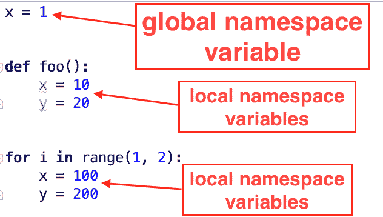

# Python 命名空间和变量范围解析(LEGB)

> 原文：<https://www.askpython.com/python/python-namespace-variable-scope-resolution-legb>

在本教程中，我们将学习 Python 命名空间、变量的作用域以及变量作用域解析的规则。

* * *

## 什么是 Python 命名空间？

Python 名称空间是将名称映射到对象的容器。在 Python 中，一切都是一个对象，我们给对象指定一个名称，这样我们以后就可以访问它。

您可以将名称空间看作是一个键-值对的字典，其中键是变量名，值是与之关联的对象。

```py
namespace = {"name1":object1, "name2":object2}

```

在 Python 中，可以同时存在多个独立的名称空间。变量名可以在这些名称空间中重用。

```py
function_namespace = {"name1":object1, "name2":object2}

for_loop_namespace = {"name1":object3, "name2":object4}

```

让我们看一个简单的例子，其中我们有多个名称空间。



Python Namespace Example

* * *

## Python 命名空间类型和生命周期

Python 名称空间可以分为四种类型。

1.  **本地名称空间**:函数、for-loop、try-except 块是本地名称空间的一些例子。当函数或代码块完成执行时，本地命名空间被删除。
2.  **封闭的名称空间**:当一个函数被定义在一个函数内部时，它会创建一个封闭的名称空间。它的生命周期与本地名称空间相同。
3.  **全局命名空间**:属于 python 脚本或者当前模块。模块的全局命名空间是在读取模块定义时创建的。通常，模块名称空间也会持续到解释器退出。
4.  **内置名称空间**:内置名称空间是在 Python 解释器启动时创建的，永远不会被删除。

* * *

## Python 变量范围

[Python 变量](https://www.askpython.com/python/python-variables)作用域定义了我们搜索变量的层次结构。例如，在上面的程序中，变量存在于不同的名称空间中。当我们想通过变量名访问变量值时，就在名称空间层次结构中进行搜索。

> [Python 变量–定义、打印、范围、删除、最佳实践](https://www.askpython.com/python/python-variables)

<about:blank>