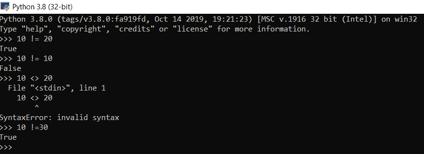
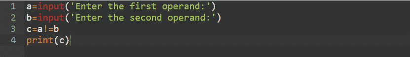
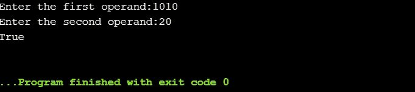
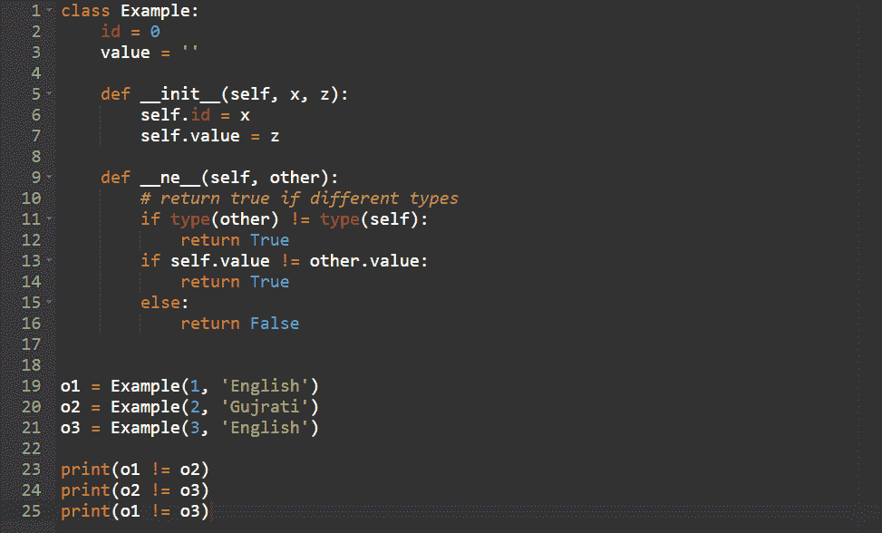
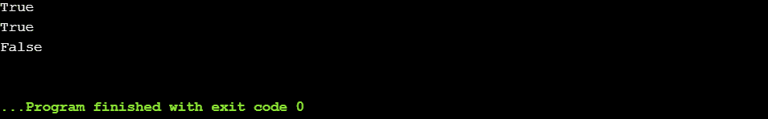

# Python 不等于运算符

> 原文：<https://www.askpython.com/python/python-not-equal-operator>

比较运算符确定操作数之间的关系，并将结果放入`True`或`False`。

Python 中的一个基本但重要的操作符是 not equal 操作符。

它返回真`**if the values on either side of the operator are unequal**`，即当`**two variables of same type have different values**`时返回真，否则返回假。

| 操作员 | 描述 |
| ！= | 不等于运算符，在 Python 2 和 Python 3 中都适用和可用。 |
| <> | Python 2 中的 Not equal 运算符，在 Python 3 及更高版本中已弃用。 |

* * *

## Python 不等于运算符语法

`operand1 != operand2`

**例** **1** :

在下面的代码片段中，10 <> 20 导致了一个语法错误，因为它在 Python 版本 3 及更高版本中已被弃用。

*Python Not Equal Operator*

**例二**:

*Python Not Equal Operator*

**输出**:

*Output Not Equal Operator*

* * *

## Python 不等于带有自定义对象的运算符

每当我们使用不等于操作符时，它就调用`**__ne__(self, other)**`函数。因此，用户可以为对象定义他们自己的定制实现，并操纵自然的或默认的结果/输出。

*Not Equal Custom Object*

**输出**:

*Output Not Equal Custom Object*

* * *

## 参考

*   Python 不等于运算符
*   Python 比较运算符
*   [Python 运算符](https://www.askpython.com/python/python-operators)