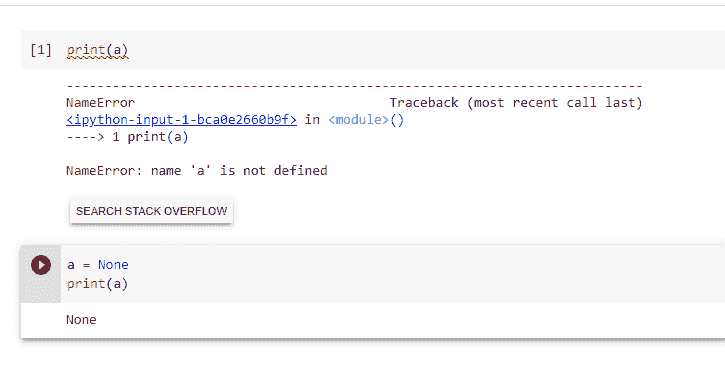

# Python NULL–如何在 Python 中识别 NULL 值？

> 原文：<https://www.askpython.com/python/oops/python-null>

我们先来了解一下 Python null 是什么意思，什么是 NONE 类型。在许多编程语言中， **null** 被用来表示一个空变量，或者一个不指向任何东西的指针。“null”基本上等于 0。而在 Python 中，没有“null”关键字可用。取而代之的是，'**' None**'用于此目的，它是一个对象。

* * *

## 什么是 Python null？

每当一个函数没有任何要返回的东西，也就是说，它不包含 return 语句，那么输出将是 None。

简而言之，这里的 None 关键字用于定义空变量或对象。None 是一个对象，数据类型为 NoneType 类。

```py
def func_no_return()
    a = 5
    b = 7
print(func_no_return())

None

```

* * *

**注:**

每当我们给一个变量赋值 None 时，所有赋给它的变量都指向同一个对象。不会创建新的实例。

在 Python 中，与其他语言不同，null 不仅仅是 0 的同义词，它本身就是一个对象。

```py
type(None)
<class 'NoneType'>

```

* * *

## 在 Python 中声明空变量

默认情况下，python 中的空变量是不声明的。也就是说，未定义的变量不同于空变量。为了理解，python 中的所有变量都是通过赋值产生的。看看下面的代码:



上面的代码显示了未定义变量和 None 变量之间的区别。

* * *

## 如何在 Python 中检查变量是否为 none？

您可以使用' is '运算符或' == '运算符检查变量是否为 None，如下所示

*   **使用[‘是’运算符](https://www.askpython.com/course/python-course-bitwise-operators)**

```py
#declaring a None variable
a = None

if a is None :                   #checking if variable is None
    print("None")
else :
    print("Not None")

```

上面的代码将给出 **None** 作为输出。

*   **使用 ['== '运算符](https://www.askpython.com/python/examples/difference-between-equal-to-and-is)**

```py
#declaring a None variable
a = None

if (a == None) :                   #checking if variable is None
    print("The value of the variable is None")
else :
    print("The value of variable is Not None")

```

上面的代码给**变量的值是 None** 作为输出。

* * *

## 结论

总之，要记住的要点是:

*   None 关键字用于定义空变量。
*   无与 0 不同。
*   没有一个是不可变类型的。
*   和 None 可用于标记缺失值以及默认参数。

* * *