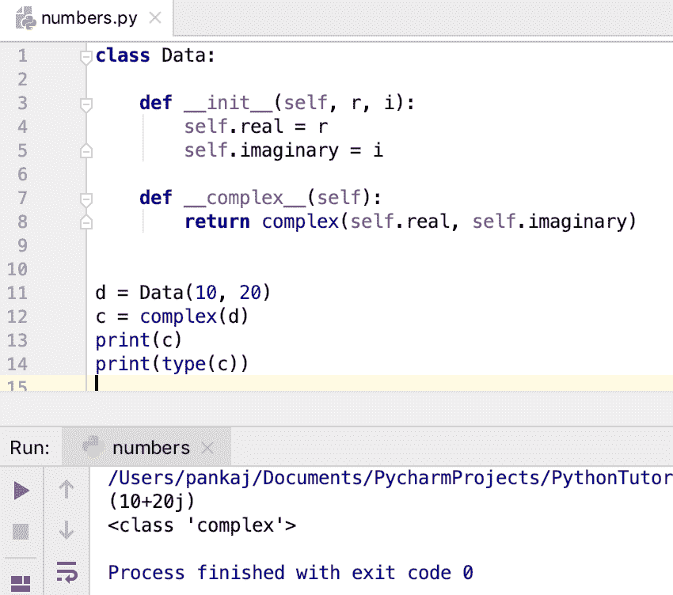

# Python 数字–int、float 和 complex

> 原文：<https://www.askpython.com/python/python-numbers>

*   数字用于存储程序中的数值。
*   Python 支持三种类型的数字——int、float 和 complex。
*   Python 2 也支持“long ”,但在 Python 3 中不支持。
*   在 Python 中，数字也是一个对象。它们的数据类型是–int、float 和 complex。
*   有内置的[函数](https://www.askpython.com/python/python-functions)来创建数字——int()、float()和 complex()。
*   我们也可以通过直接将值赋给变量来创建一个数字。
*   复数主要用于几何、微积分和科学计算。
*   我们可以通过实现 **__int__()** 、 **__float__()** 和 **__complex__()** 方法来定义对象的数值表示。

* * *

## 如何在 Python 中创建一个数字变量？

```py
x = 10
y = 10.55
z = 1 + 2j

```

复数有两部分——**实数**和**虚数**。虚部用后缀“j”表示。

* * *

## 如何求一个数的类型？

我们可以使用 type()函数找到数字的类型。

```py
print(type(x))
print(type(y))
print(type(z))

```

**输出:**


Python Numbers

* * *

## 1.整数

整数是整数。它们可以是积极的，也可以是消极的。它们必须没有十进制值。

我们可以使用 int()函数来获取一个对象的整数表示。该对象必须实现返回整数的 __int__()方法。

让我们看一些用 Python 创建整数的例子。

```py
x = 10
print(type(x))

x = int("10")
print(type(x))

class Data:
    id = 0

    def __init__(self, i):
        self.id = i

    def __int__(self):
        return self.id

d = Data(10)

x = int(d)
print(x)
print(type(x))

```

**输出:**

```py
<class 'int'>
<class 'int'>
10
<class 'int'>

```

String 类提供了 __int__()方法，这就是为什么我们可以使用 int()方法轻松地将字符串转换为 int。

如果对象没有实现 __int__()方法，int()函数抛出 TypeError。


Python Int TypeError

一般来说，整数是以 10 为基数定义的。但是，我们也可以用二进制、八进制和十六进制格式来定义它们。

```py
i = 0b1010
print(i)  # 10

i = 0xFF
print(i)  # 255

i = 0o153
print(i)  # 107

```

* * *

## 2.浮动

浮点数包含小数点。它可以是积极的，也可以是消极的。

我们可以使用 float()函数来获取对象的浮点表示。对象必须实现 __float__()方法，该方法返回一个浮点数。

```py
x = 10.50
print(x)
print(type(x))

x = float("10.50")
print(x)
print(type(x))

class Data:
    id = 0.0

    def __init__(self, i):
        self.id = i

    def __float__(self):
        return float(self.id)

d = Data(10.50)

x = float(d)
print(x)
print(type(x))

d = Data(10)
x = float(d)
print(x)
print(type(x))

```

输出:

```py
10.5
<class 'float'>
10.5
<class 'float'>
10.5
<class 'float'>
10.0
<class 'float'>

```

String 提供 __float__()方法实现。这就是为什么我们可以很容易地将一个字符串转换成浮点数。

如果对象没有实现 __float__()方法，我们会得到如下错误消息:

```py
TypeError: float() argument must be a string or a number, not 'Data'

```

如果 object __float__()方法不返回浮点数，我们会得到如下错误消息:

```py
TypeError: Data.__float__ returned non-float (type int)

```

我们也可以用“E”或“E”来定义科学记数法中的浮点数。这里“E”后面的数字表示 10 的幂。

```py
x = 10.5e2
print(x)

x = 10.5E2
print(x)

```

**输出:**

```py
1050.0
1050.0

```

**解释** : 10.5E2 = 10.5 * pow(10，2) = 10.5 * 100 = 1050.0

* * *

## 3.复杂的

一个复数包含两部分——实部和虚部。虚数部分写的是“j”后缀。

我们还可以使用 complex()函数创建一个复数。我们可以向 complex()函数传递两个 int 或 float 参数。第一个参数是实数部分，第二个参数是复数部分。

```py
x = 1 + 2j
print(x)
print(type(x))

x = -1 - 4j
print(x)
print(type(x))

x = complex(1, 2)
print(x)
print(type(x))

x = complex(1)
print(x)
print(type(x))

x = complex(-1, -2.5)
print(x)
print(type(x))

```

**输出:**

```py
(1+2j)
<class 'complex'>
(-1-4j)
<class 'complex'>
(1+2j)
<class 'complex'>
(1+0j)
<class 'complex'>
(-1-2.5j)
<class 'complex'>

```

我们还可以通过定义 __complex__()方法得到一个对象复数表示。此方法必须返回一个复数。

```py
class Data:

    def __init__(self, r, i):
        self.real = r
        self.imaginary = i

    def __complex__(self):
        return complex(self.real, self.imaginary)

d = Data(10, 20)
c = complex(d)
print(c)
print(type(c))

```

**输出:**



Python Complex Number

我们也可以将字符串转换成复数。实部和虚部之间不应有任何空白。

```py
c = complex("1+2j")  # works fine

c = complex("1 + 2j") # ValueError: complex() arg is a malformed string

```

我们可以使用“实数”属性获得复数的实数部分。我们可以使用“imag”属性获得复数的虚部。

```py
c = 10 + 20j
print(c.real)  # real part
print(c.imag)  # imaginary part

```

其他一些复数方法有:

*   conjugate():返回复共轭数。虚部的符号颠倒了。
*   abs():返回复数的幅度。

```py
c = 1 + 2j

print(c.conjugate())  # (1-2j)
print(abs(c))  # 2.23606797749979

```

* * *

## Python 数字类型转换

我们可以使用 float()函数将 int 转换成 float。同样，我们可以使用 int()函数将 float 转换为 int。

我们可以用 complex()函数把一个 int 或 float 转换成复数，虚部会是 0j。

我们不能将一个复数转换成 int 或 float。

```py
i = 10
f = 10.55

# int to float conversion
f1 = float(i)
print(f1)
print(type(f1))

# float to int conversion
i1 = int(f)
print(i1)
print(type(i1))

# int and float to complex number conversion
c = complex(i)
print(c)
print(type(c))

c = complex(f)
print(c)
print(type(c))

```

**输出:**

```py
10.0
<class 'float'>
10
<class 'int'>
(10+0j)
<class 'complex'>
(10.55+0j)
<class 'complex'>

```

* * *

## 结论

数字是任何编程语言不可或缺的一部分。Python 支持三种类型的数字——int、float 和 complex。python 中的数字也是 int、float 和 complex 类型的对象。我们可以使用 int()、float()和 complex()函数将对象转换成数字。复数主要用于几何和科学计算。

## 参考资料:

*   [Python 数字文字 API 文档](https://docs.python.org/3.8/reference/lexical_analysis.html#numeric-literals)