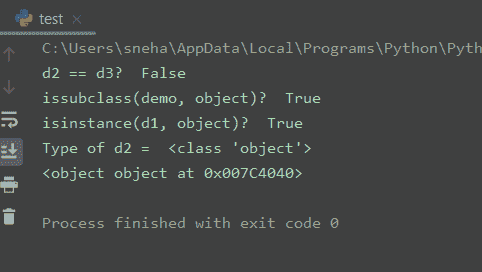

# Python object()方法是什么？

> 原文：<https://www.askpython.com/python/built-in-methods/python-object-method>

欢迎各位！今天在本教程中，我们将讨论 **Python object()方法和类**。

所以让我们从 Python `object()`方法的基本定义和语法开始。

## **Python 对象**()方法

Python `object()`方法在被调用时，返回一个新的`object`类的无特征对象。这个方法需要**没有**的参数。下面给出了使用 object()方法的语法。

```py
obj = object()

```

在这里，`obj`现在是一个无特色的对象，它拥有所有类的默认内置属性和方法。

通常，Python `object`类充当所有类的**基类**，包括用户定义的类。因此所有的类[都从 Python 中的对象类继承了](https://www.askpython.com/python/oops/inheritance-in-python)。这是 Python **3.x** 版本的默认情况。但是对于 Python **2.x** 版本来说，为了定义一个**新样式的类**，需要显式地让这个类继承 object 类，如下所示。

```py
class my_class(object):
     ...

```

## Python object()方法–示例程序

现在我们已经收集了关于**对象**类和`object()`方法的相当多的知识，让我们跳到一个例子中来获得一个更清晰的画面。

```py
#object() object
obj = object()

print("obj = ", obj)
print("Type of obj = ", type(obj))
print(dir(obj)) #attributes of obj

```

**输出:**

```py
obj =  <object object at 0x01374040>
Type of obj =  <class 'object'>
['__class__', '__delattr__', '__dir__', '__doc__', '__eq__', '__format__', '__ge__', '__getattribute__', '__gt__', '__hash__', '__init__', '__init_subclass__', '__le__', '__lt__', '__ne__', '__new__', '__reduce__', '__reduce_ex__', '__repr__', '__setattr__', '__sizeof__', '__str__', '__subclasshook__']

```

简单地说，我们已经使用`object()`方法创建了一个新对象`obj`，并分别使用 [type()](https://www.askpython.com/python/built-in-methods/python-type-function) 和 [dir()](https://www.askpython.com/python/built-in-methods/python-dir-method) 方法确定了它的**类型**以及它的所有属性。

从上面的输出中，我们可以清楚地看到`obj`属于**对象**类。注意，obj 没有一个`__dict__`属性。因此，我们不能给`object`类的实例分配任意的属性。

## Python 对象()方法的属性

在这一部分，我们将看看一些`object`属性，探索它的用途，并尝试使用它。

```py
class demo():
    a = 10
    b = 20

#declaring object of user-defined class
d1 = demo()

#featureless objects
d2 = object() 
d3 = object()

print("d2 == d3? ", d2 == d3)
print("issubclass(demo, object)? ", issubclass(demo, object)) #demo inherites from object class
print("isinstance(d1, object)? ", isinstance(d1, object))
print("Type of d2 = ", type(d2))
print(d2)

```

**输出:**



Output

在上面的代码中，`demo`是一个用户定义的类，有一些值 **a** 和 **b** 。`d1`是来自**演示**类的一个对象。鉴于，`d2`和`d3`是使用`object()`方法创建的对象类中的空对象。

从上面的输出可以看出，即使 **d2** 和 **d3** 是同类型的两个空对象，`d2==d3`条件也不满足。再次分别对`demo`类和`d1`对象使用 [issubclass()](https://www.askpython.com/python/built-in-methods/python-issubclass-method) 和 [isinstance()](https://www.askpython.com/python/built-in-methods/python-isinstance) 方法，我们可以推断出以下语句。

1.  `demo`类是`object`类的子类，因此继承自它，
2.  并且， **d1** (演示对象)也是`object`类(基类)的一个实例。

你也可以看到我们不能直接打印一个空对象，所以我们得到`<object object at 0x007C4040>`。

## 总结

这个题目到此为止。要了解更多信息，我们强烈建议浏览参考资料部分的以下链接。

关于这个话题的任何进一步的问题，请随意使用下面的评论。

快乐学习。

## 参考

*   [Python 类继承对象](https://stackoverflow.com/questions/4015417/why-do-python-classes-inherit-object)–堆栈溢出问题，
*   [Python 对象类](https://docs.python.org/3/library/functions.html?highlight=object#object)–Python 文档。