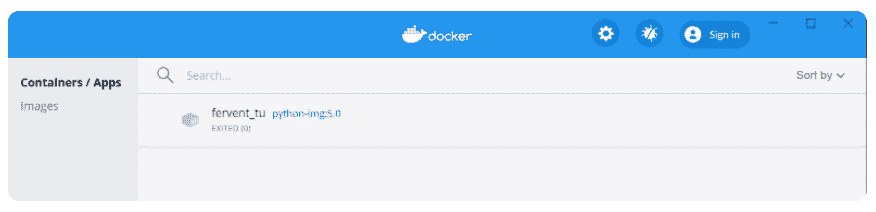

# Docker 上的 Python:如何在 Docker 容器中托管 Python 应用程序？

> 原文：<https://www.askpython.com/python/python-on-docker>

嘿！让我们来看看如何在 Docker 上托管 Python。在本教程结束时，您将知道如何创建 docker 容器，将您的应用程序添加到容器中，并在不干扰系统进程的情况下保持其运行。

***如果你是 Python 的初学者，通过跟随整个课程地图来浏览这个 [Python 视频课程](https://www.askpython.com/python-course-for-beginners)。***

一旦你都设置好了，你就可以开始了！

* * *

## 什么是 Docker 容器？

在理解容器的概念之前，让我们先讨论和理解容器的出现。

回到虚拟机大行其道的时代，所有的应用程序都托管在虚拟机上。应用程序所有者不得不为资源付出巨大的代价，这些资源未得到充分利用，但被他们阻止了通向应用程序的流量。这并没有持续很长时间，因为它不适合装在口袋里。此外，所有与应用相关的配置文件都需要存储在该虚拟机上。

这就是集装箱出现的时候。

有了容器，就有了按使用付费的概念。

基本上，Docker 向我们介绍了容器的概念。容器将应用程序及其所有相关的配置文件打包到一个独立的环境中。它将所有与系统相关的软件需求、代码和库放在一个单独的空间中。

使用容器，我们只为在应用程序运行时使用的资源付费。也就是说，我们不需要阻塞资源，因为容器会根据您的应用程序调整资源使用。

了解了容器之后，现在让我们尝试在 Docker 容器上托管一个简单的 Python 应用程序。

## 在 Docker 上运行 Python 的步骤

将应用托管到容器中的整个过程贯穿以下场景——

1.  **创建 Dockerfile 文件**
2.  **建立形象**
3.  **将应用程序作为容器运行**

* * *

### 步骤 1–创建 Dockerfile 文件

docker 文件是与计划托管的应用程序相关的配置需求的实际蓝图。我们可以包括所有需要执行的系统级命令，以便为您的最终应用蓝图做好处理准备。它可能包括应用程序所需的一些插件或库。

此外，我们将把下面的简单 python 应用程序作为一个容器来运行——

**demo.py**

```py
data = list()
data = ['JournalDev','AskPython']
for x in lst:
print(x)

```

**docker file-**

```py
FROM python:3
ADD demo.py /
CMD [ "python", "./demo.py" ]

```

Dockerfile 提供了几个[指令，如下所示](https://docs.docker.com/engine/reference/builder/)

*   **FROM**–它为即将执行的指令设置基础图像。对于本例，Python 版本已设置为 3 作为基础影像图层。当执行指令时，Dockerfile 从 Docker Hub 获取基本图像，Docker Hub 是开源图像的存储库。
*   **ADD**–使用 ADD 指令，我们可以以文件、目录甚至基本 docker 文件的 URL 的形式灌输指令。
*   **CMD**–这个指令使我们能够声明一个位置，让我们拥有一个命令来运行特定的 python 或任何 bash/sh 脚本。

* * *

### 第二步——建立 Docker 形象

建立了 Dockerfile 之后，为生产做好准备对我们来说很重要。也就是说，我们需要为 docker 文件中定义的所有命令创建一个基础层，以使容器运行良好。同样，我们使用下面的命令格式创建一个 Docker 映像。

**语法—**

```py
docker build -t image-name:tag .

```

**示例—**

```py
docker build -t python-image:1.0 .

```

**输出—**

```py
[+] Building 5.4s (7/7) FINISHED
 => [internal] load build definition from Dockerfile                                                             0.1s 
 => => transferring dockerfile: 31B                                                                              0.0s 
 => [internal] load .dockerignore                                                                                0.1s 
 => => transferring context: 2B                                                                                  0.0s 
 => [internal] load metadata for docker.io/library/python:3                                                      5.0s 
 => [internal] load build context                                                                                0.1s 
 => => transferring context: 31B                                                                                 0.0s 
 => [1/2] FROM docker.io/library/python:[email protected]:b6a9702c4b2f9ceeff807557a63a710ad49ce737ed85c46174a059a299b580  0.0s 
 => CACHED [2/2] ADD demo.py /                                                                                 0.0s 
 => exporting to image                                                                                           0.1s 
 => => exporting layers                                                                                          0.0s 
 => => writing image sha256:8b2da808b361bc5112e2afa087b9eb4e305304bcc53c18925d04fe8003f92975                     0.0s 
 => => naming to docker.io/library/python-image:1.0  

```

* * *

### 步骤 3–运行映像(将应用程序托管在容器中)

这些图像(上面创建的)实际上独立于任何底层配置。另一方面，容器需要一个图像作为基本配置来运行应用程序的实例。同样，我们需要启动运行容器的进程，应用程序的实例将通过该容器运行。

我们使用 *docker run* 命令来实际启动一个容器并运行 docker 文件中提到的配置。

**举例:**

```py
docker run python-image:1.0

```

**输出:**

```py
JournalDev 
AskPython

```

我们甚至可以通过安装如下所示的 [Docker 社区版](https://hub.docker.com/editions/community/docker-ce-desktop-windows)应用程序来检查桌面上是否存在这个正在运行的容器(出于示例目的):



**Docker Community Edition**

* * *

## 结论

到此，我们就结束了这个话题。如果你遇到任何问题，欢迎在下面评论。

更多与 Python 编程相关的帖子，请继续关注我们。

在那之前，学习愉快！！🙂