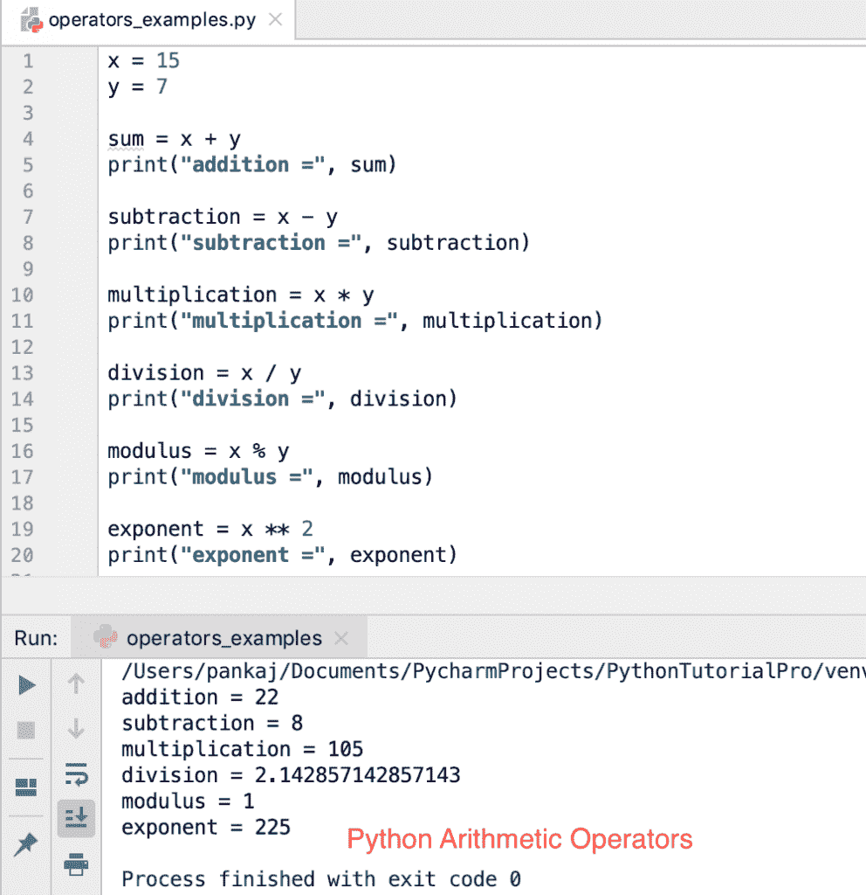
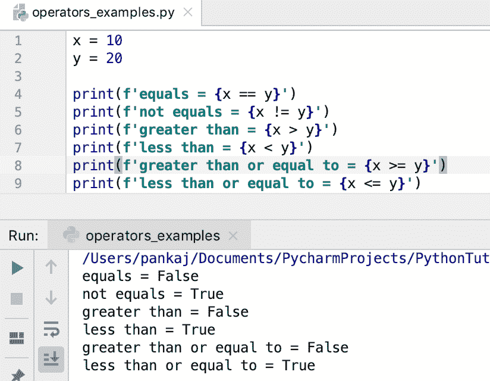
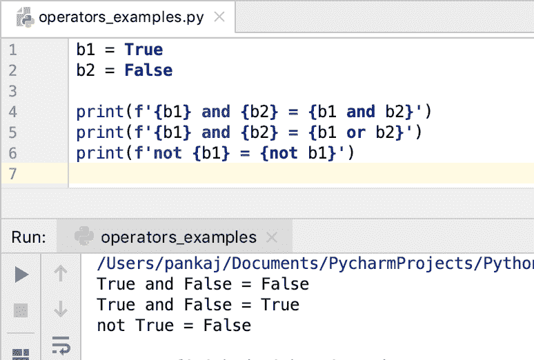
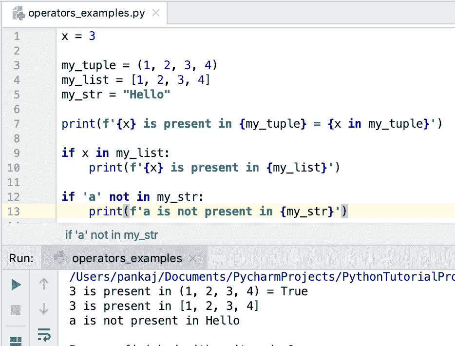

# Python 运算符

> 原文：<https://www.askpython.com/python/python-operators>

Python 中的运算符用于对变量和值执行特定操作。Python 有很多操作符，要么是关键字**，要么是特殊字符**。这些运算符处理的值或变量被称为**操作数**。

* * *

## Python 运算符的类型

Python 运算符可以分为以下几类。

1.  算术运算符
2.  逻辑运算符
3.  比较运算符
4.  按位运算符
5.  赋值运算符
6.  成员运算符
7.  标识运算符

* * *

### 1.算术运算符

Python 中的算术运算符通常处理数字。有用于加、减、乘、除、模和指数运算的运算符。这些操作符中的一些也为字符串工作。所有算术运算符都是特殊字符。

*   +:加法运算符
*   -:减法运算符
*   *:乘法运算符
*   /:除法运算符
*   **:指数运算符
*   //:楼层除法运算符

让我们看一个 Python 中算术运算符的例子。

```py
x = 15
y = 7

sum = x + y
print("addition =", sum)

subtraction = x - y
print("subtraction =", subtraction)

multiplication = x * y
print("multiplication =", multiplication)

division = x / y
print("division =", division)

modulus = x % y
print("modulus =", modulus)

exponent = x ** 2
print("exponent =", exponent)

floor_division = x // y
print("division =", floor_division)  # 2

```

**输出:**



Python Arithmetic Operators

Python 支持字符串的加法和乘法运算符。

```py
print("addition of strings =", ("Python" + " " + "Operators"))
print("multiplication of strings =", ("Python" * 2))

```

**输出:**

```py
addition of strings = Python Operators
multiplication of strings = PythonPython

```

* * *

### 2.比较运算符

Python 比较运算符用于比较两个值。结果总是一个布尔值—`True`或`False`。

Python 中的比较运算符列表如下:

*   ==:如果两个值相等，则返回 True。
*   ！=:如果两个操作数不相等，则返回 True。
*   >:如果左操作数大于右操作数，则返回 True。
*   :如果左操作数小于右操作数，则返回 True。
*   > =:如果左值大于或等于右值，则返回 True。
*   < =:如果左值小于或等于右值，则返回 True。

让我们看一个在 Python 中使用比较运算符的例子。

```py
x = 10
y = 20

print(f'equals = {x == y}')
print(f'not equals = {x != y}')
print(f'greater than = {x > y}')
print(f'less than = {x < y}')
print(f'greater than or equal to = {x >= y}')
print(f'less than or equal to = {x <= y}')

```

**输出:**



Python Comparison Operators

这些运算符也适用于字符串。如果一个字符串按字典顺序排在另一个字符串之后，则认为它比另一个字符串大。比如字典式比较中“Hi”大于“Hello”。

* * *

### 3.按位运算符

它们也被称为二元运算符，只适用于整数。操作数值被转换成二进制，然后对每一位进行运算。最后，该值被转换回十进制并返回。

Python 中有 6 个按位运算符。

*   &:按位 AND 运算符
*   |:按位 OR 运算符
*   ^:按位异或运算符
*   ~:二进制一的补码运算符
*   <<:/>
*   >>:二进制右移运算符

```py
x = 10  # 1010
y = 4  #  0100

print(f'Binary AND = {x & y}')
print(f'Binary OR = {x | y}')
print(f'Binary XOR = {x ^ y}')
print(f'Binary Ones Complement = {~x}')
print(f'Binary Left Shift by 2 = {x << 2}')
print(f'Binary Right Shift by 3 = {x >> 3}')

```

**输出:**

```py
Binary AND = 0
Binary OR = 14
Binary XOR = 14
Binary Ones Complement = -11
Binary Left Shift by 2 = 40
Binary Right Shift by 3 = 1

```

* * *

### 4.Python 逻辑运算符

Python 中有三个逻辑运算符。它们处理布尔操作数并返回一个布尔值。它们由 Python 中的 [**保留关键字**](https://www.askpython.com/python/python-keywords) 组成。

*   and:逻辑 AND 运算符
*   or:逻辑 OR 运算符
*   not:逻辑 NOT 运算符

```py
b1 = True
b2 = False

print(f'{b1} and {b2} = {b1 and b2}')
print(f'{b1} and {b2} = {b1 or b2}')
print(f'not {b1} = {not b1}')

```

**输出:**



Python Logical Operators

* * *

### 5.赋值运算符

赋值运算符(=)用于将左操作数值赋给右操作数。

有一些**复合赋值运算符**在两个操作数之间执行一些算术运算，然后将值赋给左边的操作数。

*   =:简单赋值运算符
*   +=:将两个操作数相加，然后将值赋给右操作数
*   -=:从左操作数中减去右操作数，然后将值赋给左操作数
*   *=:将两个操作数相乘，然后将它们向左赋值
*   /=:将左操作数除以右操作数，然后将值赋给左操作数
*   %=:左右操作数的模，然后赋给左操作数
*   **=:从左到右操作数的指数，然后赋给左操作数
*   //=:左操作数和右操作数的除法运算，然后将值赋给左操作数

```py
a = 10  # simple assignment operator
b = 5

a += b  # same as a=a+b
print(a)  # 15

a -= b  # same as a=a-b
print(a)  # 10

a *= b  # same as a = a*b
print(a)  # 50

a /= b  # same as a = a/b
print(a)  # 10.0

a %= b  # same as a = a%b
print(a)  # 0.0

a = 2
b = 4

a **= b  # same as a = a**b
print(a)  # 16

a //= b  # same as a = a // b (floor division)
print(a) # 4

```

* * *

### 6.成员运算符

Python 中的成员运算符用于检查序列中是否存在值。Python 中有两个成员运算符。

1.  在
2.  不在

这些运算符通常与 [if-else](https://www.askpython.com/python/python-if-else-elif-statement) 条件一起使用。

```py
x = 3

my_tuple = (1, 2, 3, 4)
my_list = [1, 2, 3, 4]
my_str = "Hello"

print(f'{x} is present in {my_tuple} = {x in my_tuple}')

if x in my_list:
    print(f'{x} is present in {my_list}')

if 'a' not in my_str:
    print(f'a is not present in {my_str}')

```



Python Membership Operators

* * *

### 7.标识运算符

Python 标识操作符用于检查两个变量是否指向同一个内存位置。有两个标识运算符。

1.  is:如果两个变量指向同一个内存位置，则返回 True
2.  is not:如果两个变量都指向不同的内存位置，则返回 True

```py
s1 = [1, 2]
s2 = [1, 2]
s3 = s1

print(s1 is s2)  # False
print(s1 is s3)  # True

print(s1 is not s2)  # True
print(s1 is not s3)  # False

```

* * *

## Python 中的运算符优先级

有时一个表达式包含多个运算符。在这种情况下，运算符优先级用于确定执行顺序。

*   我们可以用括号创建一组表达式。括号中的表达式首先被求值，然后才能参与进一步的计算。
*   一些运算符具有相同的优先级。在这种情况下，表达式从左到右计算。

下表按降序列出了运算符的优先级。

| 运算符优先级(降序) |
| **(指数) |
| ~(一的补码) |
| *、/、//、%(乘法、除法、地板除法、模数运算符) |
| +、–(加法、减法) |
| <>(左右移位运算符) |
| &(按位与) |
| &#124;，^(按位或，异或) |
| ==, !=，>， =，< =(比较运算符) |
| =，+=，-=，*=，/=，//=，%=(赋值运算符) |
| 是，不是(标识运算符) |
| in，not in(成员运算符) |
| 非、与、或(逻辑运算符) |

* * *

## Python 运算符重载

Python 支持运算符重载。为对象重载运算符有一些特定的方法。

让我们看看当一个类不支持一个操作符时会发生什么。

```py
class Data:
    id = 0

    def __init__(self, i):
        self.id = i

d1 = Data(10)
d2 = Data(20)

d3 = d1 + d2
print(d3.id)

```

**输出:**

```py
Traceback (most recent call last):
  File "/Users/pankaj/Documents/PycharmProjects/PythonTutorialPro/hello-world/operators_examples.py", line 9, in <module>
    d3 = d1 + d2
TypeError: unsupported operand type(s) for +: 'Data' and 'Data'

```

如果我们必须支持数据类的+运算符，我们必须为它定义 __add__()方法。让我们看看更新后的代码和输出。

```py
class Data:
    id = 0

    def __init__(self, i):
        self.id = i

    def __add__(self, other):
        return Data(self.id + other.id)

d1 = Data(10)
d2 = Data(20)

d3 = d1 + d2
print(d3.id)

```

**输出:** 30

下表提供了在 Python 中重载运算符时要重写的方法。

| 操作员 | 描述 | 方法 |
| + | 添加 | __ 添加 _ _(自己，其他) |
| – | 减法 | __sub__(自己，其他) |
| * | 增加 | __mul__(自己，其他) |
| / | 真正的分裂 | __truediv__(自己，其他) |
| // | 楼层划分 | __floordiv__(自己，其他) |
| % | 剩余物 | __mod__(自己，其他) |
| ** | 力量 | __pow__(自己，其他) |
| & | 按位 AND | __ 和 _ _(自己，其他) |
| &#124; | 按位或 | __ 或 _ _(自己，其他) |
| ^ | 按位异或 | __xor__(自身，其他) |
| > | 大于 | __gt__(自己，其他) |
| >= | 大于或等于 | __ge__(自己，其他) |
| < | 不到 | __lt__(自己，其他) |
| <= | 小于或等于 | __le__(自己，其他) |
| == | 等于 | __eq__(自己，他人) |
| ！= | 不等于 | __ne__(自己，其他) |

* * *

## Python 运算符模块

python 运算符模块提供了一组与 Python 中的运算符相对应的函数。这些函数名与特殊方法相同，没有双下划线。

让我们看一个支持运算符–+、>和*的自定义类的例子。我们将使用运算符模块函数来调用该类的对象上的这些方法。

```py
import operator

class Data:
    id = 0

    def __init__(self, i):
        self.id = i

    def __add__(self, other):
        return Data(self.id + other.id)

    def __gt__(self, other):
        return self.id > other.id

    def __mul__(self, other):
        return Data(self.id * other.id)

d1 = Data(10)
d2 = Data(20)

d3 = operator.add(d1, d2)
print(d3.id)

d3 = operator.mul(d1, d2)
print(d3.id)

flag = operator.gt(d1, d2)
print(flag)

```

* * *

## 摘要

Python 支持许多操作符来帮助我们进行常见的算术、比较、赋值、二进制或逻辑运算。最好的一点是，通过在我们的类中定义特殊的方法，可以重载这些操作符。如果您希望您的程序看起来更面向对象，您可以使用运算符模块，该模块提供与这些运算符相对应的函数。

## 下一步是什么？

*   [Python 中的数字](https://www.askpython.com/python/python-numbers)
*   [Python 中的循环](https://www.askpython.com/python/python-loops-in-python)
*   [Python 中的 OOPS](https://www.askpython.com/python/oops/object-oriented-programming-python)
*   [Python 模块](https://www.askpython.com/python-modules/python-modules)
*   [Python 集合](https://www.askpython.com/python-modules/python-collections)

## 参考资料:

*   [Python 运算符模块](https://docs.python.org/3.7/library/operator.html)