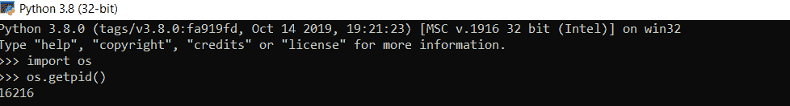

# Python 操作系统模块–10 个必须知道的函数

> 原文：<https://www.askpython.com/python-modules/python-os-module-10-must-know-functions>

模块基本上是预定义的函数，有助于减少代码的冗余，并为其添加内置功能。Python **os 模块**允许我们高效地交互和使用操作系统功能。

*   os 模块允许我们访问操作系统信息。
*   因此，这个模块包含了作为与操作系统交互方式的函数。
*   操作系统模块让我们处理文件和目录。

* * *

## 1.1.导入 Python 操作系统模块

在使用任何 [Python 模块](https://www.askpython.com/python-modules/python-modules)之前，都需要将其导入。因此，我们需要在深入研究其功能之前导入 os 模块。

**语法**:

`import os`


*Python-import os Module*

* * *

## 1.2\. os.name

这个函数帮助我们理解导入的 os 模块的名称。它因用户使用的操作系统而异。

**语法**:

`os.name`


*Python-os.name*

在上面的代码片段中，命令已经在 Windows 操作系统上运行。这就是为什么导入的 os 模块名称显示为`nt`的原因。输出因操作系统和不同系统的解释程序而异。如果在 Mac OS 上运行，会打印出`posix`。

* * *

## 1.3.os.getcwd()

该功能的输出因系统而异。它用于返回当前工作目录(CWD ),该目录用于执行和运行 python 中的代码。

**语法**:

`os.getcwd()`


*Python-os.getcwd*

* * *

## 1.4.os.execvp

这个函数可以认为是 Python 中执行系统其他命令的技术之一。

为了达到同样的目的，首先我们需要用下面的代码创建一个 python 片段 **hello.py** 。


*Python-file2*

然后，创建另一个 python 文件 **file1.py** ，在其中添加以下代码并运行脚本。


*Python-file1*

**输出**:


*Python-os.execvp*

* * *

## 1.5.操作系统错误

`OSError`是每个 IO 相关错误的基类。因此，我们可以使用这个异常类来捕获 except 块中的 IO 错误。

```py
try:
    f = open('abc.txt', 'r')  # file is missing
except OSError:
    print('Catching IO Errors in OSError block')

```

* * *

## 1.6.os.access(路径，模式)

这个函数利用 uid 来检查路径的可访问性。如果特定文件存在并且允许访问该文件，则该方法返回 True，否则返回 False。它占用了两个参数:**路径**和**模式**。路径是特定文件所在的目录。该模式可以有下列值之一:

*   `os.F_OK`–发现
*   `os.R_OK`–可读
*   `os.W_OK`–可写
*   `os.X_OK`–可执行

在下面的代码片段中，函数`os.chdir(path)`将 CWD 更改为用户作为参数指定的路径。


*Python-os.access*

* * *

## 1.7 .操作系统. getpid

这个方法返回当前正在执行的进程的 ID，通常称为 PID。

**语法**:

`os.getpid()`



*Python-os.getpid*

* * *

## 1.8.os.listdir(路径)

该函数返回 CWD 中的文件和目录列表，该列表作为参数传递。

**语法**:

`os.listdir(path)`


*Python-os.listdir*

* * *

## 1.9.os.mkdir(路径名)

这个函数从 os 模块创建一个新的目录，接受路径名作为参数。

**语法**:

`os.mkdir(path name)`


*Python-os.mkdir*

**输出**:

在下面的截图中，可以清楚地看到，当上面的代码运行时，它在提到的目录/驱动器中创建了一个文件夹，其名称作为参数传递，即“demo”。


*Output-os.mkdir*

* * *

## 结论

在本文中，我们将了解 os 模块提供的许多功能及其实现。这个模块与 [Python sys 模块](https://www.askpython.com/python-modules/python-sys-module)非常相似。

## 参考

*   Python 操作系统模块
*   [Python os 模块官方文档](https://docs.python.org/3/library/os.html)