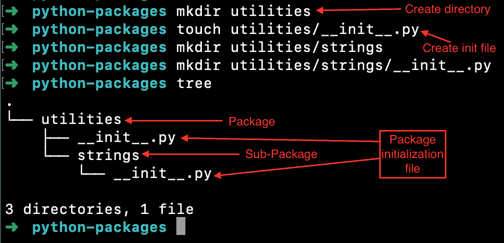
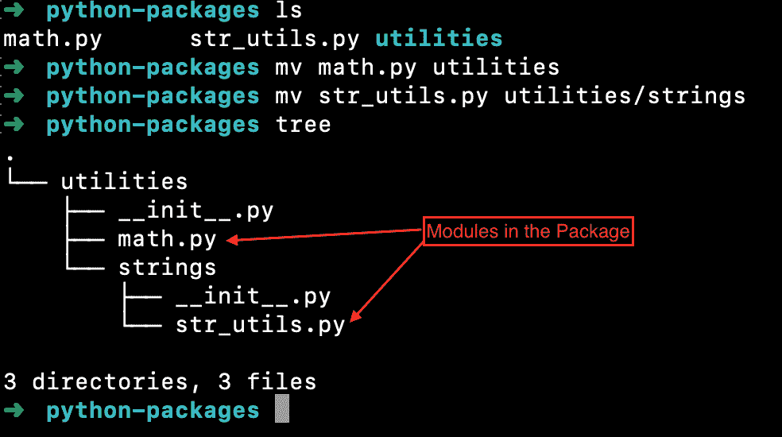
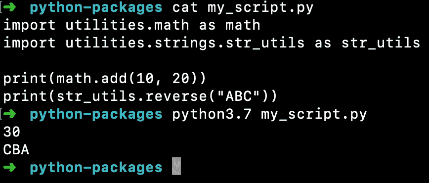
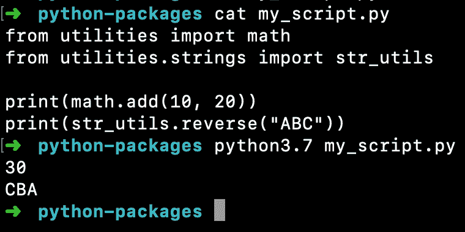
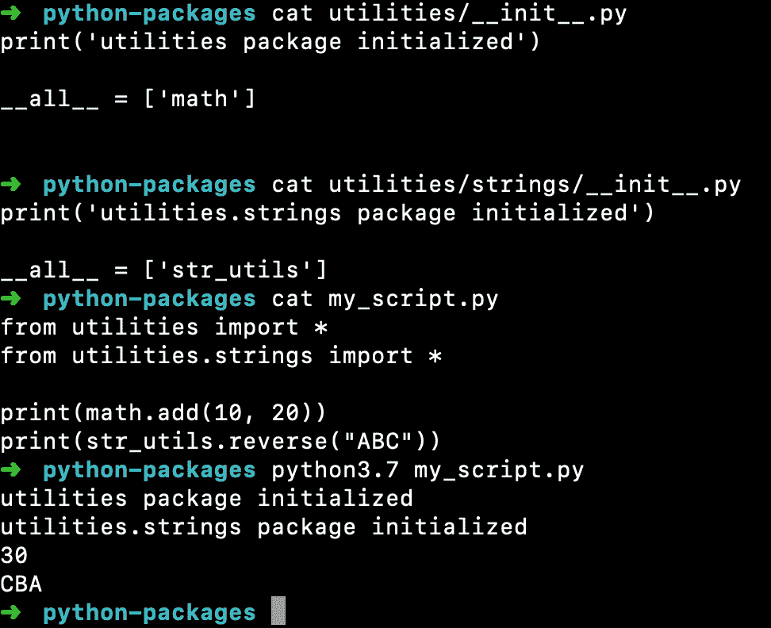

# Python 包-创建和访问

> 原文：<https://www.askpython.com/python/python-packages>

Python 包帮助我们管理模块和 python 脚本。它们是带有 init 脚本的普通目录 _ _ init _ _ .py。

* * *

## 如何创建 Python 包？

我们可以通过以下步骤创建一个包。

1.  **创建包目录**——我们可以使用终端或 Python IDE 来完成。
2.  **创建 __init__。py 文件**–这是将普通目录转换成 python 包所必需的。这个文件用于初始化包并列出所有的模块。最简单的形式是，这个文件可以是空的。

* * *

## 我们可以在 Python 包中保存什么？

*   初始化文件
*   Python 模块
*   Python 脚本
*   任何其他类型的文件

所以一般来说，一个包就像是我们计算机系统中的一个目录。唯一的区别是必须包含 __init__。py 文件。

* * *

## 我们可以用 Python 创建子包吗？

是的，我们可以在另一个包中创建一个包。我们也必须遵循打包规则来创建子包。

* * *

## Python 包示例

让我们看一些创建和使用包的例子。

### 1.创建包

```py
$ mkdir utilities
$ touch utilities/__init__.py
$ mkdir utilities/strings
$ mkdir utilities/strings/__init__.py
$ tree
.
└── utilities
    ├── __init__.py
    └── strings
        └── __init__.py

3 directories, 1 file
$ 

```



Python Packages Structure

* * *

### 2.向包中添加模块

假设我们有两个 python 模块——**math . py**和 **str_utils.py** 。他们有几个[函数](https://www.askpython.com/python/python-functions)将在我们的程序中使用。

**math.py:**

```py
def add(x, y):
    return x + y

def multiply(x, y):
    return x * y

```

**str_utils.py:**

```py
def to_uppercase(s):
    s = str(s)
    return s.upper()

def reverse(s):
    s = str(s)
    return s[::-1]

```

我们希望将这些模块添加到我们的包中。只需将这些文件复制到您想要保存这些模块的包目录中。

```py
$ ls
math.py      str_utils.py utilities
$ mv math.py utilities 
$ mv str_utils.py utilities/strings 
$ tree
.
└── utilities
    ├── __init__.py
    ├── math.py
    └── strings
        ├── __init__.py
        └── str_utils.py

3 directories, 3 files
$ 

```



Adding Modules To Python Package

* * *

### 3.从包中导入模块

在包中导入 python 模块的语法是:

```py
import package.sub_package1.sub_package2.module
import package.sub_package1.sub_package2.module as module

```

Python 使用`sys.path`变量来搜索包和模块。当前目录是`sys.path`变量的一部分。所以我们将把我们的 python 脚本保存在 **python-packages** 目录中。否则，我们将不得不在`sys.path`变量中添加包的位置。

```py
$ cat my_script.py 
import sys

print(sys.path)
$ python3.7 my_script.py 
['/Users/pankaj/Desktop/python-packages', '/Library/Frameworks/Python.framework/Versions/3.7/lib/python37.zip', '/Library/Frameworks/Python.framework/Versions/3.7/lib/python3.7', '/Library/Frameworks/Python.framework/Versions/3.7/lib/python3.7/lib-dynload', '/Library/Frameworks/Python.framework/Versions/3.7/lib/python3.7/site-packages']
$ 

```

下面是 my_script.py 代码，用于从包中访问模块并调用它们的函数。

```py
import utilities.math as math
import utilities.strings.str_utils as str_utils

print(math.add(10, 20))
print(str_utils.reverse("ABC"))

```



Importing Package Module In Python

我们也可以使用以下语法导入模块:

```py
from package.sub_package1.sub_package2 import module

```

下面是在我们的程序中访问“math”和“str_utils”模块的更新示例。

```py
from utilities import math
from utilities.strings import str_utils

print(math.add(10, 20))
print(str_utils.reverse("ABC"))

```



Python – from Package Import Module

* * *

### 4.从包中导入*

我们可以使用下面的语法从包中导入每个模块。

```py
from package.sub_package1.sub_package2 import *

```

在这种情况下，Python 会在 sub_package2 中搜索包、模块和函数。这可以通过输入你不想要的东西来产生副作用。此外，这是一个非常耗时的过程。

我们可以通过在 __init__ 中创建 **__all__** 变量来定义要导入的模块列表。py 文件。

**实用程序/__init__。py:**

```py
print('utilities package initialized')

__all__ = ['math']

```

**实用程序/字符串/__init__。py:**

```py
print('utilities.strings package initialized')

__all__ = ['str_utils']

```

更新后的 my_script.py 代码为:

```py
from utilities import *
from utilities.strings import *

print(math.add(10, 20))
print(str_utils.reverse("ABC"))

```

**输出:**

```py
$ python3.7 my_script.py 
utilities package initialized
utilities.strings package initialized
30
CBA

```



Python Package Init File All Modules List Example

注意 __init__ 中的 python 代码。当包被初始化和导入时，py 首先被执行。

* * *

## 如何将软件包添加到系统路径中

总是依赖目录层次结构来导入包模块是不可行的。我们可以将自定义包添加到 sys.path 变量中，然后在任何脚本中导入它们。

```py
import sys

sys.path.append("/Users/pankaj/Desktop/python-packages")

print(sys.path)

import utilities.math as math

print(math.add(1, 2))

```

**输出:**

```py
$ python3.7 my_script.py 
['/Users/pankaj', '/Library/Frameworks/Python.framework/Versions/3.7/lib/python37.zip', '/Library/Frameworks/Python.framework/Versions/3.7/lib/python3.7', '/Library/Frameworks/Python.framework/Versions/3.7/lib/python3.7/lib-dynload', '/Library/Frameworks/Python.framework/Versions/3.7/lib/python3.7/site-packages', '/Users/pankaj/Desktop/python-packages']
utilities package initialized
3
$ 

```

* * *

## 结论

Python 中的包允许我们将应用程序模块和脚本分成逻辑模块。这保持了我们代码库的干净和易于维护。

* * *

## 参考资料:

*   [Python.org 文件](https://docs.python.org/3.8/tutorial/modules.html#packages)