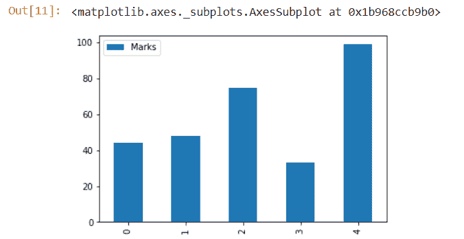

# Python 熊猫模块教程

> 原文：<https://www.askpython.com/python-modules/pandas/python-pandas-module-tutorial>

**Python Pandas** 模块基本上是一个**开源的 Python 模块**。它在计算、数据分析、统计等领域有着广泛的用途。

熊猫模块使用了 **[NumPy](https://www.askpython.com/python-modules/numpy/python-numpy-arrays) 模块**的基本功能。

因此，在继续本教程之前，我建议读者和爱好者通读并对 [Python NumPy 模块](https://www.askpython.com/python-modules/numpy/python-numpy-arrays)有一个基本的了解。

一旦你完成了它，让我们一起潜水，开始学习最有用和最有趣的模块之一—**熊猫**。

* * *

## Python 熊猫模块入门

在了解 Pandas 模块的功能之前，我们需要安装该模块(通过 Pandas 模块的[官方文档检查 Python 版本与您希望安装的模块版本的兼容性)。](https://pandas.pydata.org/pandas-docs/stable/)

有多种方法可以安装 Python 熊猫模块。最简单的方法之一是使用 **Python 包安装程序**即 **PIP** 进行安装。

在命令提示符下键入以下命令:

```py
pip install pandas
```

为了将 Pandas 和 NumPy 模块添加到您的代码中，我们需要在代码中导入这些模块。

```py
import pandas
import numpy

```

* * *

## Python 熊猫模块-数据结构

熊猫围绕以下数据结构工作:

*   **系列**
*   **数据帧**
*   **面板**

与 NumPy 数组相比，这些数据结构速度更快。

### 1.系列

Pandas 系列是一维结构，类似于包含同类数据的数组。它是一种线性数据结构，在一个维度中存储元素。

**注**:熊猫系列数据结构的**大小是不可变的**，即一旦设置，就不能动态改变。而系列中的**值/元素可以改变或操作**。

**语法:**

```py
pandas.Series(input_data, index, data_type, copy)
```

*   **input_data** :以列表、常量、NumPy 数组、Dict 等生动的形式接受输入。
*   **索引**:传递给数据的索引值。
*   **data_type** :识别数据类型。
*   **复制**:复制数据。默认值为 False。

**举例:**

```py
import pandas
import numpy
input = numpy.array(['John','Bran','Sam','Peter'])
series_data = pandas.Series(input,index=[10,11,12,13])
print(series_data)

```

在上面的代码片段中，我们使用 NumPy 数组提供了输入，并为输入数据设置了索引值。

**输出:**

```py
10     John
11     Bran
12     Sam
13     Peter
dtype: object
```

### 2.数据帧

Python Pandas 模块提供了一个二维结构的 DataFrame，类似于二维数组。这里，输入数据是以行和列的形式组织的。

**注意**:Pandas 中 DataFrame 数据结构的**大小是可变的**。

**语法**:

```py
pandas.DataFrame(input_data, index_value, columns, data_type, copy)
```

*   **input_data** :以生动的形式接受输入，如列表、序列、数字数组、字典、另一个数据帧等。
*   **索引** **值**:传递给数据的索引值。
*   **data_type** :识别每一列的数据类型。
*   **复制**:复制数据。默认值为 False。
*   **列:**标签提供了列的数据。

**举例:**

```py
import pandas
input = [['John','Pune'],['Bran','Mumbai'],['Peter','Delhi']]
data_frame = pandas.DataFrame(input,columns=['Name','City'],index=[1,2,3])
print(data_frame)

```

在上面的代码中，我们使用列表提供了输入，为列添加了标签:“Name”和“City ”,并为它们设置了索引值。

**输出:**

```py
 Name    City
1   John    Pune
2   Bran    Mumbai
3   Peter   Delhi
```

## 3.面板

Python Pandas 模块提供了一个面板，该面板是一个三维数据结构，包含 3 个轴以提供以下功能:

*   **项**:(0 轴)它的每一项都对应于其中的一个数据帧。
*   **major_axis** : (axis 1)对应每个数据帧的行。
*   **minor_axis** : (axis 2)对应每个数据帧的列。

**语法:**

```py
pandas.Panel(input_data, items, major_axis, minor_axis, data_type, copy)
```

* * *

## 将数据从 CSV 文件导入数据框架

Python Pandas 模块 DataFrame 也可以使用 CSV 文件构建。CSV 文件基本上是一个文本文件，每行数据都存储在其中。使用“逗号”分隔元素。

**read_csv(file_name)方法**用于将数据从 csv 文件读入数据帧。

**语法**:

```py
pandas.read_csv()
```

**举例**:

```py
import pandas as pd
data =  pd.read_csv('C:\\Users\\HP\\Desktop\\Book1.csv')
print(data)

```

**输出:**

```py
 Name  Age
0   John  21
1   Bran  22
```

* * *

## 熊猫的统计分析

Python 熊猫模块提出了大量的内置方法来帮助用户进行数据的统计分析。

以下是熊猫统计分析中一些最常用的函数列表:

| 方法 | 描述 |
| 计数() | 计算所有非空观察值的数量 |
| 总和() | 返回数据元素的总和 |
| 平均值() | 返回所有数据元素的平均值 |
| 中位数() | 返回所有数据元素的中值 |
| 模式() | 返回所有数据元素的模式 |
| 标准() | 返回所有数据元素的标准偏差 |
| 最小值() | 返回所有输入元素中最小的数据元素。 |
| 最大() | 返回所有输入元素中最大的数据元素。 |
| abs() | 返回绝对值 |
| 生产() | 返回数据值的乘积 |
| 联集() | 返回数据值的累积和 |
| cumprod() | 返回数据值的累积积 |
| 描述() | 它一次显示所有记录的统计摘要，即(总和、计数、最小值、平均值等) |

首先，让我们创建一个数据框架，我们将在本节中使用它来理解为统计分析提供的各种函数。

```py
import pandas
import numpy

input = {'Name':pandas.Series(['John','Bran','Caret','Joha','Sam']),
   'Marks':pandas.Series([44,48,75,33,99]),
   'Roll_num':pandas.Series([1,2,3,4,5])
}

#Creating a DataFrame
data_frame = pandas.DataFrame(input)
print(data_frame)

```

**输出:**

```py
 Name     Marks      Roll_num
0   John     44         1
1   Bran     48         2
2   Caret    75         3
3   Joha     33         4
4   Sam      99         5
```

### sum()函数

```py
import pandas
import numpy

input = {'Name':pandas.Series(['John','Bran','Caret','Joha','Sam']),
   'Marks':pandas.Series([44,48,75,33,99]),
   'Roll_num':pandas.Series([1,2,3,4,5])
}

#Create a DataFrame
data_frame = pandas.DataFrame(input)
print(data_frame.sum())

```

**输出:**

```py
Name        JohnBranCaretJohaSam
Marks       299
Roll_num    15
dtype:      object
```

如上所述，sum()函数分别将每一列的数据相加，并在找到的地方追加字符串值。

### 均值()函数

```py
import pandas
import numpy

input = {'Name':pandas.Series(['John','Bran','Caret','Joha','Sam']),
   'Marks':pandas.Series([44,48,75,33,99]),
   'Roll_num':pandas.Series([1,2,3,4,5])
}

#Create a DataFrame
data_frame = pandas.DataFrame(input)
print(data_frame.mean())

```

**输出:**

```py
Marks     59.8
Roll_num  3.0
dtype:    float64
```

与 sum()函数不同，mean 函数不会作用于数据中的字符串。

### min()函数

```py
import pandas
import numpy

input = {'Name':pandas.Series(['John','Bran','Caret','Joha','Sam']),
   'Marks':pandas.Series([44,48,75,33,99]),
   'Roll_num':pandas.Series([1,2,3,4,5])
}

#Create a DataFrame
data_frame = pandas.DataFrame(input)
print(data_frame.min())

```

**输出:**

```py
Name      Bran
Marks     33
Roll_num  1
dtype:    object
```

### 计数()

```py
import pandas
import numpy

input = {'Name':pandas.Series(['John','Bran','Caret','Joha','Sam']),
   'Marks':pandas.Series([44,48,75,33,99]),
   'Roll_num':pandas.Series([1,2,3,4,5])
}

#Create a DataFrame
data_frame = pandas.DataFrame(input)
print(data_frame.count())

```

**输出:**

```py
Name        5
Marks       5
Roll_num    5
dtype:      int64
```

### 描述()

```py
import pandas
import numpy

input = {'Name':pandas.Series(['John','Bran','Caret','Joha','Sam']),
   'Marks':pandas.Series([44,48,75,33,99]),
   'Roll_num':pandas.Series([1,2,3,4,5])
}

#Create a DataFrame
data_frame = pandas.DataFrame(input)
print(data_frame.describe())

```

**输出:**

```py
 Marks      Roll_num
count   5.000000   5.000000
mean    59.800000  3.000000
std     26.808581  1.581139
min     33.000000  1.000000
25%     44.000000  2.000000
50%     48.000000  3.000000
75%     75.000000  4.000000
max     99.000000  5.000000 
```

* * *

## 在 Pandas 中迭代数据帧

数据迭代为三种数据结构产生以下结果:

*   **系列:一组数值**
*   **DataFrame:列的标签**
*   **面板:物品标签**

以下函数可用于迭代数据帧:

*   **ITER items()**—对数据进行迭代，得到(键，值)对
*   ITER rows()—对行进行迭代，得到(index，series)对
*   ITER tuples()—遍历数据行并生成命名元组或 namedtuple

**举例:**

```py
import pandas
import numpy

input = {'Name':pandas.Series(['John','Bran','Caret','Joha','Sam']),
   'Marks':pandas.Series([44,48,75,33,99]),
   'Roll_num':pandas.Series([1,2,3,4,5])
}

data_frame = pandas.DataFrame(input)
#using the iteritems() function
for key,value in data_frame.iteritems():
   print(key,value)
print("\n")
#using the iterrows() function
for row_index,row in data_frame.iterrows():
   print(row_index,row)
print("\n")
#using the itertuples() function
for row in data_frame.itertuples():
    print(row)

```

**输出:**

```py
Name 0     John
1     Bran
2    Caret
3     Joha
4      Sam
Name: Name, dtype: object
Marks 0    44
1    48
2    75
3    33
4    99
Name: Marks, dtype: int64
Roll_num 0    1
1    2
2    3
3    4
4    5
Name: Roll_num, dtype: int64

0 Name        John
Marks         44
Roll_num       1
Name: 0, dtype: object
1 Name        Bran
Marks         48
Roll_num       2
Name: 1, dtype: object
2 Name        Caret
Marks          75
Roll_num        3
Name: 2, dtype: object
3 Name        Joha
Marks         33
Roll_num       4
Name: 3, dtype: object
4 Name        Sam
Marks        99
Roll_num      5
Name: 4, dtype: object

Pandas(Index=0, Name='John', Marks=44, Roll_num=1)
Pandas(Index=1, Name='Bran', Marks=48, Roll_num=2)
Pandas(Index=2, Name='Caret', Marks=75, Roll_num=3)
Pandas(Index=3, Name='Joha', Marks=33, Roll_num=4)
Pandas(Index=4, Name='Sam', Marks=99, Roll_num=5)
```

* * *

## 熊猫的分类

以下技术用于对 Pandas 中的数据进行排序:

*   **按标签分类**
*   **按实际值排序**

### 按标签排序

**sort_index()方法**用于根据索引值对数据进行排序。

**举例:**

```py
import pandas
import numpy

input = {'Name':pandas.Series(['John','Bran','Caret','Joha','Sam']),
   'Marks':pandas.Series([44,48,75,33,99]),
   'Roll_num':pandas.Series([1,2,3,4,5])
}

data_frame = pandas.DataFrame(input, index=[0,2,1,4,3])
print("Unsorted data frame:\n")
print(data_frame)
sorted_df=data_frame.sort_index()
print("Sorted data frame:\n")
print(sorted_df)

```

**输出:**

```py
Unsorted data frame:

    Name  Marks  Roll_num
0   John     44         1
2   Caret    75         3
1   Bran     48         2
4   Sam      99         5
3   Joha     33         4

Sorted data frame:

    Name  Marks  Roll_num
0   John     44         1
1   Bran     48         2
2   Caret    75         3
3   Joha     33         4
4   Sam      99         5
```

### 按值排序

**sort_values()方法**用于按值对数据帧进行排序。

它接受一个**‘by’参数**，其中我们需要输入列的名称，这些值需要根据该列进行排序。

**举例:**

```py
import pandas
import numpy

input = {'Name':pandas.Series(['John','Bran','Caret','Joha','Sam']),
   'Marks':pandas.Series([44,48,75,33,99]),
   'Roll_num':pandas.Series([1,2,3,4,5])
}

data_frame = pandas.DataFrame(input, index=[0,2,1,4,3])
print("Unsorted data frame:\n")
print(data_frame)
sorted_df=data_frame.sort_values(by='Marks')
print("Sorted data frame:\n")
print(sorted_df)

```

**输出:**

```py
Unsorted data frame:

    Name  Marks  Roll_num
0   John     44         1
2   Caret    75         3
1   Bran     48         2
4   Sam      99         5
3   Joha     33         4

Sorted data frame:

    Name  Marks  Roll_num
3   Joha     33         4
0   John     44         1
1   Bran     48         2
2   Caret    75         3
4    Sam     99         5
```

* * *

## Pandas 中文本数据的操作

Python 字符串函数可应用于数据帧。

下面列出了数据帧上最常用的字符串函数:

| 功能 |
| **lower()** :将数据帧中的字符串转换成小写。 |
| **upper()** :将数据帧中的字符串转换成大写。 |
| **len()** :返回字符串的长度。 |
| **strip()** :修剪数据帧中输入两边的空白。 |
| **split(')**:用输入模式拆分字符串。 |
| **contains(pattern)** :如果传递的子字符串存在于 DataFrame 的 input 元素中，则返回 true。 |
| **replace(x，y)** :它打乱了 x 和 y 的值。 |
| **startswith(pattern)** :如果输入元素以提供的参数开始，则返回 true。 |
| **endswith(pattern)** :如果输入元素以提供的参数结束，则返回 true。 |
| **交换大小写**:将大写字母交换成小写字母，反之亦然。 |
| **islower()** :返回一个布尔值，检查输入的所有字符是否都是小写。 |
| **isupper()** :返回一个布尔值，检查输入的所有字符是否都是大写。 |

**举例:**

```py
import pandas
import numpy

input = pandas.Series(['John','Bran','Caret','Joha','Sam'])
print("Converting the DataFrame to lower case....\n")
print(input.str.lower())
print("Converting the DataFrame to Upper Case.....\n")
print(input.str.upper())
print("Displaying the length of data element in each row.....\n")
print(input.str.len())
print("Replacing 'a' with '@'.....\n")
print(input.str.replace('a','@'))

```

**输出:**

```py
Converting the DataFrame to lower case....

0     john
1     bran
2     caret
3     joha
4     sam
dtype: object

Converting the DataFrame to Upper Case.....

0     JOHN
1     BRAN
2     CARET
3     JOHA
4     SAM
dtype: object

Displaying the length of data element in each row.....

0    4
1    4
2    5
3    4
4    3
dtype: int64

Replacing 'a' with '@'.....

0     John
1     [[email protected]](/cdn-cgi/l/email-protection)
2     [[email protected]](/cdn-cgi/l/email-protection)
3     [[email protected]](/cdn-cgi/l/email-protection)
4     [[email protected]](/cdn-cgi/l/email-protection)
dtype: object
```

* * *

## Python 熊猫模块中的数据争论

数据角力基本上是对数据的处理和操纵。

以下函数支持 Python Pandas 模块中的数据争论:

*   **merge()** :用于将两个数据帧的公共值合并在一起。
*   **groupby()** :它基本上是通过按提供的类别对数据进行分组来收集和表示数据。
*   **concat()** :将一个数据帧添加到另一个数据帧。

**举例:**

```py
import pandas
import numpy

input1 = {'Name':pandas.Series(['John','Bran','Caret','Joha','Sam']),
   'Marks':pandas.Series([44,48,75,33,99])}
input2 = {'Name':pandas.Series(['John','Shaun','Jim','Gifty']),
   'Marks':pandas.Series([44,45,78,99])}

#Create a DataFrame
df1 = pandas.DataFrame(input1)
df2 = pandas.DataFrame(input2)
print("DataFrame 1:\n")
print(df1)
print("DataFrame 2:\n")
print(df2)
print("Merging the DataFrames..\n")
print(pandas.merge(df1, df2, on='Marks'))
print("Grouping the DataFrame..\n")
group_by = df2.groupby('Name')
print(group_by.get_group('John'))
print("Concatenating both the DataFrames..\n")
print(pandas.concat([df1, df2]))

```

**输出:**

```py
DataFrame 1:

    Name  Marks
0   John     44
1   Bran     48
2  Caret     75
3   Joha     33
4    Sam     99

DataFrame 2:

    Name  Marks
0   John     44
1  Shaun     45
2    Jim     78
3  Gifty     99

Merging the DataFrames..

  Name_x  Marks Name_y
0   John     44   John
1    Sam     99  Gifty

Grouping the DataFrame..

   Name  Marks
0  John     44

Concatenating both the DataFrames..

    Name  Marks
0   John     44
1   Bran     48
2  Caret     75
3   Joha     33
4    Sam     99
0   John     44
1  Shaun     45
2    Jim     78
3  Gifty     99
```

* * *

## 熊猫中的数据可视化

作为输出获得的数据可以通过绘制数据以更好的方式进一步可视化。

为了绘制和显示数据，我们首先需要安装 matplotlib 库。

```py
pip install matplotlib
```

**示例:数据可视化**

```py
import pandas
import numpy as np

input1 = {'Name':pandas.Series(['John','Bran','Caret','Joha','Sam']),
   'Marks':pandas.Series([44,48,75,33,99])}
df1 = pandas.DataFrame(input1)
df1.plot.bar()

```

**输出:**



**Data Visualization**

* * *

## 结论

因此，在本教程中，我们已经了解了 Python 熊猫模块中可用的各种不同的方法和函数。

* * *

## 参考

*   Python 熊猫模块
*   [熊猫模块文档](https://pandas.pydata.org/pandas-docs/stable/index.html)