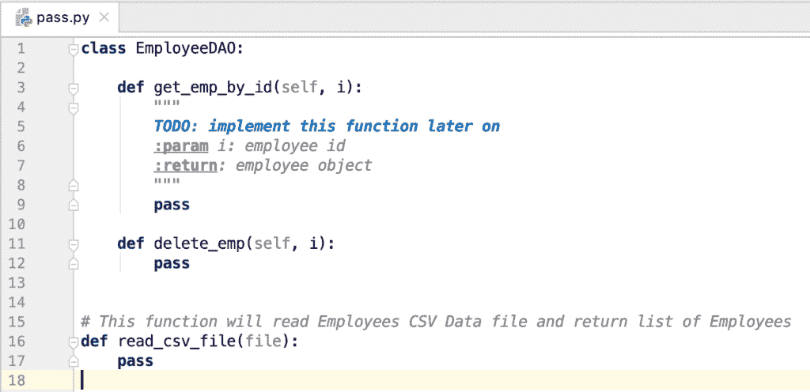

# Python pass 语句–Python 中的 pass 关键字

> 原文：<https://www.askpython.com/python/python-pass-statement-keyword>

Python pass 语句是一个无操作语句。它用于创建空代码块和空函数。

* * *

## Python pass 语句示例

让我们看一些 Python pass 语句的例子。

### 1.代码块中的传递语句

假设我们必须编写一个[函数](https://www.askpython.com/python/python-functions)来从一个[列表](https://www.askpython.com/python/list/python-list)中删除所有偶数。在这种情况下，我们将使用 for 循环遍历列表中的数字。

如果这个数被 2 除，那么我们什么都不做。否则，我们将其添加到临时列表中。最后，将只有奇数的临时列表返回给调用者。

Python 不支持空代码块。所以我们可以在 if-condition 块中对 no-operation 使用 pass 语句。

```py
def remove_evens(list_numbers):
    list_odds = []
    for i in list_numbers:
        if i % 2 == 0:
            pass
        else:
            list_odds.append(i)
    return list_odds

l_numbers = [1, 2, 3, 4, 5, 6]
l_odds = remove_evens(l_numbers)
print(l_odds)

```

**输出** : [1，3，5]

这里我们不需要 if-condition 块中的任何操作。所以我们使用 pass 语句来表示不操作。

* * *

### 2.空函数的 pass 语句

Python 没有抽象函数的概念。如果我们必须定义一个空函数，我们不能这样写。

```py
def foo():
    # TODO - implement later

```

**输出** : [缩进错误](https://www.askpython.com/python/python-indentation):应为缩进块

我们可以使用 pass 语句定义一个空的[函数](https://www.askpython.com/python/python-functions)。该函数会有一个语句，但它不会做任何事情。

```py
def foo():
    pass

```

* * *

## 一个函数中可以有多个 pass 语句吗？

是的，我们可以在一个函数或代码块中有多个 pass 语句。这是因为 pass 语句没有终止函数。它唯一的工作就是提供一个空的语句。

```py
def bar():
    pass
    print('bar')
    pass

if True:
    pass
    pass
    print('True')
else:
    print('False')
    pass
    pass

```

* * *

## 为什么我们需要通行证声明？

*   Python pass 语句在定义空函数或空代码块时非常有用。
*   pass 语句最重要的用途是为我们稍后要实现的类和函数创建一个契约。例如，我们可以这样定义一个 Python 模块:

```py
class EmployeeDAO:

    def get_emp_by_id(self, i):
        """
        TODO: implement this function later on
        :param i: employee id
        :return: employee object
        """
        pass

    def delete_emp(self, i):
        pass

# This function will read Employees CSV Data file and return list of Employees
def read_csv_file(file):
    pass

```



Python Pass Statement

我们可以开始实施了。第三方代码知道我们将实现的功能和方法，因此它们可以继续实现。

## 下一步是什么？

*   [Python 中的循环](https://www.askpython.com/python/python-loops-in-python)
*   [Python 中的运算符](https://www.askpython.com/python/python-operators)
*   [Python 中的内置函数](https://www.askpython.com/python/built-in-methods/python-built-in-functions-brief-overview)
*   [Python 类](https://www.askpython.com/python/oops/python-classes-objects)
*   [Python 中的模块](https://www.askpython.com/python-modules/python-modules)

## 资源

*   [Python.org 文件](https://docs.python.org/3/tutorial/controlflow.html#pass-statements)