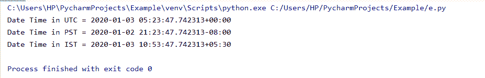

# Python 钟摆模块

> 原文：<https://www.askpython.com/python-modules/python-pendulum-module>

Python 的`**pendulum module**`支持日期/时间转换和操作。

它帮助用户轻松处理日期/时间格式。

该模块启用并提供由 **pytz** 模块提供的所有功能。

**通过命令行安装钟摆模块:**


*Pendulum Module Installation*

**导入摆锤模块:**

```py
import pendulum
```

* * *

## 显示当前时间

`**now()**`方法用于显示特定区域的当前日期时间。

**举例**:

```py
import pendulum
time = pendulum.now()  
print(time)

```

**输出:**

`**2020-01-03T10:46:59.049040+05:30**`

`**timezone objects**`和`**datetime.now()**`函数一起用于获取不同时区的当前时间戳。

**举例:**

```py
from datetime import datetime
import pendulum

utc_time = pendulum.timezone('UTC')
pst_time = pendulum.timezone('America/Los_Angeles')
ist_time = pendulum.timezone('Asia/Calcutta')

print('Date Time in UTC =', datetime.now(utc_time))
print('Date Time in PST =', datetime.now(pst_time))
print('Date Time in IST =', datetime.now(ist_time))

```

**输出:**



*Output-Timezone*

* * *

## 用钟摆模块替换日期时间模块

```py
import pendulum

utc = pendulum.now('UTC')

print('Date Time in UTC =', utc)

```

**输出:**

`**Date Time in UTC = 2020-01-03T05:28:43.853647+00:00**`

* * *

## 时区转换

```py
import pendulum
utc = pendulum.now('UTC')
ist = utc.in_timezone('Asia/Calcutta')

print('Date Time in IST =', ist)

```

**输出:**

`**Date Time in IST = 2020-01-03T11:05:20.756743+05:30**` 

* * *

## 日期时间操作

钟摆模块提供`**add(**)`和`**subtract()**`功能，以年/月/小时和小时/分钟/秒的形式操作日期和时间。

```py
import pendulum

d_t = pendulum.datetime(2020, 2, 29)
d_t.to_datetime_string()
print(d_t)

dt_add = d_t.add(years=5)
print(dt_add)
dt_add = d_t.add(months=5)
print(dt_add)
dt_add = d_t.add(days=2)
print(dt_add)
dt_add = d_t.add(weeks=5)
print(dt_add)
dt_add = d_t.add(hours=5)
print(dt_add)
dt_add = d_t.add(minutes=5)
print(dt_add)
dt_add = d_t.add(seconds=5)
print(dt_add)

dt_sub = d_t.subtract(years=1)
print(dt_sub)
dt_sub = d_t.subtract(months=5)
print(dt_sub)
dt_sub = d_t.subtract(days=2)
print(dt_sub)
dt_sub = d_t.subtract(weeks=5)
print(dt_sub)
dt_sub = d_t.subtract(hours=5)
print(dt_sub)
dt_sub = d_t.subtract(minutes=5)
print(dt_sub)
dt_sub = d_t.subtract(seconds=5)
print(dt_sub)

```

**输出:**


*Output-Datetime Manipulations*

* * *

## delta()函数

`**delta()**`函数提供两个时间戳之间的差异。

```py
import pendulum

d_t1 = pendulum.datetime(2020, 2, 20)
d_t1.to_datetime_string()
print(d_t1)
d_t2 = pendulum.datetime(2020, 2, 10)
d_t2.to_datetime_string()
print(d_t2)

delta = d_t1 - d_t2

print(delta.start)  
print(delta.end)   

print(delta.in_days())      # 10
print(delta.in_hours())     # 240

```

**输出:**


Output Delta Function

* * *

## 格式化日期时间

`**strftime()**`功能使用户能够以自己的格式设置日期时间。

```py
import pendulum

utc = pendulum.now('UTC')

print(utc .to_iso8601_string())
print(utc .to_formatted_date_string())
print(utc .to_w3c_string())
print(utc .to_date_string())

# supports strftime() too
print(utc .strftime('%Y-%m-%d %H:%M:%S %Z%z'))

```

**输出:**

```py
2020-01-03T07:17:28.650601Z
Jan 03, 2020
2020-01-03T07:17:28+00:00
2020-01-03
2020-01-03 07:17:28 UTC+0000
```

* * *

## 日期比较

摆锤模块提供了`**time-zones**`的简单比较。

```py
import pendulum

first = pendulum.datetime(2012, 9, 5, 23, 26, 11, 0, tz='America/Toronto')
second = pendulum.datetime(2019, 9, 5, 20, 26, 11, 0, tz='America/Vancouver')

first.to_datetime_string()

print(first.timezone_name)

second.to_datetime_string()

print(second.timezone_name)

print(first == second)

print(first != second)

```

**输出:**

```py
America/Toronto
America/Vancouver
False
True
```

* * *

## 结论

因此，在本文中，我们已经理解了钟摆模块提供的功能。

* * *

## 参考

*   Python 钟摆模块
*   [摆锤文件](https://pendulum.eustace.io/docs/)