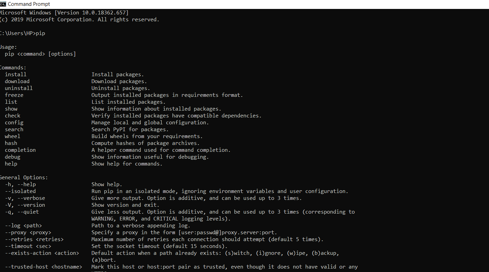
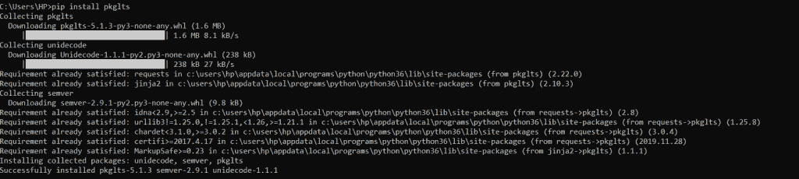
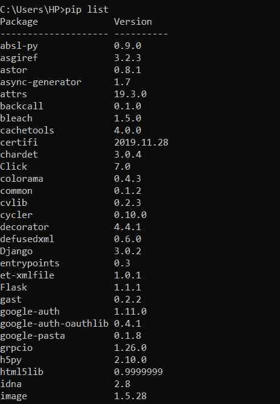
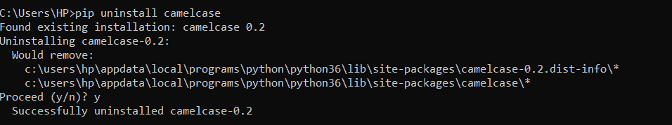
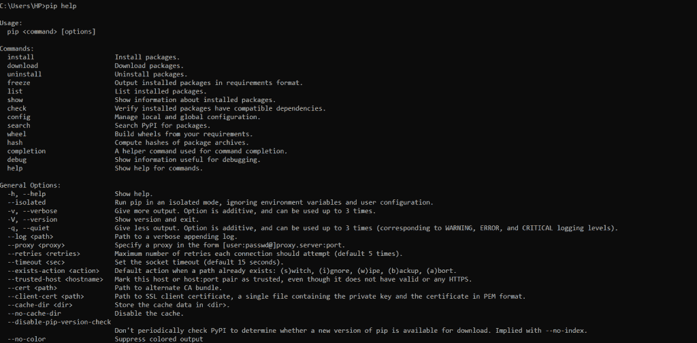
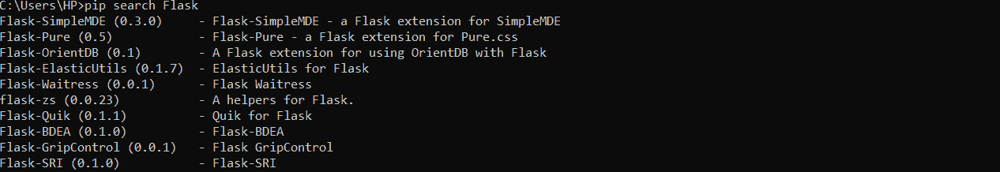
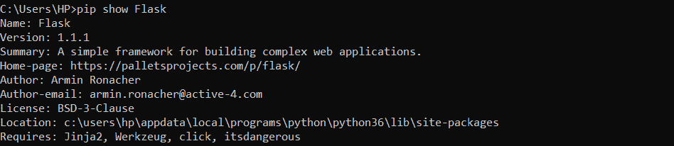

# python PIP–包管理器

> 原文：<https://www.askpython.com/python-modules/python-pip>

Python 编程语言分为不同的包和模块。除了核心的 Python 安装，我们还可以安装第三方模块来帮助我们进行项目开发。帮助我们安装和卸载这些包/模块的 python 包管理器叫做 PIP。

* * *

## 皮普是什么？

**PIP** 是一个 **python 包管理器**，帮助我们安装、审查和使用 python 编程中的各种包/模块。

* * *

## 安装 PIP

为了使用 PIP，我们需要下载并在我们的系统上设置 PIP。确保 Python 已经安装在您的系统中。这是安装 PIP 的先决条件。

PIP 可以安装在不同的平台上。让我们看看如何在 Windows、Linux 和 Mac OS 上安装它。

PIP 与 Python 安装程序捆绑在一起，即版本 2.7.9+或 3.10+。如果您使用的是旧版本或者想要更新它，您将需要显式安装它。

### 1.在 Windows 上安装 PIP

我们需要下载 **PIP 安装文件**来在 Windows 上安装。

**你可以从这个链接复制安装脚本:**【https://bootstrap.pypa.io/get-pip.py 

从上面的 **URL** 中复制内容，并以 **get-pip.py** 的名称保存，之后你需要打开**命令提示符**并光盘到 **get-pip.py** 文件保存的目录下运行该文件。

```py
$ python get-pip.py

```

安装后，运行以下命令检查 PIP 是否已成功安装在您的系统上。

**语法:**

```py
$ pip

```

**输出**:输出应该显示如何使用画中画，以及我们可以使用画中画的一般选项和命令。



PIP Installation

### 2.在 Ubuntu 上安装 PIP

**语法:**

```py
$ sudo apt-get install python-pip

```

### 3.在 Mac OS 上安装 PIP

我们也可以使用 easy_install 来安装 PIP。实际上，它们都是包管理器，PIP 已经取代了 easy_install 实用程序。

```py
$ sudo easy_install pip

```

## 升级 PIP

如果您想要升级 PIP，请运行以下命令。

```py
# python3 -m pip install --user --upgrade pip

```

如果已经安装了 PIP,–upgrade 选项用于将 PIP 升级到最新版本。如果您将在 pip 未安装时首次运行它，它将安装最新版本的 pip。因此，运行该命令将确保您的系统拥有最新的 PIP 版本。

* * *

## 使用 PIP 下载软件包

Python 由各种模块和包组成，可以使用 PIP 下载和访问。

**语法:**

```py
pip install package-name

```

**举例:**

```py
pip install pkglts

```

**输出:**



PIP install Command

* * *

## Pip 列表包

如果你想看看你系统中已安装的软件包，下面的命令可以帮助你。

Pip list 命令显示已安装的软件包及其版本。

**语法:**

```py
$ pip list

```

**输出:**



PIP List Packages

## PIP 卸载包

带有包名的 pip uninstall 命令用于从 Python 安装中移除包。

**语法:**

```py
$ pip uninstall package-name

```

**举例:**

```py
$ pip uninstall camelcase 

```

此外，将询问您是否同意您确实要卸载所选的软件包。输入“y”继续。

**输出:**



PIP Uninstall Package

* * *

## PIP 支持的命令

PIP 包含许多命令来分析和处理 Python 模块和包。

### 1.pip 帮助

以下命令可用于获取关于 **PIP** 本身支持的命令的信息。

**语法:**

```py
$ pip help

```

**输出:**



PIP help Command

* * *

### 2.pip 搜索包

我们有时可能不知道确切的包名，Python PIP 对此也有解决方案。我们可以使用下面的命令轻松地在 PIP 存储库中搜索一个包。

**语法:**

```py
$ pip search package-name

```

**举例:**

```py
$ pip search Flask

```

**输出:**



PIP search Command

* * *

### 3.pip 显示包信息

如果您希望获取关于已安装的包/模块的信息，例如存储位置和最新版本，那么 PIP 可以使用下面的命令来帮助我们。

**语法**:

```py
$ pip show package-name

```

**举例**:

```py
$ pip show Flask

```

**输出:**



PIP show Command

* * *

## Python pip vs venv

Python pip 用于在系统级别管理包。但是，我们也可以使用 [venv](https://www.askpython.com/python/examples/virtual-environments-in-python) 在项目级别管理包。venv 命令创建与特定项目相关的虚拟环境。我们可以激活虚拟环境，然后使用 pip 命令仅为该虚拟环境安装软件包。当我们在多个项目上工作，并且不想混淆它们的包依赖关系时，这就很方便了。

## 摘要

Python PIP 实用程序帮助我们管理 Python 安装模块和包。我们可以搜索一个包，并使用 pip 命令安装和卸载它。我们还可以列出所有已安装的模块和软件包及其版本。

## 下一步是什么？

*   [Python 模块](https://www.askpython.com/python-modules/python-modules)
*   [Python 包](https://www.askpython.com/python/python-packages)
*   [Python 模块 vs 包](https://www.askpython.com/python/python-modules-vs-python-packages)
*   [Python 数据分析库](https://www.askpython.com/python/data-analytics-libraries)
*   [Python 初学者课程](https://www.askpython.com/python-course-for-beginners)

* * *

## 参考

*   **[皮普](https://pypi.org/project/pip/)**