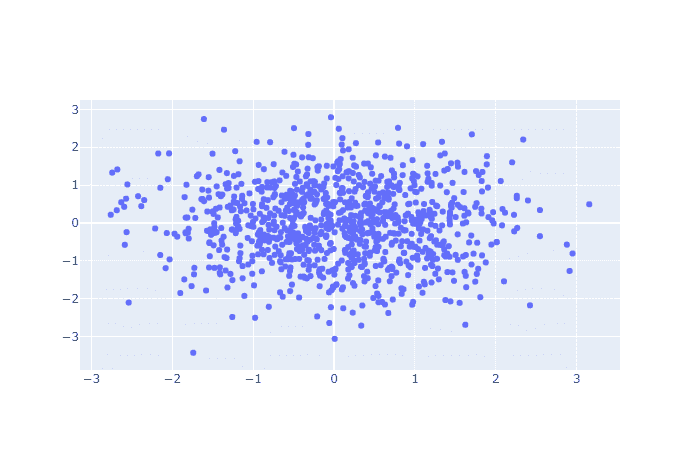
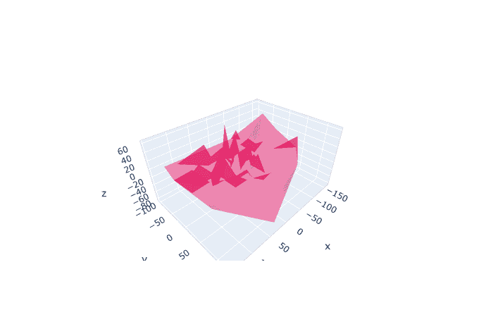

# Python Plotly 教程

> 原文：<https://www.askpython.com/python-modules/python-plotly-tutorial>

Python `Plotly library`服务于**数据可视化**的目的。它有助于在线创建交互式的高质量图形，也可以离线保存。

## Python 中 Plotly 的需求

Plotly 在统计分析、数据可视化等领域很有用。分析和预测的结果可以用 Plotly 以生动的形式呈现出来。

## Python Plotly 入门

为了利用 Plotly 库，我们首先需要使用`pip`命令安装它。

### 装置

```py
pip install plotly==4.5.0

```


Installation Of Plotly

* * *

## Python Plotly 中的基本图表

让我们深入了解 Python 的 Plotly 库所提供的功能。本节介绍了一些用于数据可视化的基本绘图技术。

### 1.散点图

顾名思义，它以分散的格式表示数据。

我们使用了 [NumPy](https://www.askpython.com/python-modules/numpy/python-numpy-arrays) 来生成随机值，作为图形的输入。

**举例:**

```py
import plotly
import plotly.graph_objs as G

import numpy

num = 15
x = numpy.random.randn(num)
y = numpy.random.randn(num)

# Create a trace
follow = G.Scatter(
    x = random_x,
    y = random_y,
    mode = 'markers'
)
output = [follow]

plotly.offline.plot(output, filename='basic-scatter.html')

```

`plotly.graph`包含`JSON object`，它是一个类似于`dict` 的结构。通过更新该对象的几个关键字的值，可以绘制出各种生动的图形。

在上面的代码片段中，plotly.graph 的 JSON 对象表示为 g。此外，为了提供输入和绘制数据，我们使用了`NumPy`来生成随机值。

`object.Scatter()`用于提供尺寸值，即创建轨迹，并用于设置我们想要添加到图形中的其他属性。

**x 和 y 参数**包含要绘制在 x 和 y 轴上的值。

参数 `mode`决定**散点图的表示方式**。它可以具有下列任意值:

*   线
*   标记
*   线条+标记
*   线条+标记+文本
*   没有人

`lines`通过线条绘制数值作为绘图模式。

`markers`将通过将未分离的数据标记为点来绘制值。

`plotly.offline`允许程序员以离线方式绘制数值并保存。它接受一个文件名作为参数。显示数据离线绘图的 html 页面。

**输出:**



Scatter Plotly

* * *

### 2.线形散点图

在这种类型的绘图中，使用线条和散射方式的组合来表示数据。

```py
import plotly
import plotly.graph_objs as G

import numpy as p

N = 20
x = p.linspace(0, 1, N)
one_y=p.random.randn(N)+10
two_y=p.random.randn(N)
three_y=p.random.randn(N)-10

# Create traces
plot0 = G.Scatter(
    x = x,
    y = one_y,
    mode = 'markers'
)

plot1 = G.Scatter(
    x = x,
    y = two_y,
    mode = 'lines+markers'

)

plot2 = G.Scatter(
    x = x,
    y = three_y,
    mode = 'lines'
)

output = [plot0, plot1, plot2]
plotly.offline.plot(output, filename='line-scatter.html')

```

在上面的代码片段中，我们使用了`numpy.linespace()`函数来为 x 维度生成均匀分布的值。

此外，我们已经使用`numpy.random()`函数通过 y 轴为三个不同的轨迹生成随机值。

如上所述，我们向参数 mode 传递了不同的值，代表了绘画风格的类型。`line+markers`代表数值，并用线条和标记点的组合来绘制。

**输出:**


Line Scatter Plot

* * *

### 3.气泡散点图

```py
import plotly.graph_objects as G

img = G.Figure(data=G.Scatter(
    x=[10, 20, 30, 40],
    y=[5, 10, 15, 20],
    mode='markers',
    marker=dict(size=[10,20,30,40],
                color=[1, 2, 3, 4])
))

img.show()

```

`marker`是一个[字典](https://www.askpython.com/python/dictionary/python-dictionary-dict-tutorial)，它设置了表示数据的符号。`size`用于将尺寸传递给绘图符号，`color`用于设置值，为这些绘图符号添加颜色。

`plotly.Figure()`函数主要包含数据和绘图布局，它将这两个值结合起来创建一个图形。**数据和布局值可表示为图形对象或字典。**

`plotly.show()`功能用于绘制图形及其布局设计。

**输出:**


Bubble Scatter Plot

* * *

## 统计风格图表

这些类型的图表有助于以非常简化的方式显示数据。

### 1.箱形图

```py
import plotly.graph_objects as G
import numpy

a = numpy.random.randn(100) - 10
b = numpy.random.randn(100) + 10

output = G.Figure()
output.add_trace(G.Box(y=a))
output.add_trace(G.Box(y=b))

output.show()

```

`plotly.add_trace()`功能用于通过向 x 和 y 维度添加轨迹来更新图形。它接受要跟踪的图形对象作为参数，即`G.Scatter`、`G.Box`等。

`plotly.graph.object.Box()`基本上将跟踪值设置为特定尺寸。

**输出:**


Box Plot

* * *

### 2.柱状图

```py
import plotly.graph_objects as G

import numpy as N

x = N.random.randn(100)

output = G.Figure(data=[G.Histogram(x=x)])
output.show()

```

`plotly.graph.object.Histogram()`用于构建直方图。 **x=x 指定 y 轴上直方图的增长**，反之亦然。

**输出:**


Histogram

* * *

### 3.距离图

Distplot 帮助我们绘制非分布数据，并使我们能够通过线图观察或检查值。

```py
import plotly.figure_factory as ff
import numpy as N

x = N.random.randn(500)
data = [x]
label = ['DISTPLOT'] 

output = ff.create_distplot(data, label)
output.show()

```

**Python 的 API** 包含`figure factory module`以简化的方式绘制数据。

`figure_factory.distplot()`绘制数据，将其表示为直方图、正态曲线等的**组合。`label`参数用于为图表设置文本标签。**

**输出:**


DistPlot

* * *

## 科学图表

这些图表有助于从更广泛的角度分析科学价值或数据。

### 1.计数器图

计数图基本上用于对大量数据的科学分析。

```py
import plotly.graph_objects as G
from plotly.subplots import make_subplots

z =   [[2, 4, 7, 12, 13, 14, 15, 16],
       [3, 1, 6, 11, 12, 13, 16, 17],
       [4, 2, 7, 7, 11, 14, 17, 18],
       [5, 3, 8, 8, 13, 15, 18, 19],
       [7, 4, 10, 9, 16, 18, 20, 19],
       [9, 10, 5, 27, 23, 21, 21, 21],
       [11, 14, 17, 26, 25, 24, 23, 22]]

out = make_subplots(rows=1, cols=1)

out.add_trace(G.Contour(z=z))

out.show()

```

`plotly.subplots`模块允许使用`make_subplots()`功能创建大量的数据子图。

`plotly.graph.objects.Contour()` 用于从提供的输入数组创建等高线。

**输出:**


Counter Plots

* * *

### 2.Plotly 中的热图

在热图绘制中，传递给输入的每个值都表示为一个像素。同样，热图也可以用来加强对科学价值和研究的分析。

```py
import plotly.graph_objects as G

out = G.Figure(data=G.Heatmap(
                    z=[[10, 20, 30],
                      [20, 30, 40],
                      [40, 50, 60]]))
out.show()

```

`plotly.graph.obejct.Heatmap()` 函数基本上将输入数据的每个值表示为热图像素。

**输出:**


Heatmaps

* * *

## 金融阴谋

这些可以被认为是以更好的方式形成和描绘实时分析的最复杂的图表之一。

### 1.时间序列图表

在下面的代码片段中，我们使用了 [Pandas 模块](https://www.askpython.com/python-modules/pandas/python-pandas-module-tutorial)来读取 CSV 文件，然后绘制了相同的时序图。

```py
import plotly.express as px
import pandas as pd

df = pd.read_csv('C:\\Users\\HP\\Desktop\\output11.csv')

fig = px.line(df, x='Marks', y='Sr no')
fig.show()

```

我使用的文件是一个简单的文件，有两列，序列号和标记。数据是根据哪个轴使用哪个列的数据自动绘制的。您可以对任何两列数据 CSV 文件进行同样的尝试。


Csv File Snapshot

**输出:**


Time Series

**或者，您可以简单地以如下所示的两个列表的形式提供数据**。我提供一些随机值来展示折线图是如何形成的。

```py
import plotly.express as px
sr = [1,2,3,4,5,6]
marks = [20, 10, 50, 30, 100, 75]

fig = px.line(x=marks, y=sr)
fig.show()

```

**输出:**


Plotly Graph

`plotly.express package`用于提供高质量的简化图形。

`plotly.express.line()`功能用于根据提供的值和标签绘制一条线到 x 和 y 维度。

* * *

### 2.漏斗图

漏斗图使我们能够以类似于业务发展过程的不同阶段的形式来表示数据。

```py
import plotly.express as p
data = dict(
    num=[25, 50, 75, 100],
    work=["Requirement Analysis", "Design", "Modelling and Construction", "Testing and Deployment"])
out = p.funnel(data, x='num', y='work')
out.show()

```

`express.funnel()`函数将输入数据帧的每一行表示为漏斗的一个阶段。这里，输入 **num** 和 **work** 以漏斗结构的形式表示。

**输出:**


Funnel Charts

如上所述，图表描述了发展的阶段和与之相关的价值。

* * *

## 三维图表

```py
import plotly.graph_objects as G
import numpy as N

n = 100

figure = G.Figure(data=[G.Mesh3d(x=(55*N.random.randn(n)),
                   y=(50*N.random.randn(n)),
                   z=(25*N.random.randn(n)),
                   opacity=0.8,
                   color='rgba(244,22,100,0.6)'
                  )])

figure.show()

```

`plotly.graph.object.Mesh3d()`将数据表示为具有顶点 x、y、z 的三维绘图结构

**输出:**



3 D Plot

* * *

## 结论

因此，在本文中，我们已经了解了 Python 的 Plotly 库所提供的功能。

* * *

## 参考

*   Python Plotly 库
*   [Plotly 文档](https://plotly.com/python/)