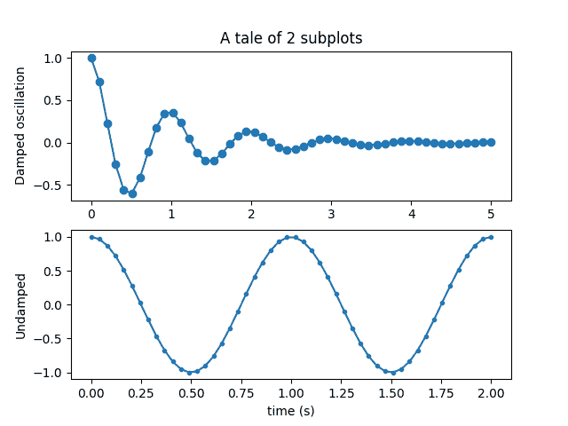

# 五大最佳 Python 绘图和图形库

> 原文：<https://www.askpython.com/python/python-plotting-and-graph-libraries>

这篇文章讨论了一些最好的 Python 绘图和图形库！在我们开始列举最佳库之前，让我们快速了解一下为什么数据可视化是必要的，以及什么是必要的

## 为什么数据可视化是必要的？

在数据分析蓬勃发展的时代，查看我们的分析结果并推断结果通常比通过文本数据或 csv 文件来理解结果更方便。

因此，数据可视化是找到复杂问题答案的简单方法。它还允许用户比表格更好地表达结果。

Data Visualization

## 五大最佳 Python 绘图和图形库

下面是我们将要讨论的几个 Python 绘图和图形库的快速列表:

1.  **Matplotlib:** 使用其 API 在所有应用程序上轻松绘制图形。
2.  基于 matplotlib 的多功能库，允许在多个变量之间进行比较。
3.  **ggplot:** 生成特定领域的可视化
4.  **散景:**实时流和数据的首选库。
5.  **Plotly:** 在 JS 的帮助下允许非常交互的图形。

### 1\. Matplotlib

Matplotlib

Matplotlib 是 python 的绘图库。它提供了一个面向对象的 API，允许我们在应用程序本身中绘制图形。它是免费和开源的。支持数十种输出类型和后端。

Matplotlib 允许使用熊猫作为其 API 的包装器。这个库运行时间更好，占用内存空间小。

**使用 Matplotlib 的好处**

*   理解变量之间的相关性
*   传达模型对数据的拟合
*   散点图可用于异常值检测

### 2.希伯恩

Seaborn

Seaborn 是一个基于 matplotlib 的 python 数据可视化库。Seaborn 有一个基于数据集的 API，允许对多个变量进行比较。

它支持多点网格，从而简化复杂可视化的构建。它有单变量和双变量可视化，可用于比较数据子集。

它利用不同的调色板来展示不同种类的图案。它还自动估计线性回归模型。

**Seaborn vs Matplotlib**

Matplotlib 试图让简单的事情变得简单，让困难的事情变得可能，seaborn 也试图定义一组定义良好的困难事情。事实上 matplotlib 很好，但 seaborn 更好。Matplotlib 留下了不太吸引人的情节，但是 seaborn 有高级接口和定制的主题来解决这个问题。

使用 pandas 时，matplotlib 在处理数据帧时表现不佳。而 seaborn 函数处理数据帧。

### 3.ggplot

Ggplot

ggplot 最初在 R 中实现，是 python 中绘制图形的通用库之一。它是一种特定于领域的语言，用于产生特定于领域的可视化，特别是用于数据分析。

Ggplot 允许以简单的方式绘制图形，仅使用 2 行代码。然而，使用 matplotlib 编写的相同代码非常复杂，涉及许多行代码。因此，ggplot 简化了图形编码。这是一个非常有价值的 python 库。

需要用熊猫来实现 ggplot 的所有特性。

### 4.散景

Bokeh

Bokeh，一个类似于 ggplot 的库，基于图形的语法。但是，它是 python 的原生库，尚未从 r 中导入。创建可用于 web 的交互式绘图，可以输出各种格式，如–HTML 文档和 JSON 对象。

散景一直是实时流和数据最受欢迎的库之一。

用户可以使用三种级别的散景，即高级、中级和低级。高级用户可以轻松快速地创建直方图和条形图。中级用户可以使用 matplotlib 框架为散点图创建点。

### 5.Plotly

Plotly

[Plotly](https://www.askpython.com/python-modules/python-plotly-tutorial) 是一个有库支持的在线可视化平台。在这里，我们可以像散景一样构建交互式绘图，但是使用了额外的图形，如等高线图、3D 图表和树状图。Plotly 还识别鼠标悬停和光标点击事件，从而使 Plotly 成为一个独特的图形和 JavaScript 库。

Bokeh 和 Plotly 是类似的库，但是，使用 Plotly，你必须将数据转换成字典。然而，当使用 Pandas 处理数据帧时，plotly 更容易。

## 总结一下…

使用 Python 绘制图形有利也有弊，原因很简单，Python 提供了各种各样的选项。最佳库的选择完全取决于您试图完成的任务类型。请注意，没有哪个库比另一个更好，每个库的使用取决于用户的需要。

然而，Matplotlib 是所有这些库的核心，允许编码人员在它上面包装工具。Seaborn 利用 matplotlib 绘制复杂的交互式可视化图形。另一方面，散景有助于创建您自己的可视化服务器。使用这些库，并在下面的评论区告诉我们你的感受。