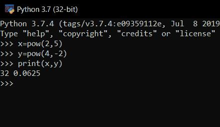

# Python pow()方法

> 原文：<https://www.askpython.com/python/built-in-methods/python-pow>

Python `pow()`函数是 Python 编程中最常用的 **[内置](https://www.askpython.com/python/built-in-methods)** 函数之一。它广泛用于计算 **a** 的幂 **n** 或更具体地说**a^n的值。当处理一些复杂的数学计算或有时用于其他操作时，它是一个非常有用的函数。因此，让我们更深入地研究一下 **Python** 中的`pow()`函数。**

## 使用 Python pow()函数

`pow()`函数可以通过总共**三个**参数来传递。下面给出了`pow()`的语法，

`pow( a , n , b )`

在哪里，

*   **a** 是我们正在计算其幂的数或者是**基数**，
*   **n** 是 a 的多少次方或者是**的指数部分**，
*   **b** 是用来计算 an 的**模数**的数字。

注意: **b** 是可选参数。

## 例子

看看下面的代码，我们在这里试着计算一下，比方说，**2⁵的值。**

```py
x=pow(2,5)     #2^5
y=pow(4,-2)    #1/(4^2)
print(x,y)

```

**输出:**



pow() In Python

现在让我们再次尝试传递可选的**模数**参数，

```py
x=pow(2,5,5)        #(2^5) % 5 = 32 % 5
print(x)

```

**输出:**

```py
2

```

因此，相应地，我们得到的输出为 **2** 。由于`pow(2,5,5)`实际上返回值为 **(2^5) % 5** 或， **32 % 5 = 2** 。

**注意:**在使用模参数时，我们必须确保第二个参数(指数部分)是一个**正整数。**否则抛出如下所示的**错误**，

```py
y=pow(4,-2,6)
print(y)

```

**输出:**

```py
Traceback (most recent call last):
  File "C:/Users/sneha/Desktop/test.py", line 2, in <module>
    y=pow(4,-2,6)
ValueError: pow() 2nd argument cannot be negative when 3rd argument specified

```

## math.pow()与 Python 中的内置 pow()

除了`math.pow()`没有自带积分模运算，内置的`pow()`和预定义的`math.pow()`都有一些很大的区别。

对于大量的数值，`pow()`函数相对来说**更快**。另一方面，为了使用 **math.pow()** ，用户必须首先导入 **mat** h 模块。

甚至 **math.pow()** 方法在计算一些复数的结果时也会抛出错误。而 **pow()** 的方法却没有。

## 参考

*   [https://stack overflow . com/questions/10282674/difference-in-built-in-pow-and-math-pow-for-floats-in-python](https://stackoverflow.com/questions/10282674/difference-between-the-built-in-pow-and-math-pow-for-floats-in-python)
*   https://www.journaldev.com/23002/python-pow