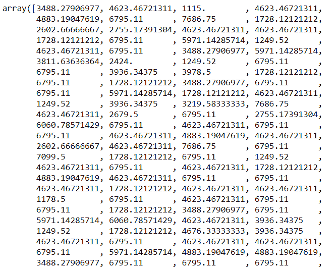
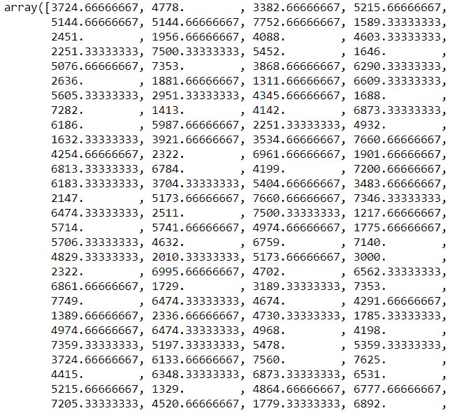

# Python predict()函数–您需要知道的一切！

> 原文：<https://www.askpython.com/python/examples/python-predict-function>

嘿，读者们！在本文中，我们将详细关注 **Python predict()函数**。所以，让我们现在就开始吧！！

* * *

## 了解 Python 中的 predict()函数

在**数据科学**领域，我们需要对数据集应用不同的机器学习模型，以便训练数据。此外，我们尝试预测未训练数据的值。

这就是 predict()函数发挥作用的时候了。

**Python predict()函数**使我们能够根据训练好的模型**预测数据值**的标签。

**语法**:

```py
model.predict(data)

```

predict()函数**只接受一个参数**，它通常是要测试的数据。

它根据从模型中获得的学习或训练数据，返回作为参数传递的数据的标签。

因此，predict()函数在训练好的模型之上工作，并利用学习到的标签来映射和预测要测试的数据的标签。

* * *

## 实现 Python predict()函数

让我们首先将数据集加载到环境中。 [pandas.read_csv()函数](https://www.askpython.com/python-modules/python-csv-module)使我们能够从系统加载数据集。

你可以在这里找到数据集[。](https://github.com/Safa1615/BIKE-RENTAL-COUNT/blob/master/day.csv)

由于数据集也包含分类变量，因此我们创建了分类特征的虚拟模型，以便使用`pandas.get_dummies()`函数进行建模。

此外，我们已经使用`train_test_split()`函数将[数据集分成训练和测试](https://www.askpython.com/python/examples/split-data-training-and-testing-set)数据集。

```py
import os
import pandas

#Changing the current working directory
os.chdir("D:/Ediwsor_Project - Bike_Rental_Count")
BIKE = pandas.read_csv("Bike.csv")
bike = BIKE.copy()

categorical_col_updated = ['season','yr','mnth','weathersit','holiday']
bike = pandas.get_dummies(bike, columns = categorical_col_updated) 

#Separating the dependent and independent data variables into two data frames.
from sklearn.model_selection import train_test_split 

X = bike.drop(['cnt'],axis=1) 
Y = bike['cnt']

# Splitting the dataset into 80% training data and 20% testing data.
X_train, X_test, Y_train, Y_test = train_test_split(X, Y, test_size=.20, random_state=0)

```

现在，让我们在下一节集中讨论预测算法的实现。

* * *

### 在决策树中使用 predict()函数

现在，我们已经对上述分割数据集应用了**决策树算法**，并使用`predict() function`根据决策树模型预测的值来预测测试数据集的标签。

```py
#Building the Decision Tree Model on our dataset
from sklearn.tree import DecisionTreeRegressor
DT_model = DecisionTreeRegressor(max_depth=5).fit(X_train,Y_train)
DT_predict = DT_model.predict(X_test) #Predictions on Testing data
print(DT_predict)

```

**输出:**



**Decision Tree Prediction**

* * *

### **用 Knn 算法使用 predict()函数**

在这个例子中，我们使用了 **Knn 算法**对数据集进行预测。我们已经对训练数据应用了`KNeighborsRegressor()`函数。

此外，我们对测试数据集上的预测应用了 predict()函数。

```py
Building the KNN Model on our dataset
from sklearn.neighbors import KNeighborsRegressor
KNN_model = KNeighborsRegressor(n_neighbors=3).fit(X_train,Y_train)
KNN_predict = KNN_model.predict(X_test) #Predictions on Testing data
print(KNN_predict)

```

**输出:**



**KNN Prediction**

* * *

## 结论

到此，我们就结束了这个话题。如果你遇到任何问题，欢迎在下面评论！

更多与 Python 相关的帖子，敬请关注，在此之前，祝你学习愉快！！🙂