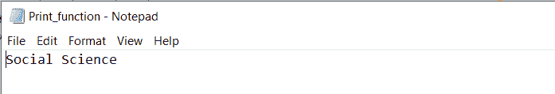

# Python print()函数

> 原文：<https://www.askpython.com/python/built-in-methods/python-print-function>

**Python print()函数**主要是将给定的输入或对象打印到输出屏幕或相应的流文件。

**语法:**

```py
print(objects, sep=value, end=end_value, file, flush)
```

**Python print()函数参数:**

| 争论 | 描述 | **必需/可选** |
| *物体* | 对象或输入字符串 | 需要 |
| *九月*=‘*值* | 关于如何分离对象的说明。
默认分隔符值是“” | 可选择的 |
| *end='end_value'* | 指定最后要打印的内容。
默认值为' \n ' | 可选择的 |
| *文件* | 它是一个具有写方法的对象。默认值为 sys.stdout。 | 可选择的 |
| *冲水* | 它是一个布尔值，指定获得的输出是刷新(True)还是缓冲(False)。默认值为 False。 | 可选择的 |

* * *

## 1.对 Python print()函数的基本理解

```py
# Passing a single object
print("Engineering Discipline") 

```

**输出:**

```py
Engineering Discipline
```

* * *

## 2.用 Python print()函数打印多个对象

```py
input = "Safa"

print("Result is: ", input) # Contains two objects

```

**输出:**

```py
Result is:  Safa
```

* * *

## 3.用 Python print()函数打印元组和列表

Python print()函数可以用来打印[字符串](https://www.askpython.com/python/string/python-string-functions)、[元组](https://www.askpython.com/python/tuple/python-tuple)、[列表](https://www.askpython.com/python/list/python-list)等。到输出屏幕。

```py
input_tuple = ("YES", "NO", 200) # Tuple
print(input_tuple)

input_list = [10,'Apple', 20,'Football', 70] # List
print(input_list) 

```

**输出:**

```py
('YES', 'NO', 200)
[10, 'Apple', 20, 'Football', 70]
```

* * *

## 4.带有“sep”关键字的 Python print()函数

默认情况下，正如您所观察到的，输出中的值由空格分隔。但是，现在 ***用户可以通过使用任何符号或值*** 替换默认值，即“”(空格)，对其进行自定义。

```py
value1 = int(10)

value2 = 'Social Science'

print(value1, value2, sep='+')

```

**输出**:

```py
10+Social Science
```

* * *

## 5.带有“end”关键字的 Python print()函数

正如所观察到的，“end”参数的默认值是“\n”，即 Python print()函数以换行符(' \n ')结束。

但是，现在 ***用户可以通过使用任何符号或值*** 替换默认值来定制它，例如' \n '(换行符)。

```py
my_list = [10, 20, 0, 32, 56, 78, 90]

print('Printing the list..... ')
for x in my_list:
    print(x, end='$')

```

**输出:**

```py
Printing the list..... 
10$20$0$32$56$78$90$
```

* * *

## 6.带有“文件”关键字的 Python print()函数

Python print()函数的**文件**参数允许用户写入[文件](https://www.askpython.com/python/python-file-handling)。如果提到的文件不存在，它会用指定的名称创建一个新文件，并将输出写入其中。

```py
input_file = open('Print_function.txt','w')
print('Social Science', file = input_file)
input_file.close()

```

**输出:**



***print() Function***

* * *

## 结论

因此，在本文中，我们已经理解了 Python 的 print()函数的工作原理。

* * *

## 参考

*   Python print()函数
*   [打印()功能文档](https://docs.python.org/3/tutorial/inputoutput.html)