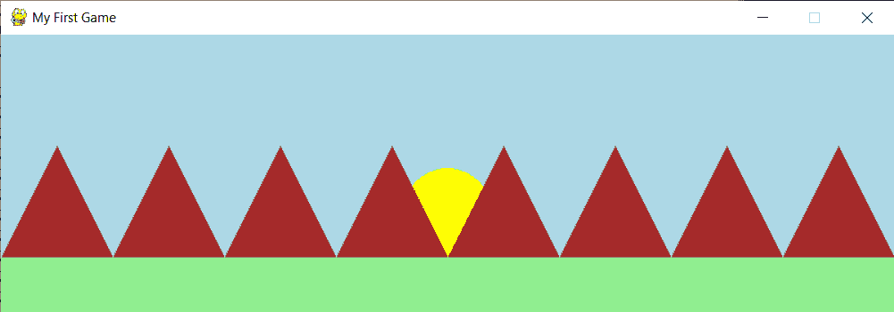

# Python Pygame:简单介绍

> 原文：<https://www.askpython.com/python-modules/python-pygame>

嘿，同学们！今天，您将学习 Python Pygame。

Python Pygame 通常用于构建游戏和其他图形。一个人可以控制所有的逻辑和图形。没有担心与音频和视频相关的背景复杂性。

## Python Pygame 入门

在开始主要内容之前，让我们先来看看下面给出的简单代码。

```py
import pygame 
from pygame.locals import * 
pygame.init() 
game_display = pygame.display.set_mode((800, 600)) 
pygame.display.set_caption('My First Game') 
def event_handler(): 
    for event in pygame.event.get(): 
        if (event.type == QUIT): 
            pygame.quit() 
            quit() 
while True: 
    event_handler() 
    pygame.display.update()

```

*   从 pygame 中导入 pygame 和**。本地导入*–**它允许访问所有 pygame 功能和内部模块
*   **pygame . init()–**初始化 pygame 以提供对函数的方便访问，并自动启动所有需要初始化的 py game 模块。
*   pygame。display.set_mode((width，height))–显示特定高度和宽度的窗口。
*   pygame。display.set_caption('我的第一个游戏')–在标题屏幕顶部添加游戏名称。
*   **处理事件的函数–**需要定义一个函数来处理屏幕上发生的事件。现在，我们考虑一个事件，即在按下窗口上的“X”时关闭窗口。
*   pygame。display . update()–用于对显示屏进行必要的更新。

下图显示了上面提到的代码的结果。只是基本的黑屏。没错。


Initial Window Pygame

## 向 Python Pygame 输出添加对象

上面的画面绝对无聊。只有黑屏，没有别的。让我们开始添加一些元素到屏幕上。

### 1.插入图像

首先，需要将背景颜色改为白色，然后从目录中加载图像。然后，在某个位置上传图片。相同的代码如下所示:

```py
game_display.fill('white')
img = pygame.image.load('img1.png')
game_display.blit(img, (0, 0))

```

下面的屏幕显示了上面输入的代码的输出。


Insert Image Pygame

### 2.插入形状

在 Pygame 库中，只需指定要在其间绘制的点，就可以绘制特定的像素、线、圆、矩形和任何多边形。

**推荐阅读—[如何使用 Python Turtle 绘制对象？](https://www.askpython.com/python-modules/python-turtle)**

**插入矩形**–要绘制一个矩形，需要使用 pygame.draw.rect()，它接受许多参数，包括屏幕名称、矩形的颜色和矩形的尺寸(x，y，宽度，高度)。

下面的代码在屏幕上显示一个红色的矩形。

```py
pygame.draw.rect(game_display, 'red', (50, 20, 120, 100))
```

**插入圆**–插入圆需要屏幕名称、颜色、圆心坐标和圆半径等参数。

```py
pygame.draw.circle(game_display, 'yellow', (150,170),40)
```

屏幕上绘制的两个形状的输出如下。


Insert Shape Pygame

参考 [Pygame.draw 官方文档](https://www.pygame.org/docs/ref/draw.html)来学习你可以使用这个模块绘制的所有不同的形状。

## 使用 Python Pygame 创建一个简单的场景

下面的代码在屏幕上显示了一个简单的场景。自己尝试一下也能得到同样的效果！

```py
import pygame 
from pygame.locals import * 
pygame.init() 
game_display = pygame.display.set_mode((800, 250)) 
pygame.display.set_caption('My First Game')

pygame.draw.rect(game_display, 'lightblue', (0, 0, 800, 200))
pygame.draw.circle(game_display, 'yellow', (400,160),40)
pygame.draw.polygon(game_display, 'brown',((0,200),(50,100),(100,200)))
pygame.draw.polygon(game_display, 'brown',((100,200),(150,100),(200,200)))
pygame.draw.polygon(game_display, 'brown',((200,200),(250,100),(300,200)))
pygame.draw.polygon(game_display, 'brown',((300,200),(350,100),(400,200)))
pygame.draw.polygon(game_display, 'brown',((400,200),(450,100),(500,200)))
pygame.draw.polygon(game_display, 'brown',((500,200),(550,100),(600,200)))
pygame.draw.polygon(game_display, 'brown',((600,200),(650,100),(700,200)))
pygame.draw.polygon(game_display, 'brown',((700,200),(750,100),(800,200)))
pygame.draw.rect(game_display, 'lightgreen', (0,200, 800, 50))

def event_handler(): 
    for event in pygame.event.get(): 
        if (event.type == QUIT): 
            pygame.quit() 
            quit() 
while True: 
    event_handler() 
    pygame.display.update()

```

**上面代码的结果如下所示:**



Scenery Using Pygame

## 结论

在本教程中，您学习了 pygame 的一些基本概念，以及如何使用它们创建简单的形状和对象。继续学习！