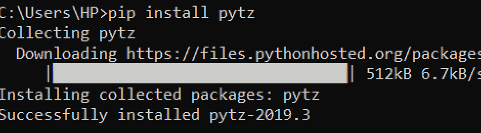

# Python pytz 模块

> 原文：<https://www.askpython.com/python-modules/python-pytz-module>

Python **pytz 模块**提供日期时间转换功能。从而使用户服务于国际客户群。

pytz 模块支持 Python 应用程序中的时区计算。

**pytz 模块安装:**

`**pip install pytz**`



Python pytz Installation

* * *

## Python pytz 模块函数

*   **all_timezones**
*   **all_timezones_set**
*   **公共时区**
*   **common_timezones_set**
*   **给定时区的取数时间**
*   **国家名称**
*   **国家时区**

* * *

### 1\. all_timezones

这个函数返回 Python 的 pytz 模块支持的所有时区的列表。

**举例:**

```py
import pytz

print('The timezones supported by pytz module: ', pytz.all_timezones, '\n')

```

**输出片段:**

```py
The timezones supported by pytz module:  ['Africa/Abidjan', 'Africa/Accra', 'Africa/Addis_Ababa', 'Africa/Algiers', 'Africa/Asmara', 'Africa/Asmera', 'Africa/Bamako', 'Africa/Bangui', 'Africa/Banjul']
```

我们只显示了几个值，因为实际的列表非常长。

* * *

### 2.所有时区集

此变量返回一组所有受支持的时区。

**举例:**

```py
import pytz
print('List of all the supported timezones: ', pytz.all_timezones_set, '\n')

```

**输出片段:**

```py
List of all the supported timezones:  LazySet({'America/Port-au-Prince', 'Asia/Ust-Nera', 'Asia/Vientiane', 'Australia/Hobart', 'Asia/Ulaanbaatar', 'Africa/Lome'})
```

* * *

### 3.公共时区

该变量返回常用时区的列表。

**举例:**

```py
import pytz

print('Commonly used time-zones: ', pytz.common_timezones, '\n')

```

**输出片段:**

```py
Commonly used time-zones:  ['Africa/Abidjan', 'Africa/Accra', 'Africa/Addis_Ababa', 'Africa/Algiers', 'Africa/Asmara', 'Africa/Bamako', 'Africa/Bangui', 'Africa/Banjul', 'US/Pacific', 'UTC']
```

* * *

### 4.公共时区集

```py
import pytz
print('common_timezones_set() = ', pytz.common_timezones_set, '\n')

```

**输出:**

```py
common_timezones_set() =  LazySet({'America/Eirunepe', 'Africa/Kinshasa', 'Australia/Sydney', 'Europe/Malta', 'America/Tortola', 'Canada/Pacific', 'America/Argentina/Cordoba'})
```

* * *

### 5.获取给定时区的时间

`pytz.timezone()`根据名称返回时区对象。并且，`datetime.now()`返回特定时区的日期时间。

```py
from datetime import datetime
import pytz
# getting utc timezone
utc_time = pytz.utc

# getting timezone by name
ist_time = pytz.timezone('Asia/Kolkata')

# getting datetime of specified timezone
print('Datetime of UTC Time-zone: ', datetime.now(tz=utc_time))
print('Datetime of IST Time-zone: ', datetime.now(tz=ist_time))

```

**输出:**

```py
Datetime of UTC Time-zone:  2020-01-03 17:49:14.220167+00:00
Datetime of IST Time-zone:  2020-01-03 23:19:14.220167+05:30
```

* * *

### 6.国家名称

`country_names`返回一个国家 ISO Alpha-2 代码和国家名称的[字典](https://www.askpython.com/python/dictionary/python-dictionary-dict-tutorial)作为键值对。

```py
import pytz

print('country_names =')
for key, val in pytz.country_names.items():
    print(key, '=', val, end=',')
print('\n')
print('Country name equivalent to the input country code: ', pytz.country_names['AQ'])

```

**输出:**

```py
country_names =
AD = Andorra,AE = United Arab Emirates,AF = Afghanistan,AG = Antigua & Barbuda,AI = Anguilla,AL = Albania,AM = Armenia,AO = Angola,AQ = Antarctica,ZW = Zimbabwe,
Country name equivalent to the input country code:  Antarctica
```

* * *

### 7.国家时区

这个函数提供了一个国家 ISO Alpha-2 代码字典作为键，并提供了特定输入键(国家代码)支持的时区列表作为输出。

```py
import pytz
print('country_timezones =')
for key, val in pytz.country_timezones.items():
    print(key, '=', val, end=',')
print('\n')
print('Time-zones supported by Antartica =', pytz.country_timezones['AQ'])

```

**输出:**

```py
country_timezones =
AD = ['Europe/Andorra'],AE = ['Asia/Dubai'],AF = ['Asia/Kabul'],AG = ['America/Antigua'],AI = ['America/Anguilla'],AL = ['Europe/Tirane'],AM = ['Asia/Yerevan'],AO = ['Africa/Luanda'],ZW = ['Africa/Harare'],
Time-zones supported by Antartica = ['Antarctica/McMurdo', 'Antarctica/Casey', 'Antarctica/Davis', 'Antarctica/DumontDUrville', 'Antarctica/Mawson', 'Antarctica/Palmer']
```

* * *

## 参考

*   Python pytz 模块
*   [Python pytz 文档](https://pypi.org/project/pytz/)