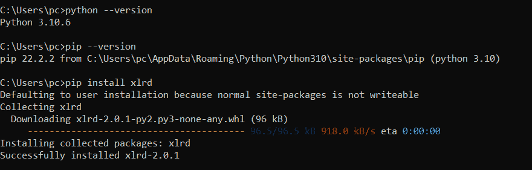
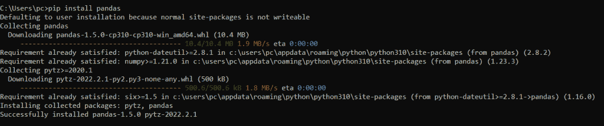
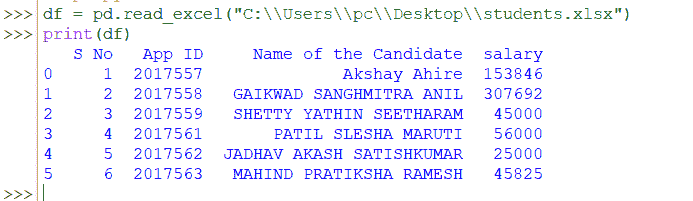
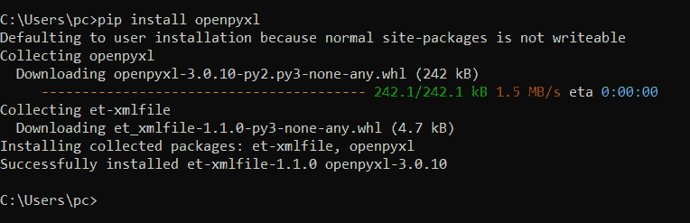
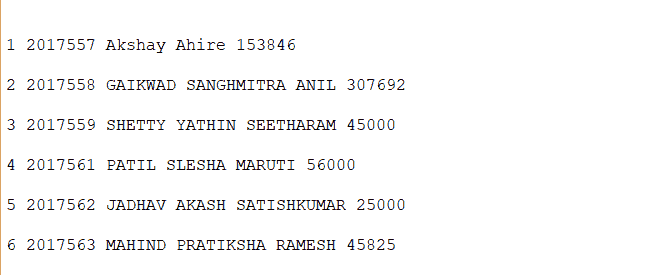

# Python 读取 Excel——使用 Python 读取 Excel 文件的不同方法

> 原文：<https://www.askpython.com/python/examples/python-read-excel>

Excel 文件是一种电子表格文件，包含行和列中的一些单元格(表格视图)，有助于数据的排列、计算、排序和管理。电子表格中的数据可以是数字、文本、公式、超链接、函数等。XLS 文件将数据存储为二进制流。它只能由最流行的 MS Excel 或其他电子表格程序创建。文件格式。xlsx 总是单独表示一个 excel 文件。

下图描述了由 MS-excel 程序创建的 excel 文件:


Excel File By MS Excel

## 如何使用 Python 读取 Excel 文件

使用 Python 读取 excel 文件，需要使用一些流行的 Python 模块和方法。让我们也理解这些。

### 使用 Python xlrd 模块

`xlrd` 是一个 python 库或模块，用于读取和管理 Excel 文件中的信息。`xlsx` 格式)。**除了**T5 之外，该模块不适用。`xlsx `文件。

让我们快速看一下如何安装`xlrd` 模块。

```py
C:\Users\pc> pip install xlrd

```

由于您正在使用 python，您必须已经下载了[**`pip`** 包安装程序](https://www.askpython.com/python-modules/python-pip)。您也可以使用自己选择的另一个 Python 包管理器。



Installing Xlrd Module

在这个方法中，我们将使用`xlwings` 模块以及与之关联的方法(即`xlwings.Book()`)。

此方法将自动打开我们的。xlsx 在后台为我们在其原始程序(即 MS-Excel)中，我们可以在那里操作和管理我们的数据。

```py
#importing the xlwings module as xw
import xlwings as xw

#you can get ur excel file already been opened after execution of this command
ws = xw.Book("C:\\Users\\pc\\Desktop\\students.xlsx").sheets['Sheet1']

```

从上面的代码片段中，我们可以在桌面上自动打开我们的 Excel，在那里我们可以访问它。

### 使用 Python 熊猫模块

**[Pandas](https://www.askpython.com/python-modules/pandas/python-pandas-module-tutorial)** 是一个开源的 Python 库或模块，提供内置的高性能数据结构和数据分析工具。它最适合与另外两个核心 python 库一起用于分析数据——用于数据可视化的`Matplotlib` 和用于数学运算的`NumPy` 。

我们将使用 pip 安装程序以与上一个模块相同的方式安装这个模块，如下所示。

```py
C:\Users\pc> pip install pandas

```

上面的代码片段将为我们安装`pandas`模块，如下所示。



Installing Panda Module

为了读取 excel 文件，让我们运行下面的代码片段。

```py
# importing pandas module as pd
import pandas as pd

#using read_excel() method to read our excel file and storing the same in the variable named "df "
df = pd.read_excel("C:\\Users\\pc\\Desktop\\students.xlsx")

#printing our spreadsheet using print() method
print(df)

```

在上面的方法中，我们是用`read_excel`()方法来读取我们的。`xlsx` 文件。我们可以使用这个方法和 pandas 模块作为`panda.read_excel*()*`，将 excel 文件数据读入 DataFrame 对象(这里是'【T3 ')。

上面的代码片段将如下所示打印我们的电子表格。



Read Excel Method

### 使用 Python openpyxl 模块

`Openpyxl` 是一个 Python 库或模块，用于读取或写入 Excel 文件。这个模块需要安装使用 load_workbook()之类的某些方法，否则我们无法使用那些方法，它会抛出`error`。让我们使用命令提示符安装这个模块。

```py
C:\Users\pc> pip install openpyxl

```

上面的代码片段将如下安装我们的`openpyxl` 模块。



Installing Openpyxl Module

在我们的第二个方法中，我们将使用 openpyxl 模块和 load_workbook()方法作为下面的代码片段。

```py
# importing openpyxl module 
import openpyxl

#using load_workbook() method to read our excel file and storing to dataframe object table1
table1 = openpyxl.load_workbook("C:\\Users\\pc\\Desktop\\students.xlsx")

#To access the table1 we need to activate and store to an another object (Here it is table2)
table2 = table1.active

for row in range(1, table2.max_row):
    for col in table2.iter_cols(1, table2.max_column):
        print(col[row].value, end = " ")
    print("\n")

```

在上面的代码片段中，我们使用 load_workbook()方法读取我们需要的 excel 文件以及 openpyxl 模块。如果不导入这个库或模块，我们就无法使用这个方法。不仅仅是这个，这个模块在我们的 read_excel()方法中负责读取位置作为一个**参数(这里是“C:\ Users \ PC \ Desktop \ students . xlsx”)。**

在读取我们的 excel 文件并将其分配给 table1 后，需要激活它。否则，如果我们打印 table1，就会出现下面的输出。


Printing Table1

我们将通过使用 for 循环作为上面的代码片段来访问 table2。我们将得到如下结果。



Output By Method 2

## 结论

在本文中，我们介绍了使用 Python 读取 Excel 文件的不同方法。我们讨论了一些流行的模块以及 Python 的一些必要方法，以获得适当的输出。希望你一定练习过并喜欢我们的代码片段。我们必须带着一些更令人兴奋的话题再次访问。