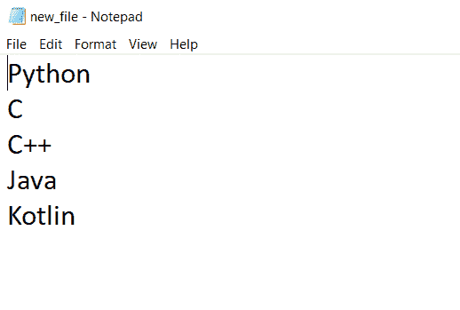

# Python 读取文件——你必须知道的 3 种方法

> 原文：<https://www.askpython.com/python/built-in-methods/python-read-file>

我们已经在 [Python 文件处理教程](https://www.askpython.com/python/python-file-handling)中看到，我们如何使用 **Python** 编程在**文件**中执行不同的操作。

其中一个操作是读取已经创建的文件。在这里，我们将详细说明这个过程，并看看我们可以用 Python 直接读取文件的不同方法。

## Python 中读取文件的不同方法

在我们开始阅读文件的方法之前，我们必须注意一些事情。首先，对于阅读来说，一个文件的存在很重要。其次，打开文件的**模式**也很重要。Python 编程中有多种打开文件的模式，即:

*   `r`–只读
*   `w`–只写
*   `a` –仅附加
*   `r+`–读和写
*   `w+`–既写又读
*   `a+`–附加和读取

在打开文件的所有不同模式中，文件内容在`r`、`r+`、`w+`和`a+`模式下是只读的。在确保文件存在并以正确的可读模式打开它之后，我们可以进一步了解用于读取文件内容的不同函数或方法。

### 1.Python 中的 read()

Python 中的`read()`方法是一个**预定义的**函数，它以**字符串**的形式返回读取的数据。`read()`方法的语法是，

**file_open_object.read( n )**

其中**文件打开对象**是在打开特定文件时创建的对象，

而**‘n’**是要从文件中读取的字节数。在没有指定 **n** 的情况下，`read()`函数读取整个文件。



new_file content

假设要读取的内容属于上面所示的文件，名为 **new_file.txt** 。因此使用`read()`我们可以读取**新文件**中的信息。让我们看看如何做到这一点，

```py
file = open("new_file.txt", "r")
print(file.read())

```

**输出:**

```py
Python
C
C++
Java
Kotlin

```

同样，为了读取特定数量的字节，我们可以以下面的方式使用`read()`,

```py
file = open("new_file.txt", "r")
print(file.read(6))

```

**输出:**

```py
Python

```

### 2.Python 中的 readline()

`readline()` 是 Python 中的另一个预定义方法，它以**字符串**的形式返回一个读取行。下面是`readline()` 函数的语法。

**file _ open _ object . readline(n)**

类似地，这里的 **file_open_object** 是打开文件时创建的对象，**‘n’**是该函数将要读取的字节数。值得注意的是，如果 **n** 超过一行的长度，该功能不考虑下一行。仔细看看函数的用法，

```py
file = open("new_file.txt", "r")
print(demo_file.readline())

```

**输出:**

```py
Python\n

```

**需要注意的一点:**这里换行符(`\n` )也被认为是**字符**。

### 3.Python 中的 readlines()

`readlines()` 读取指定文件中所有的**行**，并返回一个包含被读取行的字符串形式的列表。下面给出的是语法，

**file _ open _ object . readlines()**

使用`readlines()`方法，

```py
file = open("new_file.txt", "r")
print(demo_file.readlines())

```

**输出:**

```py
['Python\n', 'C\n', 'C++\n', 'Java\n', 'Kotlin']

```

**参考文献:**

[https://docs.python.org/3/tutorial/inputoutput.html](https://docs.python.org/3/tutorial/inputoutput.html)

[https://stack overflow . com/questions/7485458/python-reading-text-file](https://stackoverflow.com/questions/7485458/python-reading-text-file)