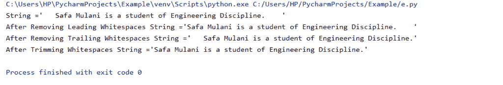
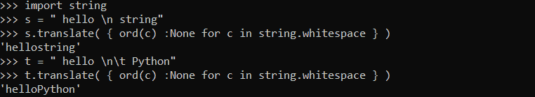
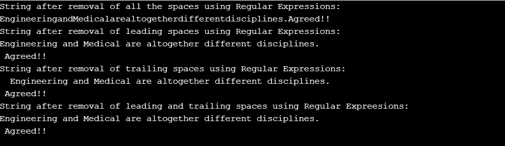

# Python 从字符串中删除空格

> 原文：<https://www.askpython.com/python/string/python-remove-spaces-from-string>

Python 提供了多种方法来删除字符串中的空格。本文将关注一些从字符串中删除空格的有效技术。

以下两种方法都可以用来去掉字符串中的空格:

*   通过使用`**strip()**`方法
*   通过使用`**replace()**`方法
*   通过使用 **`join()`** 与`**split()**`的方法
*   通过使用`**translate()**`方法
*   通过使用`**Regular Expressions**`

* * *

## 方法 1:使用 strip()方法

`split()`函数基本上删除了字符串的前导和尾随空格。

**要点:**

*   **strip()** :这个函数从包含制表符(\t)的数组中删除前导和尾随空格。
*   **lstrip()** :这个函数从字符串的左端移除空格。
*   **rstrip()** :此函数删除字符串右端的空格。

**举例:**

```py
string = '   Safa Mulani is a student of Engineering Discipline.    '

print(f'String =\'{string}\'')

print(f'After Removing Leading Whitespaces String =\'{string.lstrip()}\'')

print(f'After Removing Trailing Whitespaces String =\'{string.rstrip()}\'')

print(f'After Trimming Whitespaces String =\'{string.strip()}\'')

```

**输出**:



*Output-strip() Function*

* * *

## 方法 2:使用 replace()方法

这个函数删除字符串中的所有空格，也删除单词之间的空格。

**举例:**

```py
def remove(string_input): 
    return string_input.replace(" ", "") 

string_input = ' S a f a '
print(remove(string_input)) 

```

**输出:**

可溶性抗原荧光抗体试验

* * *

## 方法 3:使用 join()和 split()方法

join()和 split()函数一起工作。首先，split()方法使用分隔符返回整个字符串中的单词列表。然后我们需要使用 join()方法将它们连接起来。

**举例:**

```py
def remove(string_input): 
    return "".join(string_input.split()) 

# Driver Program 
string_input= ' S a f a '
print(remove(string_input))

```

**输出**:

可溶性抗原荧光抗体试验

* * *

## 方法 4:使用 translate()方法



*translate() Function*

在上面的例子中，translate()函数删除了字符串中的所有空格，并生成一个紧凑的字符串作为输出。

* * *

## 方法 5:通过使用正则表达式

函数的作用是从字符串中删除空格。

```py
import re

string = '  Engineering and Medical are altogether different disciplines. \t\n Agreed!!  '

print('String after removal of all the spaces using Regular Expressions:\n', re.sub(r"\s+", "", string), sep='') 

print('String after removal of leading spaces using Regular Expressions:\n', re.sub(r"^\s+", "", string), sep='')  # ^ matches start

print('String after removal of trailing spaces using Regular Expressions:\n', re.sub(r"\s+$", "", string), sep='')  # $ matches end

print('String after removal of leading and trailing spaces using Regular Expressions:\n', re.sub(r"^\s+|\s+$", "", string), sep='')  # | for OR condition

```

**输出:**



*Output-Removal Of Spaces Using RegEx*

* * *

## 结论

因此，在本文中，我们实现了各种技术来删除 Python 中输入字符串的空白。

## 参考

*   Python 从字符串中删除空格
*   [Python 字符串函数文档](https://docs.python.org/3/library/string.html)