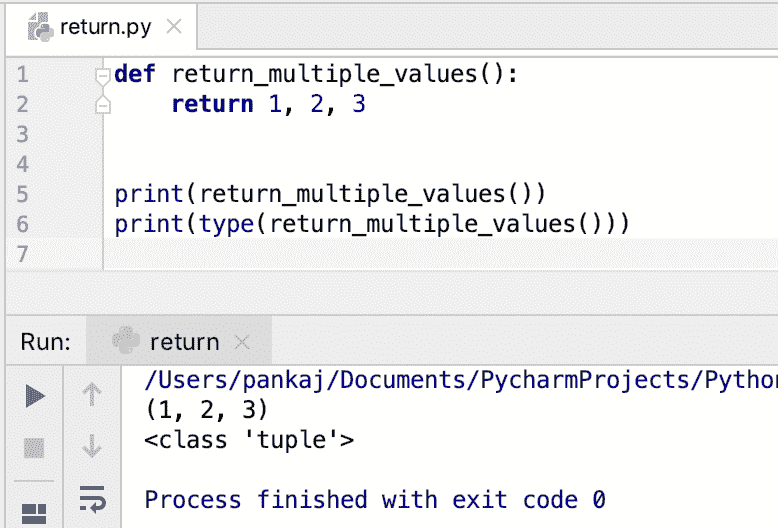

# Python 返回语句

> 原文：<https://www.askpython.com/python/python-return-statement>

*   python return 语句在 [**函数**](https://www.askpython.com/python/python-functions) 中使用，向调用程序返回一些东西。
*   我们只能在函数内部使用 return 语句。
*   在 Python 中，每个函数都返回一些东西。如果没有返回语句，那么它返回 **None** 。
*   如果 return 语句包含一个表达式，它首先被求值，然后返回值。
*   return 语句终止函数执行。
*   一个函数可以有多个 return 语句。当它们中的任何一个被执行时，函数终止。
*   一个函数可以返回多种类型的值。
*   Python 函数可以在单个 return 语句中返回多个值。

* * *

## Python return 语句示例

让我们看一个简单的例子，将两个数字相加，并将总数返回给调用者。

```py
def add(x, y):
    total = x + y
    return total

```

我们可以通过在 return 语句中包含表达式来优化函数。

```py
def add(x, y):
    return x + y

```

* * *

## 每个函数都会返回一些东西

让我们看看当一个函数没有 return 语句时会返回什么。

```py
>>> def foo():
...     pass
... 
>>> 
>>> print(foo())
None
>>>

```


Python Return None

* * *

## return 语句什么都没有会怎么样？

当 return 语句没有值时，函数返回 **None** 。

```py
>>> def return_none():
...     return
... 
>>> print(return_none())
None
>>> 

```

* * *

## Python 函数可以有多个 return 语句

```py
def type_of_int(i):
    if i % 2 == 0:
        return 'even'
    else:
        return 'odd'

```

* * *

## Python 函数可以返回多种类型的值

与其他编程语言不同，python 函数不限于返回单一类型的值。如果你看看函数定义，它没有任何关于它能返回什么的信息。

让我们看一个例子，函数将返回多种类型的值。

```py
def get_demo_data(object_type):
    if 'str' == object_type:
        return 'test'
    elif 'tuple' == object_type:
        return (1, 2, 3)
    elif 'list' == object_type:
        return [1, 2, 3]
    elif 'dict' == object_type:
        return {"1": 1, "2": 2, "3": 3}
    else:
        return None

```

* * *

## 在单个 return 语句中返回多个值

我们可以从一个 return 语句中返回多个值。这些值由逗号分隔，并作为元组返回给调用程序。

```py
def return_multiple_values():
    return 1, 2, 3

print(return_multiple_values())
print(type(return_multiple_values()))

```

**输出:**

```py
(1, 2, 3)
<class 'tuple'>

```



Python return Multiple Values

* * *

## 带有 finally 块的 Python return 语句

当在 try-except 块中执行 return 语句时，在将值返回给调用方之前，首先执行 finally 块代码。

```py
def hello():
    try:
        return 'hello try'
    finally:
        print('finally block')

def hello_new():
    try:
        raise TypeError
    except TypeError as te:
        return 'hello except'
    finally:
        print('finally block')

print(hello())
print(hello_new())

```

**输出:**

```py
finally block
hello try
finally block
hello except

```

如果 finally 块有一个 return 语句，那么前面的 return 语句将被忽略，并返回 finally 块中的值。

```py
def hello():
    try:
        return 'hello try'
    finally:
        print('finally block')
        return 'hello from finally'

print(hello())

```

**输出**:

```py
finally block
hello from finally

```

* * *

## 参考资料:

*   [Python 官方文档](https://docs.python.org/3.8/reference/simple_stmts.html#the-return-statement)