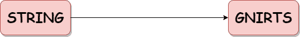

# Python 反向字符串

> 原文：<https://www.askpython.com/python/string/python-reverse-string>

字符串基本上是字符序列。Python 不支持 reverse()这样的内置字符串函数来反转字符串。



Python Reverse String

以下是在 Python 中反转字符串的方法:

1.  通过使用`for loop`
2.  通过使用`while loop`
3.  通过使用`Slicing`
4.  通过使用`join()`方法
5.  通过使用`Recursion`
6.  通过使用`List` `reverse()`的方法
7.  通过使用`stack`

* * *

## 方法 1:使用 for 循环反转字符串

```py
def rev_string_loop(s):
    res = ''
    for x in s:
        res = x + res
    return res

str = 'STRING'

print('Reversed String =', rev_string_loop(str))

```

**输出**:

反向字符串= GNIRTS

* * *

## 方法 2:使用 while 循环反转字符串

```py
def rev_string_loop(x):
    res = ''
    length = len(x) - 1
    while length >= 0:
        res = res + x[length]
        length = length - 1
    return res

str = 'STRING'

print('Reversed String =', rev_string_loop(str))

```

**输出**:

反向字符串= GNIRTS

* * *

## 方法 3:使用切片反转字符串

```py
input="STRING" 
length=len(input) 
res=input[length::-1] 
print (res) 

```

**输出**:

格尼茨

* * *

## 方法 4:使用 join()方法反转字符串

```py
input = 'STRING' 
result=''.join(reversed(input)) 
print(result)

```

**输出**:

格尼茨

* * *

## 方法 5:使用递归反转字符串

```py
def rev_string(x): 
    if len(x) == 0: 
        return x 
    else: 
        return rev_string(x[1:]) + x[0] 

x = "STRING"

print ("Original string: ") 
print (x) 

print ("Reversed string: ") 
print (rev_string(x)) 

```

**输出**:

原弦:
弦
反弦:
gnits

* * *

## 方法 6:使用 List reverse()方法反转字符串

```py
input_list = [1, 2, 3, 4, 5]

input_list.reverse()

print(input_list)

```

**输出**:

[5, 4, 3, 2, 1]

* * *

## 方法 7:使用堆栈反转字符串

```py
def create(): 
    stack1=[] 
    return stack1

def size(stack1): 
    return len(stack1) 

def isEmpty(stack1): 
    if size(stack1) == 0: 
        return true 

def push(stack1,element): 
    stack1.append(element) 

def pop(stack1): 
    if isEmpty(stack1): return
    return stack1.pop() 

def rev_string(input): 
    x = len(input) 

    stack1 = create() 

    for i in range(0,x,1): 
        push(stack1,input[i]) 

    input="" 

    for i in range(0,x,1): 
        input+=pop(stack1) 

    return input 

n = "STRING"
print ("Original string: ") 
print (n) 
print ("Reversed string: ") 
print (rev_string(n)) 

```

**输出**:

原弦:
弦
反弦:
gnits

* * *

## 参考

*   Python 反向字符串
*   [Python 文档](https://docs.python.org/3.8/library/stdtypes.html#string-methods)