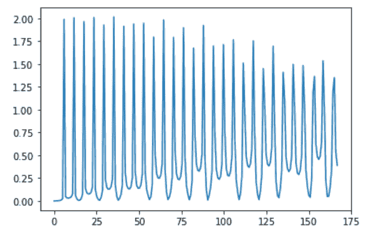
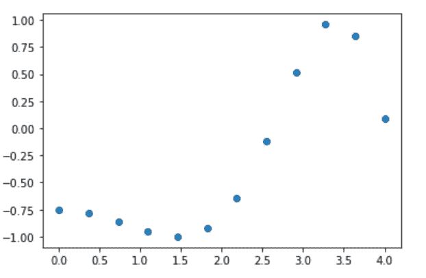

# Python SciPy 教程

> 原文：<https://www.askpython.com/python-modules/python-scipy>

**Python SciPy** 是一个以 **Python NumPy** 和数学算法为基础的库。Python SciPy 库在很大程度上用于科学计算和处理领域。

* * *

## Python Scipy 入门

为了使用 SciPy 库提供的不同功能，我们需要安装它。为此，我们将使用`pip`命令来安装 SciPy 库。

```py
pip install scipy

```

为了使用这个库的功能，我们需要使用下面的语句导入这个库:

```py
import scipy

```

* * *

## Python SciPy 中的子包

SciPy 库中有各种子模块可用于执行和提高科学计算的效率。

下面列出了 SciPy 库的一些流行子模块:

*   **特殊**:该子模块包含执行特定任务的特殊功能。
*   **常量**:表示常量。
*   **优化**:该子模块包含优化算法。
*   **积分**:该子模块包含执行数学积分的函数。
*   **插值**:表示执行插值的函数。
*   **linalg** :表示对线性代数方程进行运算的函数。
*   **io** :包含对给定输入执行输入/输出操作的函数。
*   **fftpack** :表示执行离散傅立叶变换的函数。
*   **信号**:表示 Python 中信号处理的函数和工具。
*   **稀疏**:表示处理稀疏矩阵的算法。
*   **cluster** :表示执行层次聚类的函数。

* * *

## 使用 Python SciPy 的线性代数

线性代数表示线性方程组，借助矩阵表示。

SciPy 库的`linalg`子模块用于执行与线性方程相关的所有功能。它接受要转换为二维 NumPy 数组的对象，然后执行任务。

* * *

### 1.解一组方程式

让我们借助一个示例来理解线性代数子模块以及线性方程的工作原理:

**4x+3y=12
3x+4y=18**

考虑上面的线性方程。让我们通过`linalg.solve()`函数来解方程。

```py
from scipy import linalg
import numpy
X=numpy.array([[4,3],[3,4]])
Y=numpy.array([[12],[18]])
print(linalg.solve(X,Y))
X.dot(linalg.solve(X,Y))-Y

```

在上面的代码片段中，我们通过 numpy.array()函数传递了输入方程中的系数和常数值。

此外，`linalg. solve()`函数求解线性方程并显示适用于该特定方程的 x 和 y 值。`equation1.dot(linalg.solve())-equation2`命令用于检查方程式的输出。

**输出:**

```py
[[-0.85714286]
 [ 5.14285714]]
array([[0.],
       [0.]])

```

**数组([[0。], [0.]])** 确保线性方程组已经正确求解。

**[[-0.85714286][5.14285714]]**:这些是用来解线性方程组的 x 和 y 值。

* * *

### 2.寻找矩阵的行列式

`linalg.det()`方法用于寻找输入矩阵的行列式。

**举例**:

```py
from scipy import linalg
import numpy
determinant=numpy.array([[2,4],[4,12]])
linalg.det(determinant)

```

**输出:**

```py
8.0

```

* * *

### 3.计算矩阵的逆矩阵

`linalg.inv()`方法用于计算输入矩阵的逆矩阵。

**举例:**

```py
from scipy import linalg
import numpy
inverse=numpy.array([[2,4],[4,12]])
linalg.inv(inverse)

```

**输出:**

```py
array([[ 1.5 , -0.5 ],
       [-0.5 ,  0.25]])

```

* * *

## 使用 Python SciPy 对多项式执行计算

SciPy 库的`poly1d`子模块用于对一维多项式执行操作。它接受系数作为输入，并形成多项式对象。

下面我们借助一个例子来了解一下 poly1d 子模块。

**举例:**

```py
from numpy import poly1d

# Creation of a polynomial object using coefficients as inputs through poly1d
poly_input = poly1d([2, 4, 6, 8])

print(poly_input)

# Performing integration for value = 4
print("\nIntegration of the input polynomial: \n")
print(poly_input.integ(k=3))

# Performing derivation
print("\nDerivation of the input polynomial: \n")
print(poly_input.deriv())

```

在上面的代码片段中，`poly1d()`用于接受多项式的系数。

此外，`polynomial.integ(value)`用于查找输入标量值周围的输入多项式的积分。`polynomial.deriv()` 函数用于计算输入多项式的导数。

**输出:**

```py
   3     2
2 x + 4 x + 6 x + 8

Integration of the input polynomial: 

     4         3     2
0.5 x + 1.333 x + 3 x + 8 x + 3

Derivation of the input polynomial: 

   2
6 x + 8 x + 6

```

* * *

## 使用 Python SciPy 执行集成

SciPy 库的`integrate`子模块用于对输入方程进行积分。

让我们对下面的等式进行积分:

**3*x*2 + 2*x + 6**

```py
from scipy import integrate
integrate.quad(lambda x:3*x*2 + 2*x + 6,0,2) 

```

在上面这段代码中，`integrate.quad()`函数用于计算输入方程的积分。它接受以下参数:

*   **方程式**
*   **上限**
*   **下限**

**输出:**

```py
(28.0, 3.1086244689504383e-13)

```

* * *

## 用 Python SciPy 实现傅立叶变换

傅立叶变换使我们能够将函数理解和描述为周期分量的总和。

SciPy 库的`fftpack`子模块用于对方程执行傅立叶变换。

**举例:**

```py
from scipy.fftpack import fft
import numpy as np

# Count of sample points
n = 400

# sample spacing
T = 1.0 / 500.0
x_i = np.linspace(0.0, n*T, n)
y_i = np.tan(70.0 * 2.0*np.pi*x_i) + 0.5*np.tan(70.0 * 2.0*np.pi*x_i)
y_f = fft(y_i)
x_f = np.linspace(0.0, 1.0/(3.0*T), n//2)

# matplotlib for plotting purposes
import matplotlib.pyplot as plt
plt.plot(x_f, 2.0/n * np.abs(y_f[0:n//2]))
plt.show()

```

在上面的代码片段中，我们使用了 numpy.linspace()函数来获得均匀分布的整数。此外，`fft()`函数用于计算输入的傅立叶值。我们已经使用了 [Python matplotlib 模块](https://www.askpython.com/python-modules/matplotlib/python-matplotlib)来绘制**切线**图。

**输出:**



**Fourier Transforms** – **Tangent graph**

* * *

## Python SciPy 的特殊功能

以下是 SciPy 的`special`包中一些最常用的特殊函数的列表:

*   **立方根**
*   **指数函数**
*   **对数和指数函数**
*   **伽玛**

* * *

### 1.立方根

`scipy.special.cbrt()`函数用于提供所提供输入的元素式立方根。

**举例:**

```py
from scipy.special import cbrt
val = cbrt([27, 8])
print(val)

```

**输出:**

```py
[3\. 2.]

```

* * *

### 2.指数函数

`scipy.special.exp10()`函数用于计算给定输入的元素指数。

**举例:**

```py
from scipy.special import exp10
val = exp10([27, 8])
print(val)

```

**输出:**

```py
[1.e+27 1.e+08]

```

* * *

### 3.**对数和指数函数**

`scipy.special.logsumexp()`函数用于计算输入元素的指数之和的对数值。

**举例:**

```py
from scipy.special import logsumexp
import numpy as np
inp = np.arange(5)
val = logsumexp(inp)
print(val)

```

这里，numpy.arange()函数用于生成一个数字序列作为输入传递。

**输出**:

```py
4.451914395937593

```

* * *

### 4.伽马函数

Gamma 函数用于计算 gamma 值，称为广义阶乘是因为， **gamma(n+1) = n！**

`scipy.special.gamma()`函数用于计算输入元素的灰度值。

**举例:**

```py
from scipy.special import gamma
val = gamma([5, 0.8, 2, 0])
print(val)

```

**输出:**

```py
[24\.          1.16422971  1\.                 inf]

```

* * *

## 插值函数

插值是在曲线、直线等两点或多点之间寻找值的过程。

`scipy.interpolate`包用于在特定图形上执行插值。

**举例:**

```py
import numpy as np
from scipy import interpolate
import matplotlib.pyplot as p
a = np.linspace(0, 4, 12)
b = np.sin(x**2/3+4)
print(a,b)
p.plot(a, b, 'o') # Plotting the graph assuming a and b arrays as x and y dimensions
p.show()

```

在上面的代码片段中，我们创建了一个**正弦波**，并使用 **Matplotlib 模块**的 **Python PyPlot** 包绘制了值。

**输出:**

```py
[0\.         0.36363636 0.72727273 1.09090909 1.45454545 1.81818182
 2.18181818 2.54545455 2.90909091 3.27272727 3.63636364 4\.        ] [-0.7568025  -0.78486887 -0.85971727 -0.9505809  -0.9999744  -0.92508408
 -0.64146657 -0.12309271  0.51220599  0.96001691  0.85056799  0.09131724]

```



Interpolation With SciPy

* * *

## 结论

因此，在本文中，我们已经理解了 Python SciPy 库提供的功能。

* * *

## 参考

*   Python SciPy
*   [SciPy 文档](https://docs.scipy.org/doc/scipy/)

推荐阅读: [Python Matplotlib 教程](https://www.askpython.com/python-modules/matplotlib/python-matplotlib)和 [Python NumPy](https://www.askpython.com/python-modules/numpy/python-numpy-arrays)