# Python Seaborn 教程

> 原文：<https://www.askpython.com/python-modules/python-seaborn-tutorial>

**Python Seaborn 模块**轻松高效的服务于数据可视化的目的。为了表示巨大数据集中的变化，`data visualization`被认为是描述和分析数据的最佳方式。

与 Matplotlib 相比，Seaborn 拥有一套更好的函数来以优化和高效的方式实现数据可视化。它支持 NumPy 和 Pandas 数据结构来表示数据集。

但是，为了开始使用 Seaborn 模块，我强烈建议读者理解 [Python Matplotlib 模块](https://www.askpython.com/python-modules/matplotlib/python-matplotlib)。

## Python Seaborn 入门

为了开始使用 Seaborn 模块的功能，我们需要使用下面的命令在我们的环境中安装该模块:

```py
pip install Seaborn

```

Seaborn 模块需要安装以下模块才能顺利工作:

*   Matplotlib
*   [NumPy](https://www.askpython.com/python-modules/numpy/python-numpy-arrays)
*   熊猫
*   [轨道](https://www.askpython.com/python-modules/python-scipy)轨道

我已将要点与相关文章链接起来以供参考。

* * *

## 整个教程中使用的数据文件

我们将在整个教程中使用 CSV 文件，因此这一节重点介绍我们将在整个教程中使用的文件。

无论您在哪里看到对以下文件名的引用，您都可以回过头来看看这一部分，以了解正在传递的数据。

**Book1.csv:**

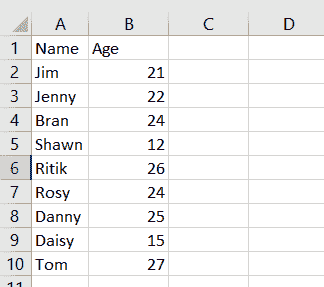

**Book1.csv**

**tips.csv** :

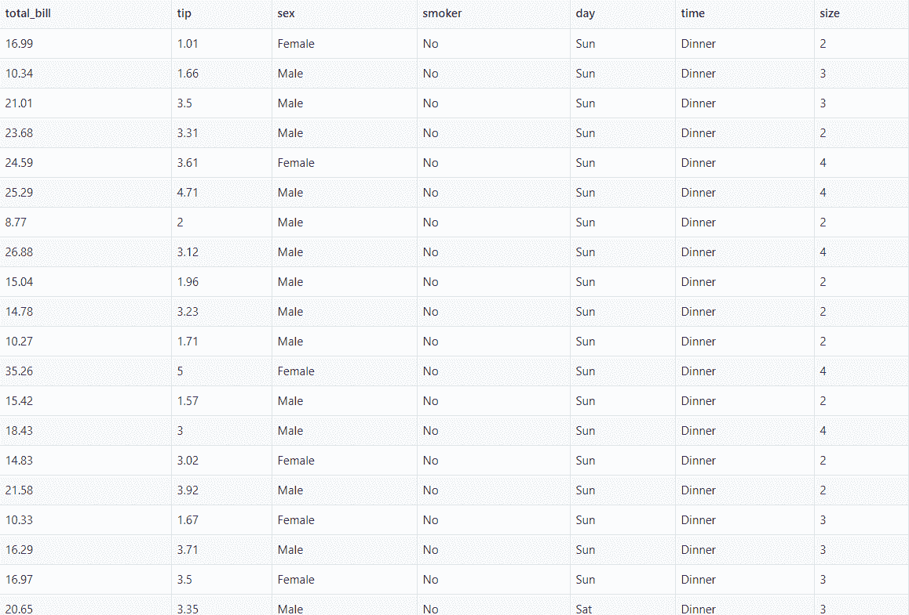

**Input csv tips-data set**

## Python Seaborn 用于统计分析

**统计分析**在很大程度上是数据集的一些参数的基本`estimation`。数据可视化可被视为执行统计分析的最佳方式，即根据图表值预测结果或原因。

在统计分析过程中，可以考虑以下任何一种方法:

*   **seaborn.scatterplot()**
*   **seaborn.lineplot()**

* * *

### 1\. seaborn.scatterplot()

`seaborn.scatterplot()`功能基本上是用来分别描绘给定轴上的参数之间的关系。图上的每一点都描绘了与之对应的一个值。

**语法:**

```py
seaborn.scatterplot(x=value, y=value, data=data)

```

**举例:**

```py
import seaborn
import pandas
import matplotlib.pyplot as plt

csv = pandas.read_csv(r'C:\Book1.csv')
res = seaborn.scatterplot(x="Name", y="Age", data=csv)
plt.show()

```

在上面的例子中，我们导入了 **Python 熊猫模块**，以便使用`read_csv()`函数读取数据集的内容。

列“姓名”由 x 轴表示，列“年龄”由 y 轴表示。

**输出:**

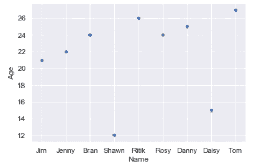

**Seaborn ScatterPlot**

* * *

### 2.seaborn.lineplot()

`seaborn.lineplot()`函数可广泛用于我们感觉需要以相对于时间的连续方式检查一个参数对另一个参数的依赖性的情况。

**语法:**

```py
seabron.lineplot(x=value, y=value, data=data)

```

**举例:**

```py
import seaborn
import pandas
import matplotlib.pyplot as plt
csv = pandas.read_csv(r'C:\Book1.csv')
res = seaborn.lineplot(x="Name", y="Age", data=csv)
plt.show()

```

**输出:**

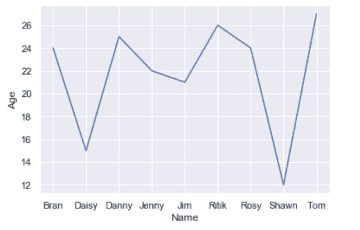

**Seaborn LinePlot**

* * *

## 分类散点图

分类数据以离散组的形式进行划分和表示，即原始数据的子集。

Python Seaborn 模块包含以下表示和可视化分类数据的方法:

*   **seaborn.catplot()**
*   **seaborn . strip lot()**
*   **seaborn . swamplot()**

* * *

### 1\. seaborn.catplot()

如上所述,`seaborn.catplot()`函数是分析一个数值和一组分类值之间关系的技术之一。

**语法:**

```py
seaborn.catplot(x=value, y=value, data=data)

```

**举例:**

```py
import seaborn
import pandas
import matplotlib.pyplot as plt

csv = seaborn.load_dataset("tips")
res = seaborn.catplot(x="tip", y="sex", data=csv)

plt.show()

```

**输出:**

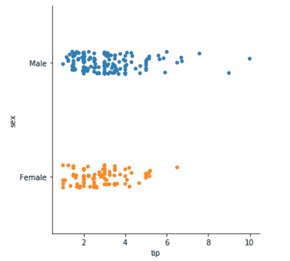

**catplot**

* * *

### 2.seaborn.stripplot()

`seaborn.stripplot()`函数将输入列中的一列视为分类数据输入，然后以顺序方式绘制相应的点，尽管输入的数据类型不同。

**语法:**

```py
seaborn.stripplot(x=value, y=value, data=data)

```

**举例:**

```py
import seaborn
import pandas
import matplotlib.pyplot as plt

csv = seaborn.load_dataset("tips")
res = seaborn.stripplot(x="tip", y="sex", data=csv,jitter=0.05)

plt.show()

```

当数据集由重叠的数据点组成时，参数`jitter`非常有用。在这种情况下，设置一个抖动值可以帮助他们得到均匀分布的 T2。

**输出:**

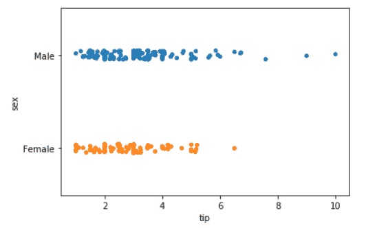

**stripplot**

* * *

### 3 . seaborn . swarmplot()

seaborn.swarmplot()函数类似于 **seaborn.stripplot()** 函数，但略有不同。`seaborn.swarmplot()`函数沿着选择的分类轴绘制数据值。因此，它完全避免了**与**重叠。

**语法:**

```py
seaborn.swarmplot(x=value, y=value, data=data)

```

**举例:**

```py
import seaborn
import pandas
import matplotlib.pyplot as plt

csv = seaborn.load_dataset("tips")
res = seaborn.swarmplot(x="tip", y="sex", data=csv)

plt.show()

```

在上面的例子中，我传递了列“sex”作为唯一的分类数据，并分别沿着 x 轴绘制了相同的数据。

**输出:**

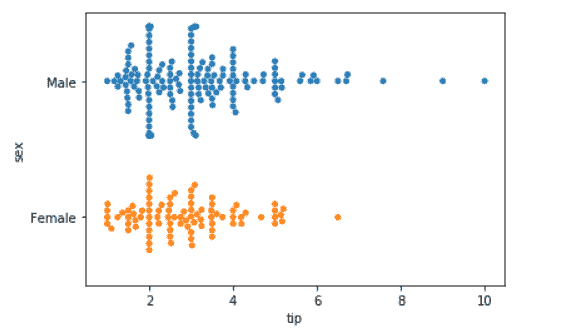

**swarmplot**

* * *

## 分类分布图

**分类分布数据**基本上是指这样一种数据，其中结果描述了随机/选择变量属于给定的**可能类别**之一的某种可能性。

Python Seaborn 具有以下函数来高效地表示分类分布式数据:

*   **seaborn.violinplot()**
*   **seaborn.boxplot()**
*   **seaborn . box plot()**

* * *

### 1.seaborn.violinplot()

`seaborn.violinplot()`函数表示数据的基本分布。它描述和表示不同分类数据输入的数据分布。

**语法:**

```py
seaborn.violinplot(x=value, y=value, data=data)

```

**举例:**

```py
import seaborn
import pandas
import matplotlib.pyplot as plt
csv = pandas.read_csv("C:\\Book1.csv")
res = seaborn.violinplot(x=csv['Age'])
plt.show()

```

在上面的例子中，我们已经分别考虑了沿着列“年龄”的数据分布。

**输出:**

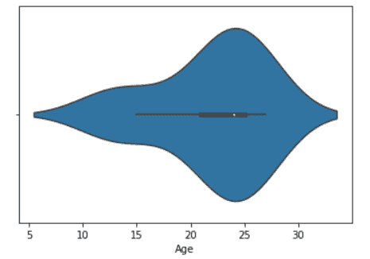

**Seaborn-violinplot**

* * *

### 2\. seaborn.boxplot()

`seaborn.boxplot()`函数代表数据的**分类分布**，并设置不同分类数据输入之间的比较。

**‘盒’结构**代表数据输入的**主四分位数，而**‘线’结构**代表数据的其余**分布**。**异常值**由使用**四分位数间函数**的点表示。**

**语法:**

```py
seaborn.boxplot(x=value, y=value, data=data)

```

**举例:**

```py
import seaborn
import pandas
import matplotlib.pyplot as plt
csv = pandas.read_csv("C:\\Book1.csv")
res = seaborn.boxplot(x=csv['Age'])
plt.show()

```

在上面的例子中，我们使用 Book1.csv 文件作为输入数据集。

如果你试着分析数据集，你会发现 12 岁是一个异常数据，其余的数据在 15-27 岁之间。这很好地由 **seaborn.boxplot()** 函数来表示。

**输出:**

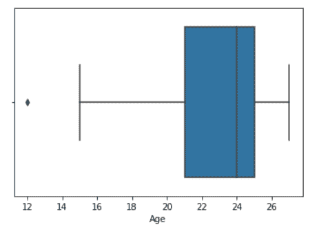

**Seaborn boxplot**

* * *

### 3 . seaborn 打印()

`seaborn.boxenplot()`函数与 **seaborn.boxplot()** 函数非常相似，只是在表示方式上略有不同。

**seaborn.boxenplot()** 函数以一种方式表示分类数据的分布，其中**大四分位数**表示对应于实际数据观察的特征。它以一种格式呈现数据，这种格式以一种可视化的形式为我们提供了关于数据整体分布的**详细信息。**

**语法:**

```py
seaborn.boxenplot(x=value, y=value, data=data)

```

**举例:**

```py
import seaborn
import pandas
import matplotlib.pyplot as plt
csv = pandas.read_csv("C:\\Book1.csv")
res = seaborn.boxenplot(x=csv['Age'])
plt.show()

```

如果您将下面的输出与输入数据集进行分析和比较，可以清楚地了解到 **boxenplot** 代表了范围在 12-27 之间的数据点的全部分布，以及具有大四分位数盒结构的分类数据的分布。

**输出:**

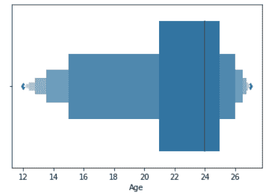

**Seaborn boxenplot**

* * *

## 分类估计图

分类数据的估计基本上是指对相应数据变量的分类数据值的某种估计或预测的表示。

Python Seaborn 具有以下用于分类数据估计的函数:

*   **seaborn.countplot()**
*   **seaborn.barplot()**
*   **seaborn.pointplot()**

* * *

### 1.seaborn.countplot()

`seaborn.counplot()`函数用于根据分类变量的频率或计数来估计和表示分类变量。

**语法:**

```py
seaborn.countplot(x=value, y=value, data=data)

```

**举例:**

```py
import seaborn
import pandas
import matplotlib.pyplot as plt
csv = pandas.read_csv("C:\\Book1.csv")
res = seaborn.countplot(x=csv['Age'])
plt.show()

```

**输出:**

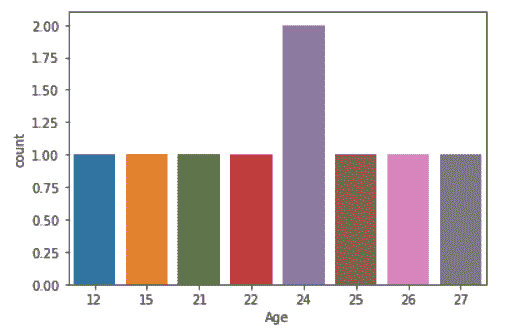

**Seaborn countplot**

从上图中可以清楚地看到， **countplot()函数**基本上计算了输入数据字段的频率，并沿 y 轴表示，而数据字段“年龄”沿 x 轴表示。

* * *

### 2.seaborn.barplot()

`seaborn.barplot()`函数基本上以数据表示的集中趋势的形式表示估计的数据。

**举例:**

```py
import seaborn
import pandas
import matplotlib.pyplot as plt
csv = pandas.read_csv("C:\\Book1.csv")
res = seaborn.barplot(x=csv['Name'], y=csv['Age'])
plt.show()

```

**输出:**

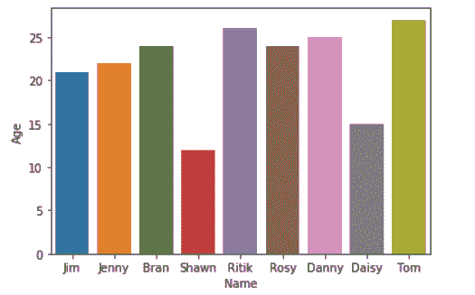

**Seaborn barplot**

### 3.seaborn.pointplot()

`seaborn.pointplot()`函数表示借助散点和连接散点的直线对分布中心趋势的估计。

**语法:**

```py
seaborn.pointplot(x=value, y=value, data=data)

```

**举例:**

```py
import seaborn
import pandas
import matplotlib.pyplot as plt
csv = pandas.read_csv("C:\\Book1.csv")
res = seaborn.pointplot(x=csv['Name'], y=csv['Age'])
plt.show()

```

**输出:**

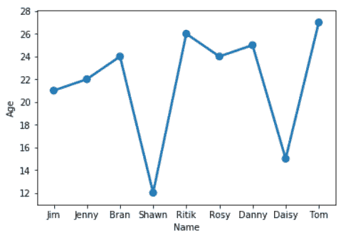

**Seaborn pointplot**

* * *

## Seaborn 的定制风格和主题

Python Seaborn 具有内置的函数和主题，能够以更好、更吸引人的方式可视化数据。

`seaborn.set()`功能用于输出可视化的**默认**主题采集。

**语法:**

```py
seaborn.set()

```

```py
import seaborn
import pandas
import matplotlib.pyplot as plt
seaborn.set()
csv = pandas.read_csv("C:\\Book1.csv")
res = seaborn.pointplot(x=csv['Name'], y=csv['Age'])
plt.show()

```

**输出:**

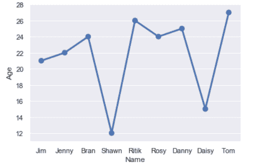

**Seaborn Style Using set()**

Python Seaborn 为我们提供了以下主题来处理、表示和可视化数据:

*   **滴答**
*   **白色网格主题**
*   **暗格主题**
*   **黑暗**
*   **白色**

**语法:**

```py
seaborn.set_style("theme-name")

```

**例:1-** `The dark theme`

```py
import seaborn
import pandas
import matplotlib.pyplot as plt
seaborn.set_style("dark")
csv = pandas.read_csv("C:\\Book1.csv")
res = seaborn.pointplot(x=csv['Name'], y=csv['Age'])
plt.show()

```

**输出:**

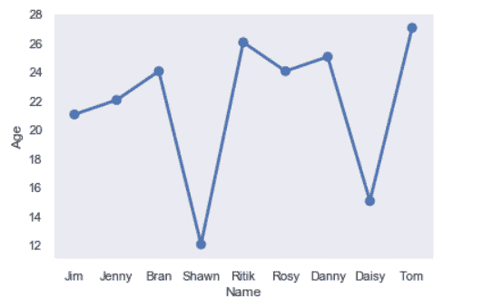

**Seaborn Dark Theme**

**例:2-** `The whitegrid theme`

```py
import seaborn
import pandas
import matplotlib.pyplot as plt
seaborn.set_style("whitegrid")
csv = pandas.read_csv("C:\\Book1.csv")
res = seaborn.pointplot(x=csv['Name'], y=csv['Age'])
plt.show()

```

**输出:**

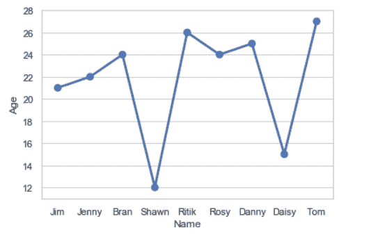

**Seaborn White grid Theme**

* * *

## Seaborn 的多点网格

为了以精确的方式表示具有分类值的大型数据集，我们可以绘制数据子集的多个图**来可视化它。**

**语法:**

```py
seaborn.FacetGird(data, col=value, col_wrap=value)

```

**举例:**

```py
import seaborn
import pandas
import matplotlib.pyplot as plt
seaborn.set_style("whitegrid")
csv = pandas.read_csv("C:\\Book1.csv")
res = seaborn.FacetGrid(csv, col="Age", col_wrap=3)
res.map(seaborn.barplot, "Name", "Age")
plt.show()

```

`FacetGrid class`用于通过针对数据子集的多个图来广泛表示数据。它可以用以下维度来表示:

*   **行**
*   **栏**
*   **色调**

参数`col_wrap`基本上表示图表需要表示的行数。

`FacetGrid.map()`函数用于将绘图技术应用于数据的每个子集。

**输出:**

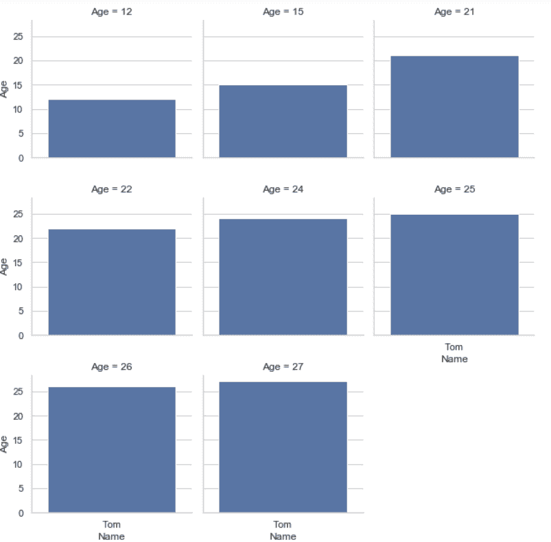

**Seaborn Multigrid**

* * *

## 用 Seaborn 绘制单变量分布

**单变量分布**基本上是指数据相对于一个**单个随机变量/数据项**的**分布**。

Python Seaborn 模块的`seaborn.distplot()`函数可以用来表示数据集的单变量分布。

**语法:**

```py
seaborn.distplot(data-column)

```

**举例:**

```py
import seaborn
import pandas
import matplotlib.pyplot as plt
seaborn.set_style("whitegrid")
csv = pandas.read_csv("C:\\Book1.csv")
res=seaborn.distplot(csv['Age'])
plt.show()

```

**输出:**

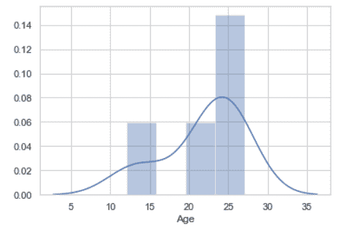

Seaborn Distplot

* * *

## 用 Seaborn 描述二元分布

**二元分布**是指数据相对于**数据集**的两个数据列或数据项的可视化。

`seaborn.jointplot()`可以用来描述两个数据变量之间的关系。

**语法:**

```py
seaborn.jointplot(x=variable1, y=variable2)

```

**举例:**

```py
import seaborn
import pandas
import matplotlib.pyplot as plt
seaborn.set_style("darkgrid")
csv = pandas.read_csv("C:\\Book1.csv")
res=seaborn.jointplot(x=csv['Age'], y=csv['Age'])
plt.show()

```

在上面的例子中，我们使用两个变量作为“年龄”,只是为了简单描述数据的可视化。

**输出:**

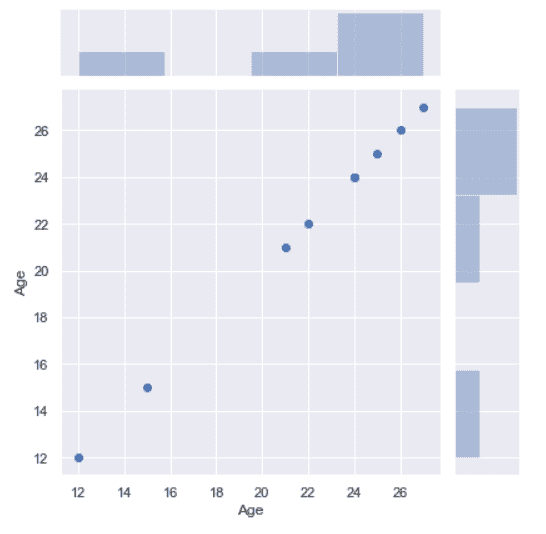

**Seaborn jointplot**

* * *

## 结论

因此，在本文中，我们已经理解了 **Python Seaborn 为数据可视化**提供的基本功能。

* * *

## 参考

*   [Python Seaborn-官方文档](https://seaborn.pydata.org/tutorial.html)
*   Python Seaborn 教程-JournalDev