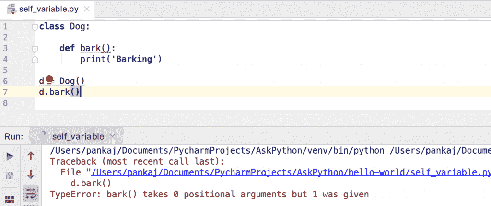

# 通过示例了解 Python 自身变量

> 原文：<https://www.askpython.com/python/python-self-variable>

Python 自身变量用于将类的实例绑定到实例方法。我们必须显式地将其声明为第一个方法参数来访问实例变量和方法。此变量仅用于实例方法。

在大多数面向对象的编程语言中，您可以在方法中访问当前对象，而不需要显式地将它作为方法参数。例如，我们可以在 Java 程序中使用**这个**关键字来访问当前对象。但是，在 Python 中，我们必须显式地将对象实例声明为“self”变量。

* * *

## Python self 是关键词？

Python 自身变量不是[保留关键字](https://www.askpython.com/python/python-keywords)。但是，使用[变量](https://www.askpython.com/python/python-variables)名称作为“自己”来引用实例是最佳实践和惯例。

* * *

## Python 自变量示例

假设我们有一个如下定义的狗类。

```py
class Dog:

    def __init__(self, breed):
        self.breed = breed

    def bark(self):
        print(f'{self.breed} is barking.')

d = Dog('Labrador')
d.bark()

```

**输出** : `Labrador is barking.`

*   __init__()函数用两个变量定义，但是当我们创建 Dog 实例时，我们必须只提供一个参数。“自我”被自动分配给新创建的 Dog 类实例。
*   bark()方法只有一个参数——“self”——它绑定到调用该方法的 Dog 实例。这就是为什么我们在调用 bark()方法时不传递任何参数。
*   如果我们必须访问函数中的任何实例变量，我们可以使用点运算符。

* * *

## 我们能跳过“自我”变量吗？

如果实例方法不需要访问实例变量怎么办？在这种情况下，我们可以跳过 self 变量吗？

让我们用一个简单的例子来了解一下。

```py
class Dog:

    def bark():
        print('Barking')

d = Dog()
print("Done")

```

如果你运行上面的代码，就不会有任何错误。但是，我们没有调用 bark()方法。让我们看看当我们试图调用 bark()方法时会发生什么。

```py
d = Dog()
d.bark()

```



Python instance method without self Error

由于 bark()方法接受 0 个参数，但我们提供了 1 个参数，因此出现了错误。这是因为当我们调用`d.bark()`时，“d”实例会自动作为第一个参数传递给 bark()实例方法。

但是，如果我们通过类引用访问 bark()实例方法，那么它会工作得很好。所以，调用 `**Dog.bark()**` **不会导致任何错误。**

* * *

## 类方法和静态方法的相似变量？

类方法也存在同样的行为。唯一的区别是，约定是使用“ **cls** ”作为类引用的变量名。

```py
class Dog:

    @classmethod
    def walk(cls):
        print('Dog is Walking')

Dog.walk()

```

然而，静态方法并不要求这样。因为，静态方法是自给自足的函数，它们不能直接访问任何类变量或函数。

让我们看一个完整的例子，有 **self** 和 **cls** 变量和一个没有任何参数的静态方法。

```py
class Dog:

    def __init__(self, breed):
        self.breed = breed

    @classmethod
    def walk(cls):
        print('Dog is Walking')

    # instance method
    def bark(self):
        print(f'{self.breed} is barking.')

    @staticmethod
    def add(x, y):
        return x + y

Dog.walk()
d = Dog('Labrador')
d.bark()
print(Dog.add(10, 20))

```

**输出:**

```py
Dog is Walking
Labrador is barking.
30

```

* * *

## 打破常规的快速例子

这个例子只是向您展示，使用变量名作为“self”和“cls”并不是强制性的。在真正的编程中，请始终遵守这一约定。

```py
class Dog:

    @classmethod
    def walk(myclass):
        print('Dog is Walking')

    # instance method
    def bark(myobject):
        print('Dog is Barking.')

Dog.walk()
d = Dog()
d.bark()

```

* * *

## “self”变量被绑定到当前实例

self 变量使我们能够访问当前的实例属性。我们可以通过创建 Dog 类的两个不同实例的简单示例来证实这一点。

```py
class Dog:

    def __init__(self, b):
        self.breed = b

    def bark(self):
        print(f'{self.breed} is Barking.')

d1 = Dog('Labrador')
d2 = Dog('Husky')

d1.bark()
d2.bark()

```

**输出:**

```py
Labrador is Barking.
Husky is Barking.

```

* * *

## 为什么不把“自我”变量隐式化？

有很多建议将“self”变量作为保留关键字，隐式地提供给实例方法。但是，这个建议被“吉多·范·罗苏姆”拒绝了。你可以在这里阅读它们[，在这里](https://www.artima.com/weblogs/viewpost.jsp?thread=239003)阅读[。](https://neopythonic.blogspot.com/2008/10/why-explicit-self-has-to-stay.html)