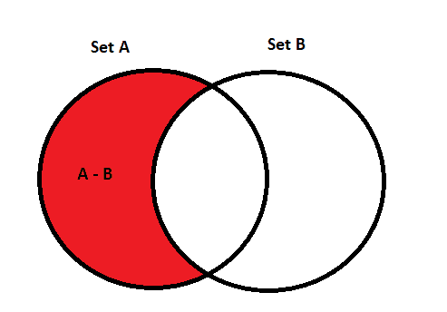

# Python 集合差异

> 原文：<https://www.askpython.com/python/set/python-set-difference>

Python Set Difference 基本上是对 iterable 对象执行差运算，结果包含它们之间的差。

它包含存在于集合(在其上调用操作)中而不存在于其他集合中的元素。

## Python 集差维恩图

下面的文氏图提供了一个比任何文本更好的理解集合差异的方法。



**Set Difference**

* * *

## 寻找集合差异的技巧

以下是在 python 中查找多个集合之间的集合差异的技巧:

*   **通过使用 set difference()方法**
*   **通过使用“-”运算符**
*   **通过使用 difference_update 方法**
*   **通过使用“-=”运算符**

### 1.Python 使用 Difference()方法设置差异

difference()方法通常对诸如[字符串](https://www.askpython.com/python/string/python-string-functions)、[列表](https://www.askpython.com/python/list/python-list)、[元组](https://www.askpython.com/python/tuple/python-tuple)等可迭代对象进行操作。

difference()方法产生一个新的集合作为输出，它包含调用该方法的特定集合中的所有项目，这些项目不存在于另一个集合中，即**它创建两个集合**之间的差异。

例如:

如果集合 A = {1，9，5，7}并且集合 B = {2，8，9，7}

然后，集合 A 差集合 B 将包含集合 A 中存在但集合 B 中不存在的所有元素，即结果= {1，5}。

**注意:**如果将 set 以外的任何 iterable 作为参数传递给 difference()方法，那么该方法首先将 iterable 对象转换为 sets，然后对其执行操作。

**语法:**

```py
Set.difference(iterable_object) = Set Object
```

**举例:**

```py
Set_A = {1, 3, 5, 7, 9}

Set_B = {2, 4, 6, 7, 9}

Result = Set_A.difference(Set_B)
print(Result);

input_list = [1, 2, 3, 4, 5, 6, 7] #list
Display = Set_A.difference(input_list)
print(Display)

```

**输出:**

```py
{1, 3, 5}
{9}
```

### 2.在 Python 中对集合差使用“-”运算符

“-”运算符也可用于对元素执行集合差运算。它的作用与 difference()方法相同。

“-”操作符和 difference()方法之间唯一的区别是:**“-”操作符只作用于集合元素**，而后者作用于任何可迭代的对象。

**语法**:

```py
SetA - SetB = Resultant_Set
```

**举例:**

```py
Set_A = {1, 3, 5, 7, 9}

Set_B = {2, 4, 6, 7, 9}

Result = Set_A - Set_B 
print(Result)

```

**输出:**

```py
{1, 3, 5}
```

### 3.使用差分更新()方法

difference_update()方法还返回来自 iterable 对象(如字符串、列表、元组等)的集合元素之间的差异。

在 **difference_update()** 方法中，差运算的结果并不存储在新创建的集合中，而是**更新对其执行运算的同一集合**。

**语法:**

```py
Set.difference_update(iterable_object)
```

**举例:**

```py
Set_A = {1, 3, 5, 7, 9}

Set_B = {2, 4, 6, 7, 9}

print("Set_A before the difference operation: ", Set_A)

Set_A.difference_update(Set_B) 

print("Set_A difference Set_B: ", Set_A);

```

**输出:**

```py
Set_A before the difference operation:  {9, 1, 3, 5, 7}
Set_A difference Set_B:  {1, 3, 5}
```

### 4.使用“-=”运算符

“-=”运算符的工作方式类似于 difference_update 方法，即它对集合元素执行差分运算，并在执行差分运算的同一集合内更新结果。

**注意:**-= "运算符只对集合对象起作用。

**语法:**

```py
Set_A -= Set_B
```

**举例:**

```py
Set_A = {1, 3, 5, 7, 9}

Set_B = {2, 4, 6, 7, 9}

print("Set_A before the difference operation: ", Set_A)

Set_A -= Set_B

print("Set_A difference Set_B: ", Set_A);

```

**输出:**

```py
Set_A before the difference operation:  {9, 1, 3, 5, 7}
Set_A difference Set_B:  {1, 3, 5}
```

* * *

## 结论

因此，在本文中，我们已经了解了在 Python 中寻找集合元素差异的不同方法。

* * *

## 参考

*   Python 集合差异
*   [Python 集合差异文档](https://docs.python.org/3.8/library/stdtypes.html#set-types-set-frozenset)