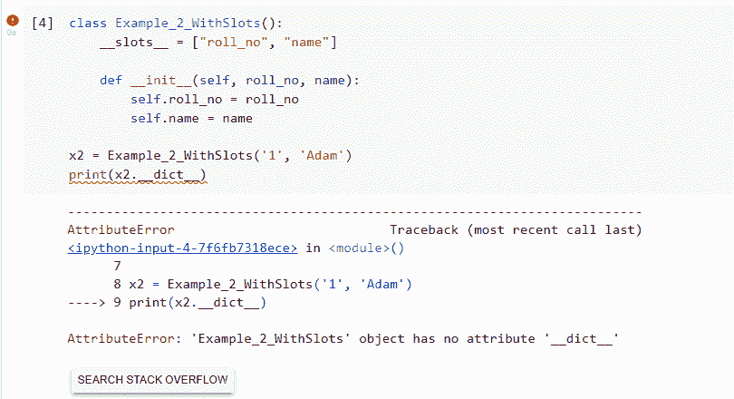
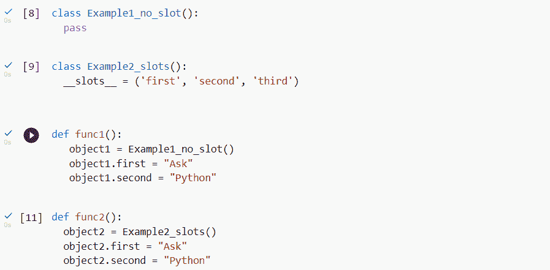
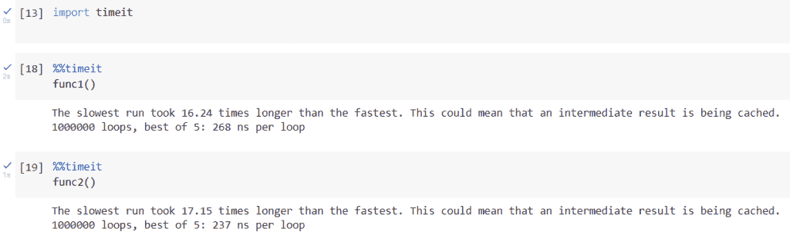

# Python __slots__ 函数是什么？

> 原文：<https://www.askpython.com/python/built-in-methods/python-slots>

你好读者，这篇文章将帮助你了解什么是 __slots__，它们的优点、缺点和用法。

## 什么是 __ 槽 _ _？

它用在类和对象实现程序中。__slots__ 是一个类变量，通常被赋予一系列字符串，这些字符串是实例使用的变量名。使用 __slots__ 的主要目的是为了在程序中更快地访问和节省内存。

在 Python 中，当我们实现一个类时，一个类将有对象实例，这些对象实例将有属性，所有这些属性都被存储。

Python 默认生成 __dict__ 属性来存储特定类中所有实例的值。它的实现非常类似于 Python 中的 [dict 数据类型。](https://www.askpython.com/python/dictionary/python-dictionary-dict-tutorial)

__dict__ 有助于动态变量的创建，但在某些情况下，它无法捕捉错误。例如，如果在编写代码时，您误拼了一个变量名，而不是产生一个 *AttributeError* 它将创建一个新变量。诸如此类的问题在 __slots__ 中得到解决。

此外，使用 __slots__ 的对象实例没有内置字典。这有两个好处，第一，访问变量的速度更快，第二，节省了大量内存。它不会为该类创建 __dict__。

```py
class Example_1_WithoutSlots():

    def __init__(self, roll_no, name):
        self.roll_no = roll_no
        self.name = name

x1 = Example_1_WithoutSlots('1', 'Adam')
print(x1.__dict__) 

```

**输出:**

{'roll_no': '1 '，' name': 'Adam'}

```py
class Example_2_WithSlots():
    __slots__ = ["roll_no", "name"]

    def __init__(self, roll_no, name):
        self.roll_no = roll_no
        self.name = name

x2 = Example_2_WithSlots('1', 'Adam')
print(x2.__dict__)

```

**输出:**



Output

此外，使用 __slots__ 的对象实例没有内置的字典，这使得访问实例更快，也节省了内存。为了测试，我们在 python 中导入了 *timeit* 来检查两个类中函数的速度。实现的第一个类没有类，第二个类有槽。我们可以清楚地看到两种功能的区别。

实现类和函数



Classes

**输出:**



Output

请注意两个函数所用时间的差异。第一个函数每循环花费 268ns，而第二个函数每循环花费 237 ns。在像这样的短程序中，差别似乎不大，但是当开发人员大规模开发一个程序时，速度是一个主要因素。

## 结论

Python 中的 __slots__ 是提高程序速度和更快访问属性的非常有效的方法。它使面向对象编程变得更加容易。