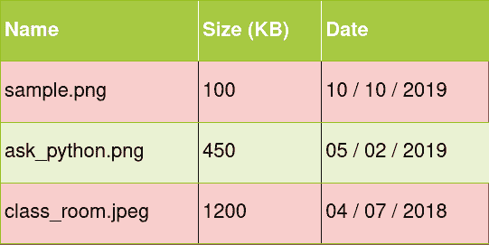
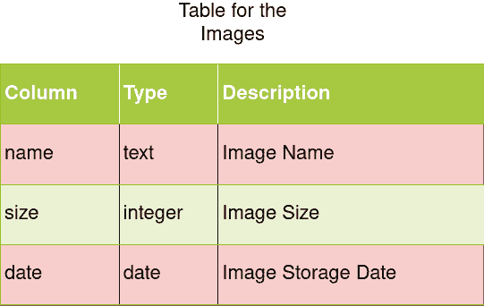

# Python SQLite 模块

> 原文：<https://www.askpython.com/python-modules/python-sqlite-module>

Python **SQLite** 模块是一个轻量级的库，它提供了一种简单的方法来完成 **SQL** 类型的数据库管理的困难任务。与其他数据库系统不同，这不需要专用的服务器进程/机器。

这结合了易于使用的 SQL 类型查询进行数据库管理，但以最 Pythonic 化的方式将其用于对象的内部存储！

让我们快速浏览这个库，并为我们的应用程序创建自己的数据库！

## Python SQLite

Python SQLite 随任何已安装的 Python 版本一起提供，所以不需要用`pip`安装。没错，你已经有了！

为了导入它，因为我们将使用 **Python3** ，我们将导入`sqlite3`模块。

```py
import sqlite3

```

现在让我们从主要的模块方法开始。

## 创建数据库

尽管我们提到没有外部服务器运行，所有的东西都在当前的机器中，因为这是数据库系统的标准协议，这个模块通过这样做也像一个标准协议！

我们将创建一个*连接*到 **Python SQLite** 数据库。这只为数据库分配内存，并从数据库文件中检索任何数据，因此数据库是从`db`文件构建的。

```py
import sqlite3
# Establish a connection to the Database and create
# a connection object
conn = sqlite3.connect('database.db')

```

这里，`database.db`是数据库文件，数据将存储在其中。所以我们从这个文件调用数据库。

**注意**:如果该文件不存在，数据库会自动为您创建，并在下次使用该文件更新数据库。

如果我们已经有了这个文件，我们必须确保我们不会意外地覆盖它。因此，我们必须使用下面的函数检查该文件是否已经存在于系统中。

```py
import os

def check_db(filename):
    return os.path.exists(filename)

```

不过，如果您只是想要一个临时数据库，还有另一个选择，通过使用特殊文件`:memory:`，直接在 **RAM** 中构建数据库。

```py
import sqlite3
conn = sqlite3.connect(':memory:')

```

上述方法的问题在于，我们需要在最后使用`conn.close()`显式关闭连接。Python 有一个很好的解决方案——**上下文管理器**。一个`with`语句上下文管理器将自动为您完成这项工作，因此我们修改后的代码将是:

```py
import sqlite3

db_file = 'database.db'
with sqlite3.connect(db_file) as conn:
    print('Created the connection!')
print('Automatically closed the connection!')

```

**输出**

```py
Created the connection!
Automatically closed the connection!

```

## 创建光标对象

一旦建立了连接，我们就有了一个连接对象，从中我们可以构造一个`Cursor`对象。

```py
# Create a cursor to the Database
c = conn.cursor()

```

这个光标是一个指向数据库的指针，用于导航数据库，以便我们可以移动到位置并执行 SQL 查询。

## 创建我们的数据库方案

在开始执行查询之前，我们需要首先根据记录的存储方式创建一个模式。这是一个**数据库表**，它是一个具有行和列的结构。

行对应于实际的数据值，而列对应于它的属性名。

让我们为存储图像创建一个简单的模式。我们将任何图像定义为具有名称、**大小**和图像创建日期的**。实际的数据会在内存的某个地方。模式只定义了数据的组织方式。**



Db Table

由于我们要像这样定义表，表的模式将如下图所示。



Image Table

我们可以使用光标，通过传递`cursor.execute('SQL_QUERY')`，使用 **SQL** 查询来执行查询。

让我们编写创建这个模式的 SQL 查询。

```py
CREATE TABLE images(
    name text primary key,
    size text,
    date date
);

```

我们可以将该查询作为字符串传递，但是如果您想要执行更长的查询，更简单的方法是创建一个`.sql`文件，然后使用`cursor.executescript()`从该文件中读取。

因此，让我们将查询放入一个名为`schema.sql`的文件中，并从中读取。

```py
import sqlite3
import os

def check_db(filename):
    return os.path.exists(filename)

db_file = 'database.db'
schema_file = 'schema.sql'

if check_db(db_file):
    print('Database already exists. Exiting...')
    exit(0)

with open(schema_file, 'r') as rf:
    # Read the schema from the file
    schema = rf.read()

with sqlite3.connect(db_file) as conn:
    print('Created the connection!')
    # Execute the SQL query to create the table
    conn.executescript(schema)
    print('Created the Table! Now inserting')
    conn.executescript("""
                       insert into images (name, size, date)
                       values
                       ('sample.png', 100, '2019-10-10'),
                       ('ask_python.png', 450, '2019-05-02'),
                       ('class_room.jpeg', 1200, '2018-04-07');
                       """)
    print('Inserted values into the table!')
print('Closed the connection!')

```

**输出**

```py
Created the connection!
Created the Table! Now inserting
Inserted values into the table!
Closed the connection!

```

## 从表中获取值

现在我们有了带有初始值的表，让我们查询该表以获得它的所有行。我们不能只打印光标对象，所以我们需要使用`cursor.fetchall()`显式地获取属性，并通过迭代打印出来。

```py
import sqlite3

db_file = 'database.db'

with sqlite3.connect(db_file) as conn:
    cursor = conn.cursor()
    cursor.execute("""
                   select * from images
                   """)
    for row in cursor.fetchall():
        name, size, date = row
        print(f'{name} {size} {date}')

```

**输出**

```py
sample.png 100 2019-10-10
ask_python.png 450 2019-05-02
class_room.jpeg 1200 2018-04-07

```

## SQLite 中的事务

事务管理是 SQL 数据库的特性之一，SQLite 也处理它们。事务基本上是一系列的更改，通过执行一个查询，然后放置一个`commit`，您可以安全地修改数据库。

如果由于某种原因，在提交之前，您不想完成事务，您可以使用`rollback`返回到提交之前的状态。

同样，我们也可以通过这些类型的更改来查看数据库的状态。

```py
import sqlite3

db_filename = 'database.db'

def display_table(conn):
    cursor = conn.cursor()
    cursor.execute('select name, size, date from images;')
    for name, size, date in cursor.fetchall():
        print(name, size, date)

with sqlite3.connect(db_filename) as conn1:
    print('Before changes:')
    display_table(conn1)

    cursor1 = conn1.cursor()
    cursor1.execute("""
    insert into images (name, size, date)
    values ('JournalDev.png', 2000, '2020-02-20');
    """)

    print('\nAfter changes in conn1:')
    display_table(conn1)

    print('\nBefore commit:')
    with sqlite3.connect(db_filename) as conn2:
        display_table(conn2)

    # Commit from the first connection
    conn1.commit()
    print('\nAfter commit:')
    with sqlite3.connect(db_filename) as conn3:
        display_table(conn3)

    cursor1.execute("""
    insert into images (name, size, date)
    values ('Hello.png', 200, '2020-01-18');
    """)

    print('\nBefore commit:')
    with sqlite3.connect(db_filename) as conn2:
        display_table(conn2)

    # Revert to changes before conn1's commit
    conn1.rollback()
    print('\nAfter connection 1 rollback:')
    with sqlite3.connect(db_filename) as conn4:
        display_table(conn4)

```

**输出**

```py
Before changes:
sample.png 100 2019-10-10
ask_python.png 450 2019-05-02
class_room.jpeg 1200 2018-04-07

After changes in conn1:
sample.png 100 2019-10-10
ask_python.png 450 2019-05-02
class_room.jpeg 1200 2018-04-07
JournalDev.png 2000 2020-02-20

Before commit:
sample.png 100 2019-10-10
ask_python.png 450 2019-05-02
class_room.jpeg 1200 2018-04-07

After commit:
sample.png 100 2019-10-10
ask_python.png 450 2019-05-02
class_room.jpeg 1200 2018-04-07
JournalDev.png 2000 2020-02-20

Before commit:
sample.png 100 2019-10-10
ask_python.png 450 2019-05-02
class_room.jpeg 1200 2018-04-07
JournalDev.png 2000 2020-02-20

After connection 1 rollback:
sample.png 100 2019-10-10
ask_python.png 450 2019-05-02
class_room.jpeg 1200 2018-04-07
JournalDev.png 2000 2020-02-20

```

在这里，正如您所看到的，只有在我们显式完成一个事务之后，表才会被修改。在此之前的任何更改实际上都不会修改该表。

最后，我们回滚`Hello.png`记录，这样它就不会被插入到表中。

* * *

## 结论

希望这给你一个好主意，让你知道如何在`sqlite3`中用 Python 的易用性开发 SQL 类型的数据库系统。

* * *

## 参考

*   [Python SQLite 官方文档](https://docs.python.org/3.8/library/sqlite3.html)
*   关于 SQLite 模块的 JournalDev 文章

* * *