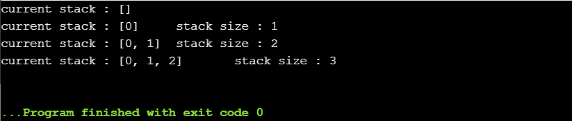
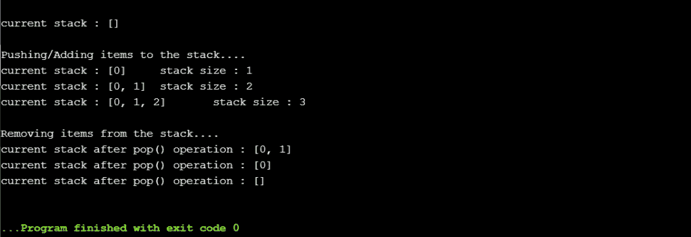
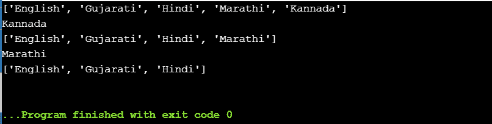
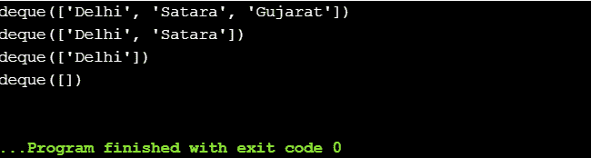
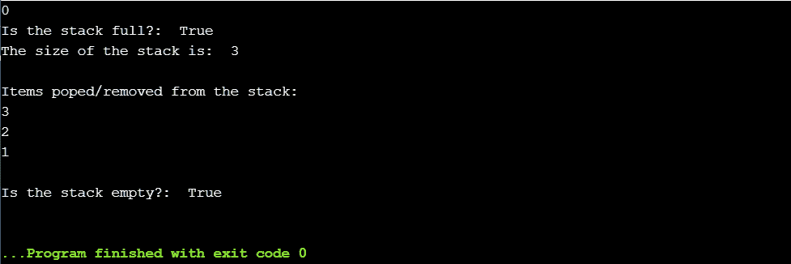

# Python 堆栈

> 原文：<https://www.askpython.com/python/python-stack>

堆栈是一种后进先出的线性数据结构，即最后进入的元素将是第一个被移除的元素。

在堆栈中，数据项从一端加入，从同一端取出。

**与堆栈相关的操作:**

*   `Push`–向堆栈中添加元素
*   `Pop`–从堆栈中删除/移除元素

* * *

## 堆栈中的推送操作

`**push() method**`用于向堆栈中添加元素。此方法将一个元素添加到堆栈的顶部。我们可以使用`append()`方法向堆栈中添加元素。

**举例:**

```py
stack_store = [] 
print('current stack :', stack_store)

for x in range(3):
    # push items into stack
    stack_store.append(x)
    print('current stack :', stack_store,'\tstack size :', len(stack_store))

```

**输出**:



*Output-Push Method*

* * *

## 堆栈中的弹出操作

`**pop() method**`用于从堆栈中移除元素。调用此方法时，从堆栈中移除最顶端的元素。

**举例:**

```py
stack_store= []
print('\ncurrent stack :', stack_store)

print('\nPushing/Adding items to the stack....')

for x in range(3):

    stack_store.append(x)
    print('current stack :', stack_store,'\tstack size :', len(stack_store))

print('\nRemoving items from the stack....')
while len(stack_store) > 0:  
    stack_store.pop()
    print('current stack after pop() operation :', stack_store)

```

**输出**:



*Output-Pop Method*

* * *

## 在 Python 中实现堆栈的方法

以下是在 Python 中实现堆栈的方法:

*   `**list**`
*   `**collections.deque**`
*   `**queue.LifoQueue**`

### 方法 1:使用列表实现堆栈

```py
# stack using list 
stack_list = ["English", "Gujarati", "Hindi"] 
stack_list.append("Marathi") 
stack_list.append("Kannada") 
print(stack_list) 
print(stack_list.pop()) 
print(stack_list) 
print(stack_list.pop()) 
print(stack_list) 

```

**输出:**



*Output-Stack Using List*

* * *

### 方法 2:使用 Deque 集合实现堆栈

```py
from collections import deque
stack_store = deque()

stack_store.append('Delhi')
stack_store.append('Satara')
stack_store.append('Gujarat')

print(stack_store)

stack_store.pop()
print(stack_store)
stack_store.pop()
print(stack_store)
stack_store.pop()
print(stack_store)

```

**输出:**



*Output-Deque As Stack*

* * *

### 方法 3:使用队列实现堆栈

```py
from queue import LifoQueue 

# Initializing a stack 
stack_store = LifoQueue(maxsize = 3) 

print(stack_store.qsize()) 

stack_store.put('1') 
stack_store.put('2') 
stack_store.put('3') 

print("Is the stack full?: ", stack_store.full())  
print("The size of the stack is: ", stack_store.qsize())  

print('\nItems poped/removed from the stack: ') 
print(stack_store.get()) 
print(stack_store.get()) 
print(stack_store.get()) 

print("\nIs the stack empty?: ", stack_store.empty()) 

```

**输出:**



*Output-Stack Using Queue*

* * *

## 结论

因此，在本文中，我们已经了解了堆栈数据结构的机制及其基本操作，以及在编程中实现它的生动方法。

## 参考

*   Python 堆栈
*   [Python 文档中的堆栈](https://docs.python.org/3/tutorial/datastructures.html)