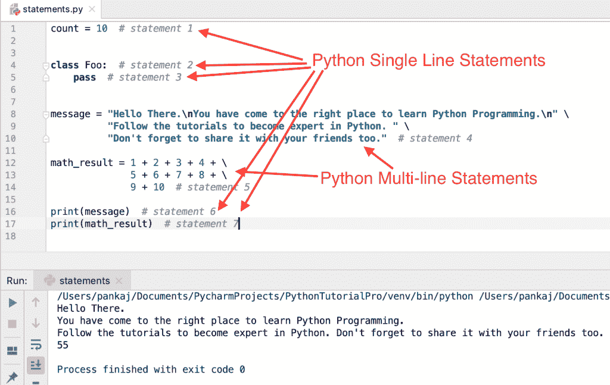

# Python 语句–多行、简单和复合示例

> 原文：<https://www.askpython.com/python/python-statements>

Python 语句是由 Python 解释器执行的代码指令。当语句出现在代码中时，Python 会逐个执行它们。

* * *

## Python 语句示例

我们来看一些简单的语句例子。

```py
count = 10  # statement 1

class Foo:  # statement 2
    pass    # statement 3

```

* * *

## Python 多行语句

Python 语句通常写在一行中。换行符标志着语句的结束。如果语句很长，我们可以用行继续符(\)显式地把它分成多行。

让我们看一些多行语句的例子。

```py
message = "Hello There.\nYou have come to the right place to learn Python Programming.\n" \
          "Follow the tutorials to become expert in Python. " \
          "Don't forget to share it with your friends too."

math_result = 1 + 2 + 3 + 4 + \
              5 + 6 + 7 + 8 + \
              9 + 10

print(message)
print(math_result)

```



Python Statements

Python 支持圆括号( )、方括号[ ]和大括号{ }内的多行连续。括号由 List 使用，大括号由 dictionary 对象使用。我们可以对表达式、[元组](https://www.askpython.com/python/tuple/python-tuple)和字符串使用括号。

```py
message = ("Hello\n"
           "Hi\n"
           "Namaste")

math_result = (1 + 2 + 3 + 4 +
               5 + 6 + 7 + 8 +
               9 + 10)

prime_numbers_tuple = (2, 3, 5, 7,
                       11, 13, 17)

list_fruits = ["Apple", "Banana",
               "Orange", "Mango"]

dict_countries = {"USA": "United States of America", "IN": "India",
                  "UK": "United Kingdom", "FR": "France"}

```

* * *

## 我们可以在一行中有多个语句吗？

我们可以用分号(；)在一行中包含多个语句。

```py
x = 1; y = 2; z = 3

```

* * *

## Python 简单语句

Python 简单语句由一行组成。上面创建的多行语句也是简单的语句，因为它们可以写在一行中。让我们看看 Python 中一些重要类型的简单语句。

* * *

### 1.Python 表达式语句

```py
i = int("10")  # expression is evaluated and the result is assigned to the variable.

sum = 1 + 2 + 3  # statement contains an expression to be evaluated first.

```

* * *

### 2.Python 赋值语句

```py
count = 10  # value is assigned to the variable, no expression is evaluated

message = "Hi"

```

* * *

### 3.Python 断言语句

```py
assert 5 < 10
assert (True or False)

```

在 [Python 断言](https://www.askpython.com/python/built-in-methods/assertions-in-python)阅读更多内容。

* * *

### 4.Python pass 语句

```py
def foo():
    pass  # pass statement

```

阅读 Python 中 [pass 语句的更多信息。](https://www.askpython.com/python/python-pass-statement-keyword)

* * *

### 5.Python del 语句

```py
name = "Python"
del name  # del statement

```

* * *

### 6.Python 返回语句

```py
def foo():
    return 10  # return statement

```

推荐阅读:[Python 中的 return 语句](https://www.askpython.com/python/python-return-statement)。

* * *

### 7.Python yield 语句

```py
def yield_statement():
    yield 'Statement 1'  # yield statement

```

在 Python 的 [yield 阅读更多。](https://www.askpython.com/python/python-yield-examples)

* * *

### 8.Python raise 语句

```py
def raise_example():
    raise TypeError('Exception Example')  # raise statement

```

阅读更多关于 Python 中[异常处理的内容。](https://www.askpython.com/python/python-exception-handling)

* * *

### 9.Python break 语句

```py
numbers = [1, 2, 3]

for num in numbers:
    if num > 2:
        break  # break statement

```

在 [Python break 语句](https://www.askpython.com/python/python-break-statement)阅读更多内容。

* * *

### 10.Python continue 语句

```py
numbers = [1, 2, 3]

for num in numbers:
    if num > 2:
        continue  # continue statement
    print(num)

```

延伸阅读: [Python continue 语句](https://www.askpython.com/python/python-continue-statement)

* * *

### 11.Python 导入语句

```py
import collections
import calendar as cal
from csv import DictReader

```

推荐阅读:[Python 中的导入](https://www.askpython.com/python/python-import-statement)。

* * *

### 12.Python 全局语句

```py
name = "Python"

def global_example():
    global name  # global statement
    name = "Flask"

print(name)  # prints Python
global_example()
print(name)  # prints Flask

```

* * *

### 13.Python 非局部语句

```py
def outer_function():
    scope = "local"

    def inner_function():
        nonlocal scope  # nonlocal statement
        scope = "nonlocal"
        print(scope)

    inner_function()
    print(scope)

outer_function()

```

* * *

## Python 复合语句

Python 复合语句包含一组其他语句，并影响它们的执行。复合语句通常跨越多行。让我们简单看几个复合语句。

* * *

### 1.Python if 语句

```py
if 5 < 10:
    print("This will always print")
else:
    print("Unreachable Code")

```

推荐阅读: [Python if-else 语句](https://www.askpython.com/python/python-if-else-elif-statement)

* * *

### 2.Python for 语句

```py
for n in (1, 2, 3):
    print(n)

```

延伸阅读: [Python for 循环](https://www.askpython.com/python/python-for-loop)

* * *

### 3.Python while 语句

```py
count = 5
while count > 0:
    print(count)
    count -= 1

```

在 [Python while 循环](https://www.askpython.com/python/python-while-loop)阅读更多内容。

* * *

### 4.Python try 语句

```py
try:
    print("try")
except ValueError as ve:
    print(ve)

```

* * *

### 5.Python with 语句

```py
with open('data.csv') as file:
    file.read()

```

* * *

### 6.Python 函数定义语句

一个 [python 函数](https://www.askpython.com/python/python-functions)定义是一个可执行语句。它的执行将当前本地名称空间中的函数名绑定到一个函数对象。该函数只有在被调用时才会被执行。

```py
def useless():
    pass

```

* * *

### 7.Python 类定义语句

这是一个可执行语句。 [Python 类](https://www.askpython.com/python/oops/python-classes-objects)定义定义了类对象。

```py
class Data:
    id = 0

```

* * *

### 8.Python 协同例程函数定义语句

```py
import asyncio

async def ping(url):
    print(f'Ping Started for {url}')
    await asyncio.sleep(1)
    print(f'Ping Finished for {url}')

```

* * *

## 摘要

Python 解释器使用 Python 语句来运行代码。了解 Python 中不同类型的语句很有好处。

* * *

## 参考资料:

*   [简单语句](https://docs.python.org/3.7/reference/simple_stmts.html#simple-statements)
*   [复合报表](https://docs.python.org/3/reference/compound_stmts.html)