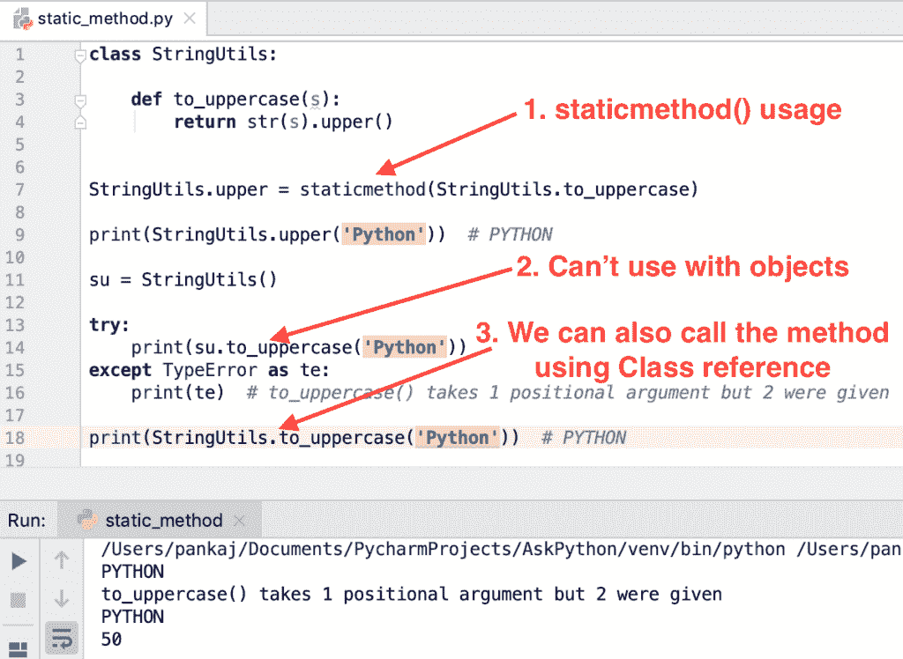
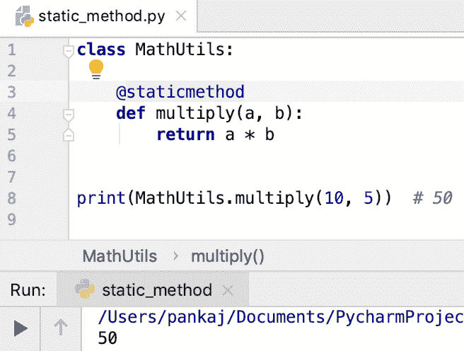

# python 静态方法

> 原文：<https://www.askpython.com/python/python-static-method>

*   Python 静态方法属于这个类。
*   它们用于为类创建实用方法。
*   静态方法是从类引用调用的。
*   他们不能改变对象的状态，因为他们属于类。
*   事实上，静态方法不能访问类属性。
*   静态方法就像 Python 脚本中的一个函数，但是在类体内部。
*   我们可以从类引用或对象引用中调用静态方法。如果 foo()是类 Utils 中的静态方法，我们可以像调用`Utils().foo()`一样调用`Utils.foo()`。

* * *

## 为什么我们需要 Python 静态方法？

静态方法提供了一种将实用方法分成独立子模块的方式。

假设我们有一个 Python 模块，用于字符串、列表和元组的实用方法。

为了更好地理解和使用，我们可以在单独的类中创建静态方法。

```py
class ListUtils:

    @staticmethod
    def reverse(l):
        pass

    @staticmethod
    def clear(l):
        pass

class StringUtils:

    @staticmethod
    def reverse(l):
        pass

    @staticmethod
    def upper(l):
        pass

class TupleUtils:

    @staticmethod
    def reverse(t):
        pass

    @staticmethod
    def shuffle(t):
        pass

```

如果我们必须反转一个列表，我们将调用`ListUtils.reverse()`方法。如果我们必须打乱元组元素，我们将调用`TupleUtils.shuffle()`静态方法。

* * *

## 如何在 Python 中创建静态方法

Python 提供了两种创建静态方法的方法。

1.  staticmethod()方法
2.  @staticmethod 函数装饰器

* * *

### 1.使用 staticmethod()函数

当您想要创建在类中定义的静态方法时，staticmethod()非常有用。注意，该方法不应该有[自参数](https://www.askpython.com/python/python-self-variable)。

```py
class StringUtils:

    def to_uppercase(s):
        return str(s).upper()

StringUtils.upper = staticmethod(StringUtils.to_uppercase)

print(StringUtils.upper('Python'))  # PYTHON

```

如果我们试图从 StringUtils 对象中调用 to_uppercase()方法，它将引发一个错误，即“该方法采用 1 个位置参数，但给出了 2 个”。

```py
su = StringUtils()

try:
    print(su.to_uppercase('Python'))
except TypeError as te:
    print(te)

# Output
# to_uppercase() takes 1 positional argument but 2 were given

```

我们可以从类引用中调用 to_uppercase()方法。

```py
print(StringUtils.to_uppercase('Python'))  # PYTHON

```



Python Static Method

* * *

### 2.使用@staticmethod 批注

这是创建静态方法的推荐方式。我们只需要用@staticmethod 装饰器来注释这个方法。

```py
class MathUtils:

    @staticmethod
    def multiply(a, b):
        return a * b

print(MathUtils.multiply(10, 5))  # 50

```

这种创建静态方法的方式使用起来非常简单，可读性强，易于维护。



Python @staticmethod Decorator

* * *

## Python 静态方法与类方法

*   Python 类方法可以访问类变量，但静态方法不能访问类变量。
*   类方法需要第一个形参来绑定到类。静态方法可以不带任何参数。
*   我们使用@classmethod 来创建类方法。我们使用@staticmethod 来创建静态方法。

```py
class Test:
    x = 10

    @classmethod
    def foo(cls):
        print(cls.x)

    @staticmethod
    def bar():
        # Unresolved reference error for class variable x
        # print(x)
        pass

```

* * *

## Python 静态方法与实例方法

*   类中的实例方法可以访问实例变量以及类变量。静态方法不能访问类变量或实例变量。
*   我们需要“自身变量”作为实例方法的形式参数。静态方法没有这样的限制。
*   我们使用@staticmethod decorator 创建一个静态方法。我们不需要任何装饰者来创建实例函数。

```py
class Test:
    x = 10

    def func(self):
        print(type(self))
        print(self.x)

```

* * *

## Python 中静态方法的好处

静态方法有利于在类边界内对实用方法进行分组。否则，它就像 python 脚本中的普通函数一样。

* * *

## 参考资料:

*   [正式文件](https://docs.python.org/3/library/functions.html#staticmethod)