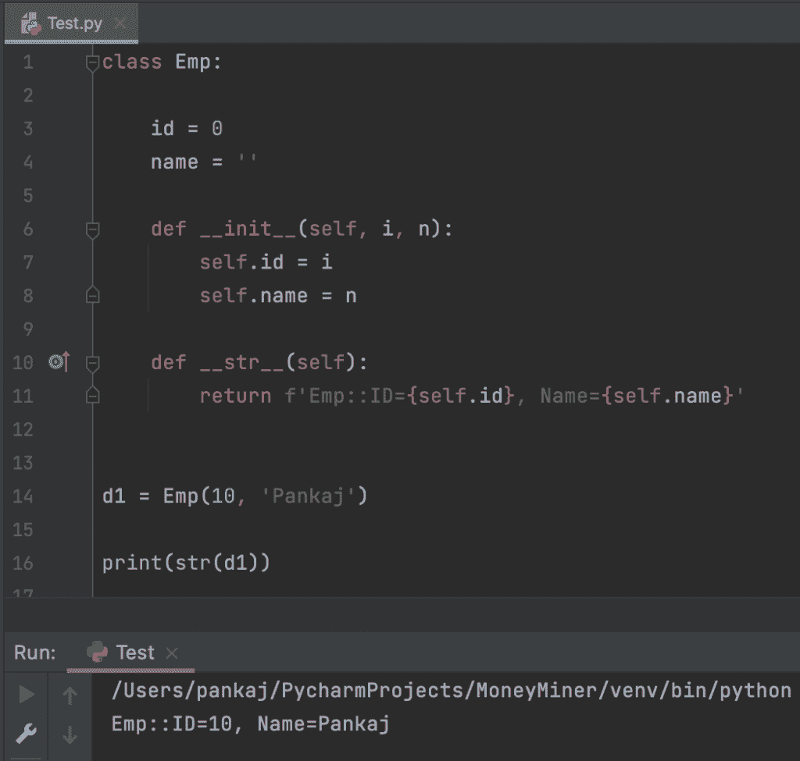

# Python str()函数

> 原文：<https://www.askpython.com/python/built-in-methods/python-str-function>

Python str()函数是内置函数之一。这个函数返回对象的字符串表示。如果没有提供参数，它将返回一个空字符串。

## Python str()函数示例

让我们看一些 str()函数的简单例子。

```py
>>> str("AskPython")
'AskPython'
>>> str(10)
'10'
>>> str(None)
'None'
>>> str()
''
>>> 

```

## 如何为一个对象实现 str()函数

当我们用对象参数调用 str()函数时，它调用对象的 __str__()函数。所以，我们可以为对象实现 __str__()函数，它应该返回一个字符串。

首先，让我们看看当我们没有为一个对象实现 __str__()函数时会发生什么。

```py
class Emp:

    id = 0
    name = ''

    def __init__(self, i, n):
        self.id = i
        self.name = n

d1 = Emp(10, 'Pankaj')

print(str(d1))

```

当我们运行上面的代码时，它会打印:

<**主**。位于 0x104e72ee0 的 Emp 对象>

**这是什么？**

当 __str__()函数未实现时，str()函数回退到 repr()函数。object 类提供 repr()函数实现，返回对象的内存地址。

这个输出对我们没有帮助，因为作为开发人员，没有关于对象的有用信息。让我们实现 __str__()函数。

```py
def __str__(self):
    return f'Emp::ID={self.id}, Name={self.name}'

```

输出:



Python Str Function

## 摘要

*   python str()函数是内置函数之一。
*   str()函数在内部调用 __str__()函数，如果不调用，则返回 repr()函数。
*   如果没有提供参数，str()函数将返回一个空字符串。
*   我们可以使用 str()函数将对象转换为字符串。当你想把数字转换成字符串等的时候很有用。
*   为数据对象实现 __str__()函数是一个好主意，它有助于轻松获得关于对象的有用信息。

## 下一步是什么？

*   [Python 内置函数](https://www.askpython.com/python/built-in-methods/python-built-in-functions-brief-overview)
*   [Python 中的字符串](https://www.askpython.com/python/string/strings-in-python)
*   [Python 字符串方法](https://www.askpython.com/python/string/python-string-functions)

## 资源

*   [Python.org 文件](https://docs.python.org/3/library/stdtypes.html#str)