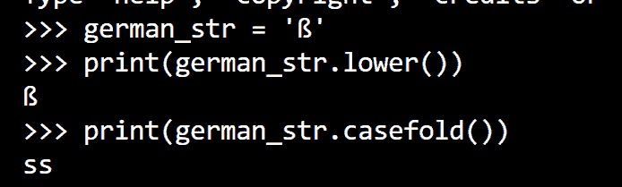

# Python 字符串 casefold()

> 原文：<https://www.askpython.com/python/string/python-string-casefold>

[Python String](https://www.askpython.com/python/string/python-string-functions) casefold()方法返回一个大小写折叠的字符串，我们用它来删除字符串中所有的大小写区别。

让我们看看这意味着什么。

* * *

## 使用 Python 字符串 casefold()方法

这属于`String`类，只能用于字符串对象。

此方法的语法是:

```py
string_obj.casefold()

```

这将在应用所有大小写折叠后返回一个新字符串。

例如，它会将所有大写字母转换成小写字母。

```py
my_str = "Hello from AskPython"

casefolded_str = my_str.casefold()

print(casefolded_str)

```

**输出**

```py
hello from askpython

```

这会将英文字母表中的所有大写字母转换为小写字母。

但是，如果字符串包含另一种语言的字符，并且采用另一种编码，该怎么办呢？Python string casefold()方法解决了这个问题。

以德语小写字母'`ß`'为例。这对应于英语字符串“ss”，因为有一个德语字母的编码，我们将其解码为英语字符串。

如果我们在这个字母表上使用`lower()`方法，它什么都不会做，因为这个字母已经是小写的了，所以输出仍然是“`ß`”。Python string casefold()不仅转换成小写，还确保我们得到我们的英文字符串“ss”。

下面的截图显示了这种差异。



German String Casefold

让我们再举一个例子，说明字符串'`ß`'和“ss”将解析为相同的大小写折叠字符串“SS”。

```py
s1 = 'ß'
s2 = 'ss'
s3 = 'SS'
if s1.casefold() == s2.casefold():
    print('Casefolded strings of s1 and s2 are equal')
else:
    print('Casefolded strings of s1 and s2 are not equal')

if s1.casefold() == s3.casefold():
    print('Casefolded strings of s1 and s3 are equal')

```

**输出**

```py
Casefolded strings of s1 and s2 are equal
Casefolded strings of s1 and s3 are equal

```

事实上，这两个字符串都解析为同一个 casefolded 字符串！

* * *

## 结论

在本文中，我们学习了如何在 Python 中使用 Python string casefold()方法。

* * *

## 参考

*   [皮套上的官方文件](https://docs.python.org/3.7/library/stdtypes.html#str.casefold)()
*   String casefold()上的 JournalDev 文章

* * *