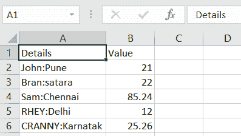

# Python 字符串到浮点，浮点到字符串

> 原文：<https://www.askpython.com/python/string/python-string-float-conversion>

在本文中，我们将处理 Python 字符串**到 float** 的转换，反之亦然。在日常编程实践中，很多时候我们会遇到这样的场景，我们觉得需要转换我们正在处理的数据类型。

## 要浮动的 Python 字符串

Python 为我们提供了内置的 **`float()`** 方法，将输入的数据类型从 String 转换为 float。

**语法:**

```py
float(input_string)

```

**举例:**

```py
inp = '99.23'
print("Input string:\n",inp)
opt = float(inp)

print('Input value after converting it to float type:\n',opt)
print(type(opt))

```

**输出:**

```py
Input string:
 99.23
Input value after converting it to float type:
 99.23
<class 'float'>

```

* * *

### 要浮动的 Python NumPy 字符串

**[NumPy 模块](https://www.askpython.com/python-modules/numpy/python-numpy-arrays)** 已经得到了`astype()`方法来转换数据的类型。

**astype()方法**将输入数据的类型转换为参数中指定的数据类型。

**语法:**

```py
input_string.astype(numpy.float)

```

**举例:**

```py
import numpy
inp = numpy.array(["76.5", "75.5", "75.7"]) 

print ("Input array:\n")
print(str(inp)) 

opt = inp.astype(numpy.float) 

print ("Output array after conversion:\n")
print(str(opt)) 

```

**输出:**

```py
Input array:

['76.5' '75.5' '75.7']
Output array after conversion:

[ 76.5  75.5  75.7]

```

* * *

### 熊猫串起来飘

**[熊猫模块](https://www.askpython.com/python-modules/pandas/python-pandas-module-tutorial)** 也使用`astype()`函数将数据集特定字段的数据类型转换为指定的类型。

**语法:**

```py
input.astype(float)

```

**输入 csv 文件:**



Input File

**举例:**

```py
import pandas
import numpy
inp = pandas.read_csv('C:\\Users\\HP\\Desktop\\Book1.csv')
print(inp.dtypes)
inp['Value'] = inp['Value'].astype(float)
print(inp)
print(inp.dtypes)

```

**输出:**

```py
Details     object
Value      float64
dtype: object

           Details  Value
0        John:Pune  21.00
1      Bran:satara  22.00
2      Sam:Chennai  85.24
3       RHEY:Delhi  12.00
4  CRANNY:Karnatak  25.26

Details     object
Value      float64
dtype: object

```

* * *

## Python 浮点到字符串

Python String 内置了`str()`方法，可以将任意类型的输入数据转换成字符串形式。

**语法:**

```py
str(input)

```

**举例:**

```py
inp = 77.77
print(inp)
print(type(inp))

opt = str(inp)
print(opt)
print(type(opt))

```

**输出:**

```py
77.77
<class 'float'>
77.77
<class 'str'>

```

### Python NumPy 浮点到字符串

**List Comprehension** 可以用来将 Python NumPy float 数组转换成 String 元素的数组。

**语法:**

```py
["%.2f" % i for i in input_array]

```

**举例:**

```py
import numpy
inp = numpy.array([77.75, 77.25, 77.55])
print("Input array:\n",inp)
opt =["%.2f" % i for i in inp]
print("Converted array to string:\n")
print(opt)

```

在上面的代码片段中，“ **%.2f** ”将在输出数组中给我精确到**两位小数**。

**输出:**

```py
Input array:
 [77.75 77.25 77.55]
Converted array to string:
['77.75', '77.25', '77.55']

```

## 结论

在本文中，我们已经理解了使用 Python 数据结构将数据从字符串形式转换为浮点形式，反之亦然。

* * *

## 参考

*   **Python 字符串浮动**
*   [**【NumPy 字符串到浮点**](https://stackoverflow.com/questions/3877209/how-to-convert-an-array-of-strings-to-an-array-of-floats-in-numpy)