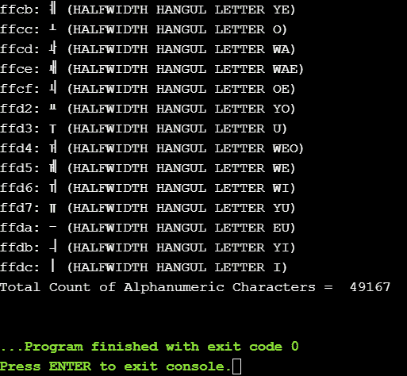

# Python 字符串 isalnum()函数

> 原文：<https://www.askpython.com/python/string/python-string-isalnum-function>

Python 中的 String 有内置的函数，可以对字符串执行几乎所有的操作。Python String isalnum()函数检查字符串中的字母数字字符，只有当字符串由字母数字字符组成时，即字母(a-z，A-Z)或数字(0-9)或两者的组合，才返回 **True** 。

**要点:**

*   **返回类型:**布尔型，即真或假
*   **参数值:**isalnum()函数中不需要解析任何参数
*   字符串中不应有空格
*   空字符串也返回 False
*   不区分大小写，即返回值不取决于字符串的大小写

* * *

## String isalnum() Syntax

```py
str_name.isalnum()

```

这里的 str_name 指的是输入字符串。并且，isalnum()是 python 中内置的字符串函数。

```py
str_name = "Hello123"
print(str_name.isalnum())  # True

```

* * *

## String isalnum()示例

不同情况的例子如下:

### 情况 1:字符串只包含字母

```py
str_name = "Hello"
print(str_name.isalnum())  # True

```

### 情况 2:字符串只包含数字

```py
str_name = "786"
print(str_name.isalnum())  # True

```

### 情况 3:字符串之间包含空格

```py
str_name = "Welcome user 123"
print(str_name.isalnum())       #False

```

### 情况 4:字符串包含不同大小写的数字和字母

```py
str_name = "w3lC0Me"
print(str_name.isalnum())  # True

```

### 情况 5:字符串包含特殊字符

```py
str_name = "[email protected]"
print(str_name.isalnum())  # False

```

### 情况 6:字符串为空或包含空格

```py
str_name = ' '
print(str_name.isalnum())  # False

```

* * *

## 用 Python 打印所有可能的字母数字字符列表的程序

Unicode 模块可用于检查字母数字字符。该计划是打印所有的字母数字 Unicode 字符。

```py
import unicodedata

total_count = 0
for i in range(2 ** 16):
    charac = chr(i)
    if charac.isalnum():
        print(u'{:04x}: {} ({})'.format(i, charac, unicodedata.name(charac, 'UNNAMED')))
        total_count = total_count + 1
print("Total Count of Alphanumeric Characters = ",total_count)

```

**输出:**



Output All Alphanumeric Characters

这只是输出的一瞥，因为实际输出很长。总共有 49167 个字母数字字符。

## 参考资料:

*   Python 字符串 isalnum()
*   [Python 内置的字符串函数](https://docs.python.org/3/library/stdtypes.html)