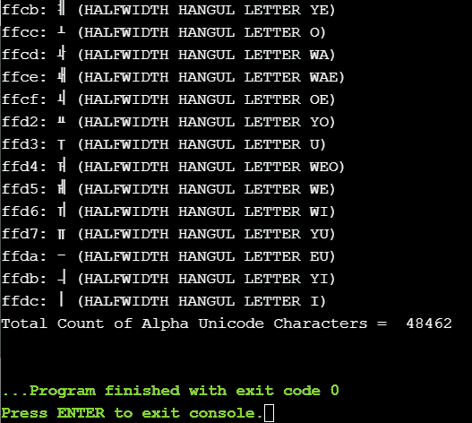

# Python 字符串 isalpha()函数

> 原文：<https://www.askpython.com/python/string/python-string-isalpha-function>

Python 中的 String 有内置的函数，可以对字符串执行几乎所有的操作。Python String isalpha()函数检查字符串中的字母，如果字符串只包含字母(a-z，A-Z)，则返回 True。

**要点:**

*   **返回类型:**布尔型，即真或假
*   **参数值:**不需要参数
*   空格不被认为是字母。因此，空格将返回 False。
*   空字符串也会返回 False。

* * *

## 字符串 isalpha()语法

```py
str_name.isalpha()

```

这里的 str_name 指的是输入字符串。并且，isalpha()是 python 中内置的字符串函数。

```py
str_name = "Welcome"
print(str_name.isalpha())   # True

```

* * *

## 字符串 isalpha()示例

下面给出不同的案例。

### 情况 1:字符串包含空白

```py
str_name = "Welcome User"
print(str_name.isalpha())   # False

```

### 情况 2:字符串包含数字

```py
str_name = "WelcomeUser1"
print(str_name.isalpha())   # False

```

### 情况 3:字符串包含特殊字符

```py
str_name = "[email protected]"
print(str_name.isalpha())    # False

```

### 情况 4:字符串为空

```py
str_name = ' '
print(str_name.isalpha())    # False

```

* * *

## 打印 Python 中所有可能的字母字符列表的程序

Unicode 模块可用于检查字母字符。该计划是打印所有的阿尔法 Unicode 字符。

```py
import unicodedata

total_count = 0
for i in range(2 ** 16):
    charac = chr(i)
    if charac.isalpha():
        print(u'{:04x}: {} ({})'.format(i, charac, unicodedata.name(charac, 'UNNAMED')))
        total_count = total_count + 1
print("Total Count of Alpha Unicode Characters = ",total_count)

```

**输出:**



Output All Alpha Unicode Characters

这只是输出的一瞥，因为实际输出很长。Unicode 中有 48462 个字母字符。

## 参考资料:

*   Python 字符串 isalpha()
*   [Python 内置字符串](https://docs.python.org/3/library/stdtypes.html)